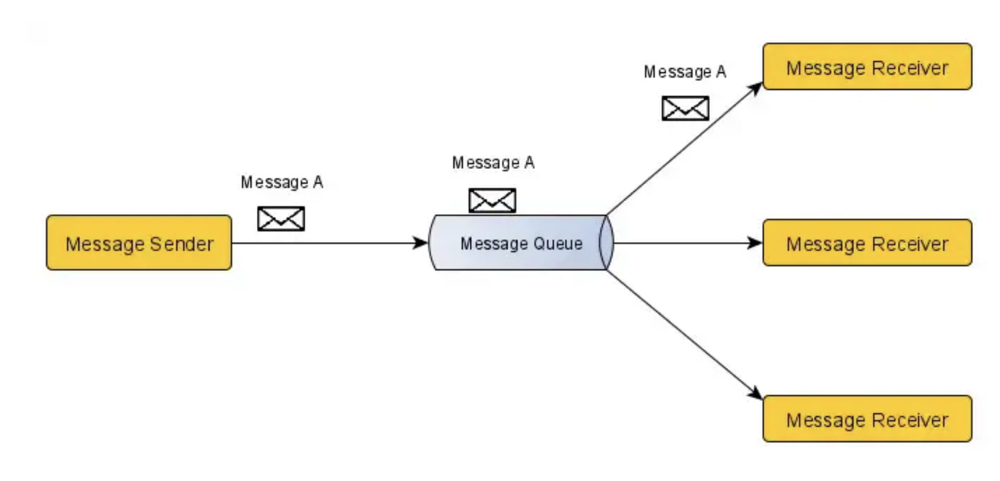
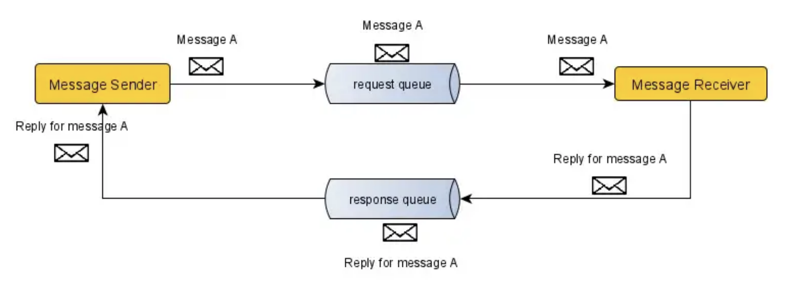
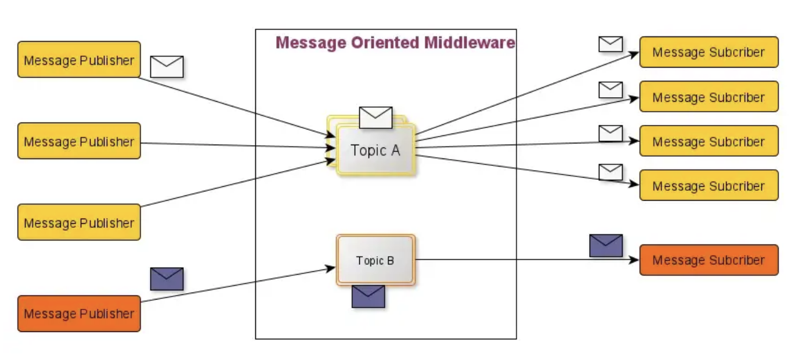

## <span style="color:gray">들어가기 앞서</span>

---

오늘 회사에서 Spring 내에서 비동기로 로직을 처리하는 소스를 분석하였다.

내부적으로 publish-subscribe 패턴을 사용하고 있었다. 사실 나는 이 개념을 잘 모른다.

결과적으로 소스를 분석하는데 있어 많은 시간을 사용하였다. 물론 주변의 도움으로 분석은

완벽하지는 않지만 이해하는 정도로 마무리하였다. 

암튼 이번 포스팅에서는 동기와 비동기의 차이를 기점으로 새롭게 알게 된 지식들을 

차근차근 정리해보고자 한다.

<br>

## <span style="color:gray">스프링에서 비동기처리를 알아보자!!</span>

---

#### <span style="background-color:black; color:white">동기 & 비동기</span>

우선 동기와 비동기의 개념적인 의미를 리마인드 해보자.

<br>

**[ 동기(Synchronous) ]**

동기란 동시에 일어난다는 뜻이다. 요청과 그 결과가 동시에 일어난다는 약속이다.

바로 요청을 하면 시간이 얼마가 걸리던지 요청한 자리에서 결과가 주어진다.

장점으로는 설계가 매우 간단하고 직관적이다. 하지만 먼저 요청한 결과가 주어질 때까지

사용자는 아무것도 하지 못하고 대기하고 있어야 한다.

<br>

**[ 비동기(Asynchronous) ]**

비동기란 동시에 일어나지 않는다를 의미한다. 요청과 결과가 동시에 일어나지 않을 것이라는

약속이다. 요청한 그 자리에서 결과가 주어지지 않는다. 결과가 주어지는데 시간이 걸리더라도

그 시간 동안에 다른 작업을 할 수 있으므로 자원들을 효율적으로 사용할 수 있다.

동기처리 보다는 설계가 복잡하다는 단점을 가지고 있다.

<br>

#### <span style="background-color:black; color:white">@Async</span>

<br>

**[ Async 실습해보기 ]**

<details>
<summary><u>간단한 Async 예제 코드</u></summary>
<div markdown="1">

<br>

```java
@RequiredArgsConstructor
@AsyncTestRestController
public class AsyncTestController {

    private final TestAsyncService testAsyncService;

    @GetMapping("/v1")
    public void testAsyncV1() {
        for (int i = 0; i < 100; i++) {
            testAsyncService.asyncTest(i);
        }
    }
    
}
```

```java
@Service
public class TestAsyncService {

    @Async
    public void asyncTest(int i) {
        System.out.println("test aysnc = " + i);
    }

}
```

```java
@Configuration
@EnableAsync
public class AsyncConfiguration {

    @Bean
    public Executor aysncThreadTaskExecutor() {

        ThreadPoolTaskExecutor executor = new ThreadPoolTaskExecutor();
        executor.setCorePoolSize(10);
        executor.setQueueCapacity(20);
        executor.setThreadNamePrefix("gilbert-");

        return executor;
    }

}
```

</div>
</details><br>


<details>
<summary><u>비동기 출력 결과</u></summary>
<div markdown="1">

<br>

순서가 일정하지 않음을 확인할 수 있다. 다시 말해 비동기로 작업이 진행되었다.

```text
test aysnc = 42
test aysnc = 95
test aysnc = 98
test aysnc = 41
test aysnc = 40
test aysnc = 37
test aysnc = 38
test aysnc = 47
test aysnc = 89
test aysnc = 36
test aysnc = 35
test aysnc = 34
test aysnc = 0
test aysnc = 10
test aysnc = 11
test aysnc = 31
test aysnc = 33
test aysnc = 87
test aysnc = 16
test aysnc = 17
test aysnc = 18
.
.
.
test aysnc = 66
test aysnc = 56
test aysnc = 75
test aysnc = 74
test aysnc = 79
test aysnc = 51
test aysnc = 53
test aysnc = 77
test aysnc = 78
test aysnc = 45
test aysnc = 49
test aysnc = 73
test aysnc = 52
test aysnc = 59
test aysnc = 97
test aysnc = 80
test aysnc = 86
test aysnc = 44
```

</div>
</details><br>


<br>

**[ 주의사항 ]**

**<span style="background-color:#F0E68C">private 메서드에는 적용이 안된다. public만 된다.</span>**

스프링에서 제공해주는 @Async는 스프링 AOP에 의해 프록시 패턴 기반으로 동작하게 된다.

프록시는 타겟 클래스를 상속 받아 생성되는 클래스이기 때문에 타겟 클래스의 private 메서드는

프록시 객체에서는 사용할 수 없다.

<br>

**<span style="background-color:#F0E68C">self-invocation(자가 호출) 해서는 안된다.</span>**

Spring AOP에서 프록시의 동작 과정을 보면 프록시를 통해 들어오는 외부 메서드 호출을 인터셉트하여 

작동한다. 즉, self-invocation이라 함은, 프록시를 통하지 않고 같은 객체의 다른 메서드를 참조하는 것을 말한다. 

프록시 객체의 target 메소드 안에서 또 다른 target 메소드를 실행시 AOP가 동작하지 않는 다는 것이다.

<details>
<summary><u>자가 호출 결과</u></summary>
<div markdown="1">

<br>

self-invocation을 했기 때문에 @Async 애노테이션이 정상작동 하지않았다.

결과적으로 동기처리가 이루어졌음을 확인할 수 있다.

```java
@Service
public class TestAsyncService {

    /**
     * self-invocation
     */
    public void callAsyncTest(int i) {
        this.asyncTest(i);
    }

    @Async
    public void asyncTest(int i) {
        System.out.println("test aysnc = " + i);
    }

}
```

```text
test aysnc = 0
test aysnc = 1
test aysnc = 2
test aysnc = 3
test aysnc = 4
test aysnc = 5
test aysnc = 6
test aysnc = 7
test aysnc = 8
test aysnc = 9
test aysnc = 10
.
.
.
test aysnc = 90
test aysnc = 91
test aysnc = 92
test aysnc = 93
test aysnc = 94
test aysnc = 95
test aysnc = 96
test aysnc = 97
test aysnc = 98
test aysnc = 99

```

</div>
</details><br>

<br>

**[ 참고 링크 ]**

• <a href="https://tecoble.techcourse.co.kr/post/2022-11-07-transaction-aop-fact-and-misconception/" target="_blank">tecoble - AOP에 대한 오해와 진실</a>

<br>

## <span style="color:gray">Spring Integration</span>

---

#### <span style="background-color:black; color:white">spring integration이란?</span>

> Spring Integration Docs

Spring 프로그래밍 모델을 확장하여 잘 알려진 Enterprise Integration Patterns를 지원한다.

Spring Integration은 스프링 기반 애플리케이션에서 경량 메시지를 사용가능하게 하고 외부 시스템을 

선언적 어뎁터로 쉽게 통합할 수 있는 기능을 제공한다. 이러한 어댑터는 원격, 메시징 및 예약에 대한 

Spring의 지원보다 높은 수준의 추상화를 제공한다.

Spring Integration의 주요 목표는 "엔터프라이즈 통합 솔루션"을 구축하기 위한 간단한 모델을 제공하는 

동시에 유지 관리 가능하고 테스트 가능한 코드를 생성하는 데 필수적인 관심사의 분리를 유지하는 것이다.

<br>

Spring Framework를 사용하면 개발자가 인터페이스와 DI를 사용해서 코딩할 수 있도록 권장한다.

Spring Integration은 위 개념을 한 단계 더 발전시켜 POJO가 Messaging Paradigm을 사용하여

서로 연결되고 개별 구성 요소가 애플리케이션의 다른 구성요소를 이식하지 못할 수 있다.

이러한 애플리케이션은 더 높은 수준의 기능을 형성하기 위해 세분화된 재사용 가능 구성 요소를

조립하여 구축된다. 신중한 설계를 통해 이러한 흐름을 모듈화하고 더 높은 수준에서 재사용할 수도 있다.

<br>

세분화된 구성 요소를 함께 연결하는 것 외에도 Spring Integration은 외부 시스템과 통신하기 위한

다양한 Channel Adapter및 Gateway를 제공한다. 

<br>

## <span style="color:gray">Messaging Models</span>

---

#### <span style="background-color:black; color:white">Point-to-Point</span>

<br>

**[ Point-to-Point ]**

Point-to-Point 모델에서는 Sender가 보낸 messages는 오직 하나의 receiver에게만 

전달이 된다. <span style="color:red">많은 receiver가 동일한 message Queue를 수신하는 경우에도 마찬가지다.</span>

이 모델에서는 publisher, consumer라는 용어 보단 <span style="color:#4169E1">sender</span>, <span style="color:#4169E1">receiver</span>를 사용한다.

<br>

<br>

해당 모델에는 아래와 같이 두 개의 타입이 존재한다.

- fire-and-forget(one-way) messaging 
- request/reply(request-response) messaging

<br>

**[ fire-and-forget ]** 

fire-and-forget에서 sender는 Message Queue의 응답을 기다리지 않는다.

다시 말해, sender는 Message Queue가 message를 받았는지 못받았는지 신경쓰지 않는다.

이 모드에서 sender와 receiver는 전혀 상호 작용하지 않는다.

<br>

**[ request/reply ]** 

Fire-and-Forget 모드와 달리 request/reply 메시징 모델에서는 sender가 하나의 Queue에 

message를 보낸 다음 receiver의 응답을 기다린다. 이 모드를 사용하면 sender에서 message가 

수신되었는지 여부에 주의를 기울인다.

<br>

<br>

#### <span style="background-color:black; color:white">Publish/Subscribe</span>

<br>

**[ Publish/Subscribe 란? ]**

Publish/Subscribe Messaging 모델은 비동기(Asyncronous) 형식이다.

해당 모델에서 message를 생산하는 쪽을 publisher라 하며, message를 소비하는 쪽을

subscriber라고 한다.

publisher는 message를 topic에 전달한다. 그리고 해당 topic을 구독하고 있는 

<span style="color:red">모든 subscriber들</span>이 message를 전달받고 소비한다.

> topic : 메시지 feed를 나타내는 이름이 지정된 리소스

참고로 topic에 있는 message는 모든 구독자들이 message를 전달 받을 때 topic에서 제거된다.

<br>

publisher와 subscriber는 서로의 존재를 모른채 인터페이스 혹은 message에만 의존하기 때문에 

시스템 간 상호 의존성을 줄여주는 특징이 있다.


<br>

<br>

참고로 PUB/SUB 패턴과 비슷한 패턴이 있는데 그것은 바로 Observer 패턴이다.

Observer 패턴은 특정 객체 A의 상태 변화를 관찰하는 옵저버들의 목록을 이 객체에 등록하여

A의 상태 변화가 있을 때 마다 A가 직접 옵저버 목록에 있는 각 옵저버들에게 <span style="color:#4169E1">notify</span>하도록

하는 디자인 패턴이다. PUB/SUB 패턴과는 다르게 발행자와 구독자가 서로 잘 아는(의존성이 높은) 

형태를 띄고 있다.

<br>

**[ point-to-point VS pub/sub ]**

- message 수신자 수
    -  ptp : 1명
    - pub/sub : 여러명

<br>

- 수신자 인지 여부
    -  ptp : 알아야 함
    - pub/sub : 몰라도 됨 → **<span style="background-color:#F0E68C">High decoupling</span>**

<br>

## <span style="color:gray">참고 자료</span>

---

• <a href="https://www.youtube.com/watch?v=daGeuBA5Xqo" target="_blank">Point to Point vs Publish/Subscribe messaging model.
</a>

• <a href="https://programmingsharing.com/point-to-point-and-publish-subscribe-messaging-model-2efc4d2b6726" target="_blank">programmingsharing blog</a>

• <a href="https://incheol-jung.gitbook.io/docs/study/srping-in-action-5th/chap-9." target="_blank">incheol-jung.gitbook.io</a>

• <a href="https://docs.spring.io/spring-integration/docs/4.3.12.RELEASE/reference/html/messaging-channels-section.html" target="_blank">spring integration docs </a>