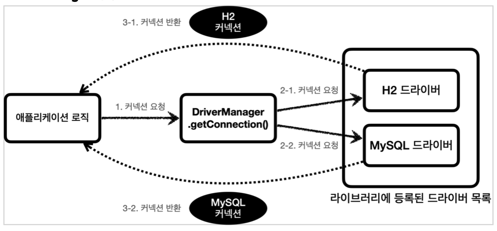
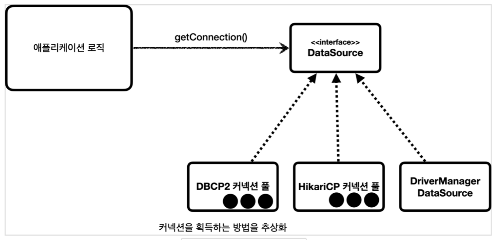

## JDBC 이해

---

#### JDBC의 등장 이유

데이터베이스를 다른 종류의 데이터베이스로 변경하면 애플리케이션 서버에 개발된 데이터베이스

사용 코드도 함께 변경해야 한다. 또 개발자가 각각의 데이터베이스마다 커넥션 연결, SQL전달,

그리고 그 결과를 응답 받는 방법을 새로 학습해야한다.

이런 문제를 해결하기 위해 JDBC라는 자바 표준이 등장한다.

 

#### JDBC 표준 인터페이스

• java.sql.Connection - 연결

• java.sql.Statement - SQL을 담은 내용

• java.sql.ResultSet - SQL 요청 응답

 

#### DriverManager 커넥션 요청 흐름

 

 

## 커넥션풀 이해

---

#### 왜 사용할까?

커넥션 풀이 있기 이전에는 매 요청 마다 새로운 데이터베이스 커넥션을 연결했다.

 

이렇게 커넥션을 새로 만드는 것은 과정도 복잡하고 시간도 많이 소모되는 일이다.

DB는 물론이고 애플리케이션 서버에서도 `TCP/IP` 커넥션을 새로 생성하기 위한 리소스를

매번 새용해야 한다. 가장 큰 문제는 고객이 애플리케이션을 사용할 때, SQL을 실행하는 

시간 뿐만 아니라 커넥션을 새로 만드는 시간이 추가되기 때문에 결과적으로 응답 속도에 

영향을 줄 수 있다. 이런 문제를 한 번에 해결하는 아이디어가 바로 커넥션을 미리 생성해두고

사용하는 커넥션 풀이라는 방법이다.

 

#### 자세히 알아보기

애플리케이션을 시작하는 시점에 커넥션 풀은 필요한 만큼 커넥션을 미리 확보해서 풀에 보관한다. 

보통 얼마나 보관할 지는 서비스의 특징과 서버 스펙에 따라 다르지만 보통 10개로 설정한다.

 

커넥션 풀에 들어 있는 커넥션은 TCP/IP로 DB와 커넥션이 연결되어 있는 상태이기 때문에 언제든지

즉시 SQL을 DB에 전달할 수 있다.

 

## 데이터소스 이해

---

#### 등장 이유

커넥션을 얻는 방법은 JDBC DriverManager를 직접 사용하거나, 커넥션 풀을 사용하는 등

다양한 방법이 존재한다. 

만약에 애플리케이션 로직에서 DriverManager 를 사용해서 커넥션을 획득하다가 HikariCP 같은 

커넥션 풀을 사용하도록 변경하면 커넥션을 획득하는 애플리케이션 코드도 함께 변경해야 한다. 

의존관계가 DriverManager 에서 HikariCP 로 변경되기 때문이다.

이런 문제를 해결하기 위해서 자바에서는 `DataSource`라는 인터페이스를 제공한다.

정리하자면, **DataSource는 커넥션을 획득하는 방법을 추상화하는 인터페이스이다.**

 

DriveManager를 사용하다가 커넥션 풀을 사용해서 코드의 변경이 없다.

왜냐면 DataSource 인터페이스에 의존하기 때문이다. 이것이 바로 DataSource를 사용하는

이유이며, DI와 OCP를 지킬수 있다.