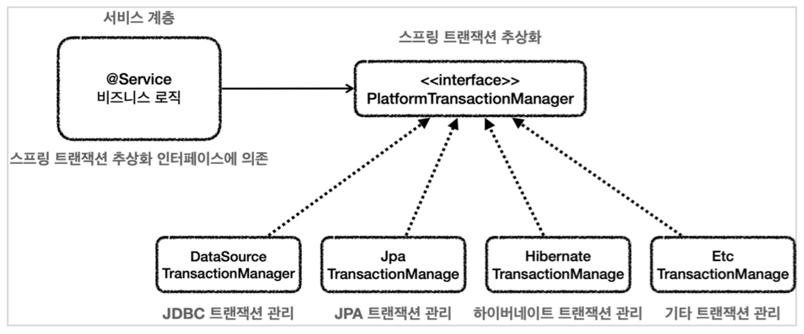
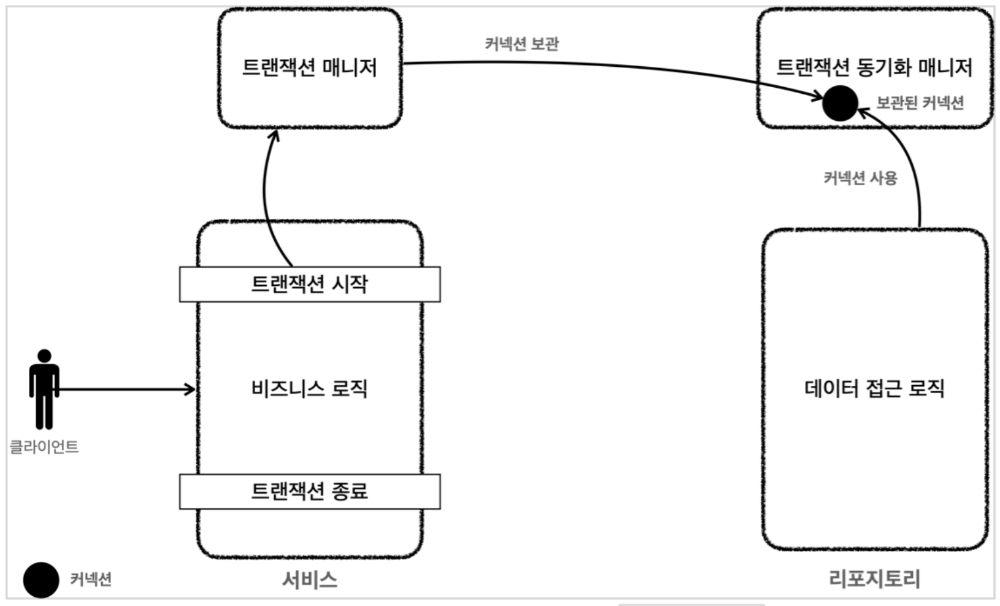

## <span style="color:gray">스프링과 문제 해결 - 트랜잭션</span>

---

#### <span style="background-color:black; color:white">발생한 문제를 파악하기</span>

스프링을 사용하지 않고 개발을 할 때는 아래와 같은 문제가 발생한다.

- 트랜잭션 문제
- 예외 누수 문제
- JDBC 반복 문제

<br>

**[ 트랜잭션 문제 ]**

가장 큰 문제는 트랜잭션을 적용하면서 생긴 다음과 같은 문제들이다.

- 트랜잭션을 적용하기 위해 JDBC 구현 기술이 서비스 계층에 누수되었다.
<br>
- 트랜잭션 동기화 문제
    - 같은 트랜잭션을 유지하기 위해 커넥션을 파라미터로 넘겨야한다.
    - 똑같은 기능도 트랜잭션용, 일반용으로 분리해야 한다.
<br>
- 트랜잭션 적용 반복 문제
    - 트랜잭션 적용 코드가 많이 반복된다. (try-catch-finally)

<br>

**[ 예외 누수 ]**

- 데이터 접근 계층의 JDBC 구현 기술 예외가 서비스 계층으로 전파된다.
<br>
- SQLException은 체크 예외이기 때문에 데이터 접근 계층을 호출한 서비스 계층에서
해당 예외를 잡아서 처리하거나 명시적으로 `throws`를 통해서 다시 밖으로 던져야한다.
<br>
- SQLException은 JDBC전용 기술이다. 향후 JPA나 다른 데이터 접근 기술을 사용하면,
그에 맞는 다른 예외로 변경해야 하고, 결국 서비스 코드도 수정해야 한다.

<br>

**[ JDBC 반복 문제 ]**

- 유사한 반복이 너무 많다.
    - try, catch, finally

<br>

## <span style="color:gray">트랜잭션 추상화</span>

---

#### <span style="background-color:black; color:white">스프링의 트랜잭션 추상화</span>



스프링의 트랜잭션 추상화의 핵심은 `PlatformTransactionManager` 인터페이스이다.

```java
package org.springframework.transaction;

public interface PlatformTransactionManager extends TransactionManager {
    TransactionStatus getTransaction(@Nullable TransactionDefinition definition)
			throws TransactionException;

    void commit(TransactionStatus status) throws TransactionException;

    void rollback(TransactionStatus status) throws TransactionException;
}
```

- `getTransaction()` : 트랜잭션을 시작한다.
    - 이름이 `getTransaction()`인 이유는 기존에 이미 진행중인 트랜잭션인 있는 경우
    해당 트랜잭션에 참여할 수 있기 때문이다.
<br>
- `commit()` : 트랜잭션을 커밋한다.
<br>
- `rollback()` : 트랜잭션을 롤백한다.

<br>

<details>
<summary><u>실습 예제</u></summary>
<div markdown="1">

<br>

```java
// Service
public class MemberServiceV3_1 {

    private final PlatformTransactionManager transactionManager;
    private final MemberRepositoryV3 memberRepository;

    public void accountTransfer(String formId, String toId, int money) {
        
        TransactionStatus status = transactionManager.getTransaction(new DefaultTransactionDefinition());

        try {
            bizLogic(fromId, toId, money);
            transactionManager.commit(status);
        } catch (Exception e) {
            transactionManager.rollback(status);
            throw new IllefalStateException(e);
        }
        // 더 이상 개발자가 release 할 필요가 없다.
    }

    private void bizLogic(String fromId, String toId, int money) throws SQLException {
        Member fromMember = memberRepository.findById(fromId);
        Member toMember = memberRepository.findById(toId);

        memberRepository.update(fromId, fromMember.getMoney() - money);
        validation(toMember);
        memberRepository.update(toId, toMember.getMoney() + money);
    }
}
```

```java
// Repository
private Connection getConnection() throws SQLException {
    //주의! 트랜잭션 동기화를 사용하려면 DataSourceUtils를 사용해야 한다.
    Connection con = DataSourceUtils.getConnection(dataSource);
    log.info("get connection={}, class={}", con, con.getClass());
    return con;
}
```

</div>
</details><br>

<br>

## <span style="color:gray">트랜잭션 동기화</span>

---

#### <span style="background-color:black; color:white">트랜잭션 매니저와 트랜잭션 동기화 매니저</span> 

**[ TransactionManager ]**

스프링이 제공하는 `TransactionManager`는 크게 2가지 역할을 한다.

- 트랜잭션 추상화
<br>
- 리소스 동기화
    - 트랜잭션을 유지하려면 트랜잭션의 시작부터 끝까지 같은 데이터베이스 커넥션을 
    유지해야한다. 결국 같은 커넥션을 동기화하기 위해서 이전에는 파라미터로 커넥션을
    전달하는 방법을 사용했다. 

<br>

**[ TransactionSynchronizationManager ]**



스프링은 `TransactionSynchronizationManager`를 제공한다.

이것은 ThreadLocal을 사용해서 커넥션을 동기화 해준다. TransactionManager는 내부에서

이 TransactionSynchronizationManager를 사용한다.

TransactionSynchronizationManager는 ThreadLocal을 사용하기 때문에 멀티쓰레드 상황에 안전하게

커넥션을 동기화 할 수 있다. 따라서 커넥션이 필요하면 TransactionSynchronizationManager를 통해

커넥션을 획득하면 된다. 따라서 이전처럼 파라미터로 커넥션을 전달하지 않아도 된다.

<br>

동작 방식에 대해서 알아보자.

1. 트랜잭션을 시작하려면 커넥션이 필요하다. TransactionManager는 DataSource를 통해
커넥션을 만들고 트랜잭션을 시작한다. 
<br>
2. TransactionManager는 트랜잭션이 시작된 커넥션을 TransactionSynchronizationManager에 보관한다.
<br>
3. 리포지토리는 TransactionSynchronizationManager에 보관된 커넥션을 꺼내서 사용한다.
따라서 파라미터로 커넥션을 전달하지 않아도 된다.
<br>
4. 트랜잭션이 종료되면 TransactionManager는 TransactionSynchronizationManager에 보관된 
커넥션을 통해 트랜잭션을 종료하고, 커넥션도 닫는다.

<br>

## <span style="color:gray">트랜잭션 문제 해결 - 트랜잭션 템플릿</span>

---

#### <span style="background-color:black; color:white">왜 사용할까?</span>

트랜잭션을 시작하고, 비즈니스 로직을 실행하고, 성공하면 커밋하고, 예외가 발생해서 실패하면

롤백한다. 다른 서비스에서 트랜잭션을 시작하려면 try, catch, finally를 포함한 코드가 반복될

것이다. 이런 형태는 각각의 서비스에서 반복된다. 달라지는 부분은 비즈니스 로직뿐이다.

이럴 때 템플릿 콜백 패턴을 활용하면 이런 반복 문제를 깔끔하게 해결할 수 있다.

<br>

#### <span style="background-color:black; color:white">TransactionTemplate</span>

템플릿 콜백 패턴을 적용하려면 템플릿을 제공하는 클래스를 작성해야 하는데, 스프링은

`TransactionTemplate`라는 템플릿 클래스를 제공한다.

```java
public class TransactionTemplate {

    private PlatformTransactionManager transactionManager;
    
    public <T> T execute(TransactionCallback<T> action){
        //...
    }
    
    void executeWithoutResult(Consumer<TransactionStatus> action){
        //...
    }
}
```

- `execute()` : 응답 값이 있을 때 사용한다.
- `executeWithoutResult()` : 응답 값이 없을 때 사용한다.

<br>

<details>
<summary><u>실습 예제</u></summary>
<div markdown="1">

<br>

```java
public class MemberService {

    private final TransactionTemplate txTemplate;
    private final MemberRepositoryV3 memberRepository;

    public MemberService(PlatformTransactionMangaer txManager, MemberRepositoryV3 memberRepository) {
        this.txTemplate = new TransactionManager(txManager);
        this.memberRepository = memberRepository;
    }

    public void accountTransfer(String fromId, String toId, int money) throws SQLException {
        txTemplate.executeWithoutResult((status) -> {
            try {
                bizLogic(fromId, toId, money);        
            } catch (SQLException e) {
                throw new IllegalStateException(e);
            }
        })
    }
}
```

</div>
</details><br>

위 실습예제 코드에서도 알 수 있든 TransactionTemplate 덕분에, 반복되는 코드를 제거할 수 

있었다. 하지만 서비스 계층에 비즈니스 로직 뿐만 아니라 트랜잭션 로직이 공존하고 있다.

이렇게 두 관심사가 하나의 클래스에 공존하게 되면 추후 유지보수가 어려워진다. 

어떻게 이 문제를 해결할 수 있을까? 앞으로 알아보자!!

<br>

## <span style="color:gray">트랜잭션 문제 해결 - 트랜잭션 AOP 이해</span>

---

#### <span style="background-color:black; color:white">프록시 사용</span>


프록시를 사용하면 트랜잭션을 처리하는 객체와 비즈니스 로직을 처리하는 객체를 

명확하게 분리할 수 있다.

<br>

트랜잭션 프록시 코드는 아래와 비슷할 것이다.

```java
public class TransactionProxy {
    private MemberService target;

    public void logic() {
        TransactionStatus status = transactionManager.getTransaction(...)

        try {
            target.logic();
            transactionManager.commit(status); //성공시 커밋 } catch (Exception e) {
        } catch (Exception e) {
            transactionManager.rollback(status); //실패시 롤백
            throw new IllegalStateException(e);
        }   
    }
}
```

- `target.logic()` : 이 시점에서 실제 객체(target)의 비즈니스 로직을 호출한다.

<br>

#### <span style="background-color:black; color:white">스프링이 제공하는 트랜잭션 AOP</span>

스프링이 제공하는 AOP 기능을 사용하면 프록시를 매우 편리하게 적용할 수 있다.

하지만 트랜잭션은 매우 중요한 기능이고, 전세계 누구나 다 사용하는 기능이다.

따라서 스프링은 트랜잭션 AOP를 처리하기 위한 모든 기능을 제공한다. 스프링 부트를 사용하면,

트랜잭션 AOP를 처리하기 위해 필요한 스프링 빈들도 자동으로 등록해준다.

개발자는 트랜잭션 처리가 필요한 곳에 `@Transaciton` 애노테이션만 붙여주면 된다.

스프링의 트랜잭션 AOP는 이 애노테이션을 인시갷서 트랜잭션 프록시를 적용해준다.