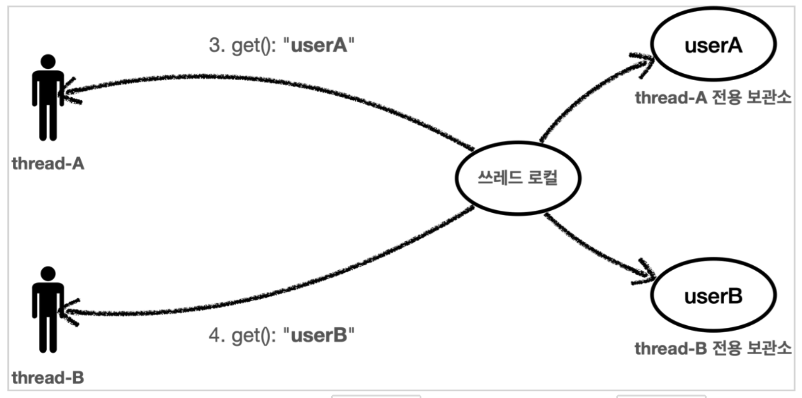

## <span style="color:gray">Thread Local</span>

---

#### <span style="background-color:black; color:white">이전의 문제점</span>

스프링에서 필드 동기화시 <span style="color:red">동시성 문제</span>를 만날 수 있다.

왜냐면 스프링부트는 싱글톤으로 컨테이너에 빈을 등록하기 때문이다. 

만약 A라는 싱글톤 빈에 여러 요청이 동시에 들어왔을 때, 특정 필드에 여러 쓰레드가

동시에 접근할 수 있기 때문이다.

<br>

#### <span style="background-color:black; color:white">ThreadLocal 이해하기</span>

ThreadLocal은 해당 쓰레드만 접근할 수 있는 특별한 저장소를 말한다.

ThreadLocal을 사용하면 각 쓰레드마다 별도의 내부 저장소를 제공한다. 따라서 같은

인스턴스의 ThreadLocal 핃드에 접근해도 문제 없다.



위의 이미지에서 Thread-A와 Thread-B가 동시에 요청을 보내도 각각 전용 보관소가 있기 때문에

동시성 문제에 안전하다.

자바는 언어차원에서 ThreadLocal을 지원하기 위한 `java.lang.ThreadLocal` 클래스를 제공한다.

<br>

#### <span style="background-color:black; color:white">실슬 예제</span>

```java
public class ThreadLocalLogTrace implements LogTrace {

    private ThreadLocal<TraceId> traceIdHolder = new ThreadLocal<>();

    @Override
    public TraceStatus begin(String message) {
        syncTracdId();
        TraceId traceId = traceIdHolder.get();
        //...
    }
}
```

<br>

#### <span style="background-color:black; color:white">ThreadLocal.remove( )</span>

ThreadLocal을 모두 사용하고 나면 꼭 `ThreadLocal.remove()` 메소드를 호출해서

ThreadLocal에 저장된 값을 제거해주어야 한다. 만약 제거해 주지 않는다면 아래와 같은

문제가 발생할 것이다.

<br>

<details>
<summary><u>문제 발생 설명 이미지</u></summary>
<div markdown="1">

<br>


</div>
</details><br>

결과적으로 사용자B는 사용자A의 데이터를 확인하게 되는 심각한 문제가 발생하게 된다.

이런 문제를 예방하려면 사용자A의 요청이 끝날 때 쓰레드 로컬의 값을 `ThreadLocal.remove()`를

통해 꼭 제거해야 한다. 이 부분을 꼭!!! 기억하자.