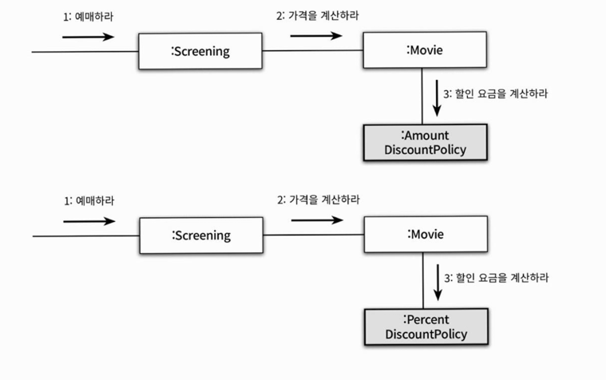
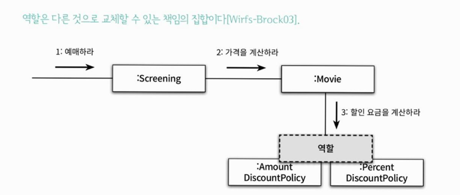

- 객체지향 패어다임의 관점에서 핵심은 **역할(role), 책임(responsibility), 협력(collaboration)** 이다.
- 클래스와 상속은 구현 매커니즘일 뿐

 

### ❐ 1. 협력 

---

#### 🌀 1-1. 영화 예매 시스템 돌아보기

> 영화 시스템 예시

- 객체들이 애플리케이션 기능을 구현하기 위해 수행하는 상호작용을 **협력**이라고 한다.
- 객체가 협력에 참여하기 위해 수행하는 로직을 **책임**이라고 부른다.
- 객체들이 협력 안에서 수행하는 책임들이 모여 객체가 수행하는 **역할**을 구성한다.

 

#### 🌀 1-2. 협력

> 협력이란?

- 협력은 객체지향의 세계에서 기능을 구현할 수 있는 유일한 방법
- 객체들은 **메시지 전송**을 통해 서로 소통한다.
- 메시지를 수신한 객체는 메서드를 실행해 요청에 응답한다.
  - 객체가 메시지를 처리할 방법을 스스로 선택한다.

 

> 예시

- 발신자 : `Screening`
- 메시지 : `calculateMovieFee(...)`
- 수신자 : `Movie`

 

> 정리

- 객체들 사이의 협력을 구성하는 일련의 요청/응답의 흐름을 통해 애플리케이션 기능이 구현된다.
  
 

#### 🌀 1-3. 협력이 설계를 위한 문맥을 결정한다.

> 객체가 가질 수 있는 '행동'을 결정하는 기준은?

- **협력 안에서 객체가 처리할 메시지로 결정된다.**
- 협력이 바뀌면 행동도 바뀐다.

 

> 그렇다면 '객체의 상태'를 결정하는 기준은? 

- **객체가 행동하는데 필요한 정보에 의해 결정된다.**
- 객체는 스스로 결정하고 관리하는 자율적인 존재이기 때문
- Movie를 예로 들면...
  - 행동 : 요금 계산
  - 상태(행동을 수행하는데 필요한 정보) : fee, discountPolicy

 

> 정리하면.. 

- 객체가 참여하는 협력이 객체를 구성하는 행동과 상태를 모두 결정한다.
- 따라서, 협력은 객체를 설계하는 일종의 문맥(context)을 제공한다.

 
 

### ❐ 2. 책임

---

#### 🌀 2-1. 책임이란 무엇인가

> 책임이란? 무엇을 알고 있는가(knowing) + 무엇을 할 수 있는가(doing)

- 객체지향 설계에서 가장 중요한 요소로, 협력에 참여하기 위해 객체가 수행하는 행동
- 책임이란 객체에 의해 정의되는 응집도 있는 행위의 집합으로,  
  객체가 유지해야 하는 정보와 수행할 수 있는 행동에 대해 개략적으로 서술한 문장이다. 
- 예시
  - Screening
    - doing : 영화를 예매하는 것
    - knowing : 자신이 상영할 영화
  - Movie
    - doing : 요금을 계산하는 것
    - knowing : 가격과 어떤 할인 정책이 적용됐는지

 

> 책임 vs 메시지

- 일반적으로 책임과 메시지의 크기는 다르다.
- 책임은 메시지보다 추상적이고 개념적으로도 더 크다.
- 하나의 책임이 여러 메시지로 분할되기도 하고,  
  하나의 객체가 수행할 수 있다고 생각했던 책임이 나중에는 여러 객체들의 협력으로만 해결되는 경우도 있다.

 

> '아는 것'과 '하는 것'은 밀접하게 연관대 있다. 

- 객체는 자신이 맡은 책임을 수행하는 데 필요한 정보를 알고 있을 책임이 있다.

 

_CRC(Candidates Responsibility Collaborator) 카드_
- CRC 카드는 역할을 식별하고, 책임을 할당하며, 협력을 명시적으로 표현하는  
  구체적이면서도 실용적인 설계 기법이다.

 

#### 🌀 2-2. 책임 할당

> Information Expert(정보 전문가) 패턴

- 자율적인 객체를 만드는 가장 기본적인 방법은  
  책임을 수행하는 데 필요한 정보를 잘알고 있는 전문가에게 그 책임을 할당하는 것
- 객체에게 책임을 할당하기 위해서는 먼저 협력이라는 문맥을 정의해야 한다.
- 객체가 책임을 수행하게 하는 유일한 방법은 메시지를 전송하는 것
  - 책임을 할당한다는 것은 메시지의 이름을 결정하는 것과 같다.
- 어떤 경우에는 응집도와 결합도의 관점에서 정보 전문가가 아닌 다른 객체에게 책임을 할당하는 것이 적절할 때도 있다.

 

> 책임을 할당할 때 고려해야 하는 두 가지 요소

- 메시지가 객체를 결정한다.
- 행동이 상태를 결정한다.

 

#### 🌀 2-3. 책임 주도 설계 (RDD)

> 책임 주도 설계란?

- 책임을 찾고 책임을 수행할 적절한 객체를 찾아 책임을 할당하는 방식으로 협력을 설계하는 방법

 

> RDD 방법의 과정

1. 시스템이 사용자에게 제공해야 하는 기능인 시스템 책임을 파악한다.
2. 시스템 책임을 더 작은 책임으로 분할한다.
3. 분할된 책임을 수행할 수 있는 적절한 객체 또는 역할을 찾아 책임을 할당한다.
4. 객체가 책임을 수행하는 도중 다른 객체의 도움이 필요한 경우 이를 책임질 적절한 객체 or 역할을 찾는다.
5. 해당 객체 또는 역할에게 책임을 할당함으로써 두 객체가 협력하게 한다.

 

> 구현이 아닌 책임에 집중하는 이유

- 유연하고 견고한 객체지향 시스템을 위해 가장 중요한 재료가 바로 책임이기 때문

 

#### 🌀 2-4. 메시지가 객체를 결정한다.

> 메시지가 객체를 선택하게 해야 하는 두 가지 중요한 이유

1. 객체가 최소한의 인터페이스를 가질 수 있게 된다.
   - 필요한 메시지가 식별될 때까지 객체의 public interface에 어떤 것도 추가하지 않음.
   - 결과적으로 객체는 딱 필요한 public interface만 갖게 된다.
2. 추상적인 인터페이스를 가질 수 있게 된다.
   - 세부 구현을 외부로 노출하지 않는다.

 

#### 🌀 2-5. 행동이 상태를 결정한다.

> 가장 많이 하는 실수

- 객체의 행동이 아니라 상태에 초점을 맞추는 행위
- 상태는 단지 객체가 행동을 정상적으로 수행하기 위해 필요한 재료일 뿐
- 객체를 객체답게 만드는 것은 객체의 상태가 아니라 객체가 다른 객체에게 제공하는 행동

 
 

### ❐ 3. 역할

---

#### 🌀 3-1. 역할과 협력

> 역할이란?

- 객체가 어떤 특정한 협력 안에서 수행하는 책임의 집합

 

> 책임 할당 과정   

- 책임 할당 과정은 실제로는 두 개의 독립적인 단계가 합쳐진 것이다.
  1. 역할 찾기
  2. 역할을 수행할 객체 찾기

 

#### 🌀 3-2. 유연학도 재사용 가능한 협력

> 왜 역할이라는 개념을 이용해 설계 과정을 더 번거롭게 만든 것일까

- 우선 역할이 중요한 이유는, 역할을 통해 유연하고 재사용 가능한 협력을 얻을 수 있기 때문이다.

  

> 두 종류의 객체가 참여하는 협력을 개별적으로 만들어야 할까?

- `AmountDiscountPolicy`, `PercentDiscountPolicy` 모두 '할인 요금을 계산하라' 메시지에 응답할 수 있어야 함.
- 이렇게 코드를 구현하면 대부분의 코드가 중복된다.

  

> 이런 문제를 해결하기 위해 객체가 아닌 "책임"에 초점을 맞춰야 한다.

- 객체라는 존재를 지우고, '할인 요금을 계산하라'라는 메시지에 응답할 수 있는 대표자를 생각하라.
- 이러면 두 협력을 하나로 통합할 수 있다. 즉, 역할이 두 종류의 구체적인 객체를 포괄하는 추상화다.
- 요점
  - 동일한 책임을 수행하는 역할을 기반으로 두 개의 협력을 하나로 통합할 수 있다.

 

#### 🌀 3-3. 객체 vs 역할

> 한 종류의 객체만 협력에 참여하는 경우에 '역할'이라는 개념이 유용할까?

- 레베카 워프스브록의 말에 따르면
  - 후보가 여러 종류의 객체에 의해 수행될 수 있나? 그렇다면 후보는 **역할**
  - 단지 한 종류의 객체만이 협력에 참여할 필요가 있다면 후보는 **객체**

- 객체에 관해서 생각할 때 '이 객체가 무슨 역할을 수행하는가?'라고 자문하면 큰 도움이 됨.
- 이 질문은 객체가 어떤 형태를 띠어야 하는지, 그리고 어떤 동작을 해야하는지에 집중할 수 있게 도움이 됨.
- 객체는 의미 있는 역할을 정의하는 책임을 통해 애플리케이션의 기능을 담당하게 된다.

 

> 일반적인 경우 추천 설계 가이드

- 대부분의 경우 어떤 것이 역할이고 어떤 것이 객체인지가 또렷하게 드러나지 않음.
- 설계 초반에는 적절한 책임과 협력의 큰 그림을 탐색하는 것이 가장 중요한 목표여야 한다.
  - 역할과 객체를 명확하게 구분하는 것은 그렇게 중요하지 않다는 의미
- 따라서 애매하다면 단순하게 객체로 시작하고 
  - 반복적으로 책임과 협력을 정제해가면서 필요한 순간에 객체로부터 역할을 분리해내는 것이 좋다.

 

> 암튼 중요한 것은...

- 협력을 구체적인 객체가 아니라 추상적인 역할의 관점에서 설계하면 협력이 유연하고 개사용 가능해진다.
- 즉, 역할의 가장 큰 장점은 **설계의 구성 요소를 추상화할 수 있다는 것**이다.

 

#### 🌀 3-4. 역할과 추상화

> 역할과 추상화

- 역할은 공통의 책임을 바탕으로 객체의 종류를 숨기기 때문에, 이런 관점에서 역할을 객체의 추상화로 볼 수 있다.

 

> 추상화의 장점

1. 세부 사항에 억눌리지 않고도 상위 수준의 정책을 쉽고 간단하게 표현할 수 있다.
2. 설계를 유연하게 만들 수 있다.
   - 역할을 다양한 환경에서 다양얀 객체들을 수용해주므로 협력을 유연하게 만든다.

 

#### 🌀 3-5. 배우와 배역

> 객체지향 세계를 연극 세계에 비유 

| 연극 세계        | 객체지향 세계            |
|--------------| ------------------ |
| 연극           | 협력(collaboration)  |
| 배역이 해야 할 연기  | 책임(responsibility) |
| 배역(로미오, 줄리엣) | 역할(role)           |
| 실제 배우        | 객체(object)         |

 

> 결론

- 협력에서 중요한 것은 객체가 아니라 역할이다. 
- 객체는 협력에 참여할 때 협력 안에서 하나의 역할로 보여진다.
  - 다른 협력에 참여할 때는 다른 역할로 보여진다. 
- 여러 객체가 같은 역할을 맡을 수 있고, 한 객체가 여러 역할을 맡을 수도 있다. 
- 역할은 객체를 추상화하는 개념이며, 협력의 문맥 안에서만 존재한다.
