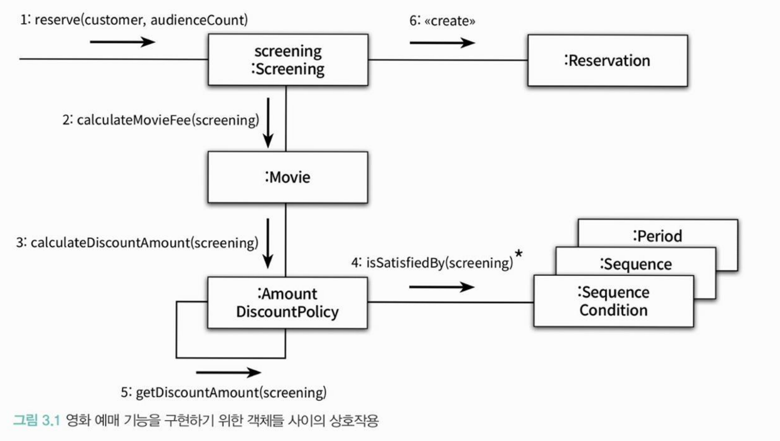
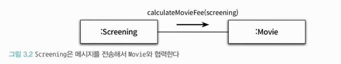

- 객체지향 패어다임의 관점에서 핵심은 **역할(role), 책임(responsibility), 협력(collaboration)** 이다.
- 클래스와 상속은 구현 매커니즘일 뿐

 

## ❐ 1. 협력 

---

### 🌀 1-1. 영화 예매 시스템 돌아보기

> 영화 시스템 예시

- 객체들이 애플리케이션 기능을 구현하기 위해 수행하는 상호작용을 **협력**이라고 한다.
- 객체가 협력에 참여하기 위해 수행하는 로직을 **책임**이라고 부른다.
- 객체들이 협력 안에서 수행하는 책임들이 모여 객체가 수행하는 **역할**을 구성한다.

 

### 🌀 1-2. 협력

> 협력이란?

- 협력은 객체지향의 세계에서 기능을 구현할 수 있는 유일한 방법
- 객체들은 **메시지 전송**을 통해 서로 소통한다.
- 메시지를 수신한 객체는 메서드를 실행해 요청에 응답한다.
  - 객체가 메시지를 처리할 방법을 스스로 선택한다.

 

> 예시

- 발신자 : `Screening`
- 메시지 : `calculateMovieFee(...)`
- 수신자 : `Movie`

 

> 정리

- 객체들 사이의 협력을 구성하는 일련의 요청/응답의 흐름을 통해 애플리케이션 기능이 구현된다.
  
 

### 🌀 1-3. 협력이 설계를 위한 문맥을 결정한다.

> 객체가 가질 수 있는 '행동'을 결정하는 기준은?

- **협력 안에서 객체가 처리할 메시지로 결정된다.**
- 협력이 바뀌면 행동도 바뀐다.

 

> 그렇다면 '객체의 상태'를 결정하는 기준은? 

- **객체가 행동하는데 필요한 정보에 의해 결정된다.**
- 객체는 스스로 결정하고 관리하는 자율적인 존재이기 때문
- Movie를 예로 들면...
  - 행동 : 요금 계산
  - 상태(행동을 수행하는데 필요한 정보) : fee, discountPolicy

 

> 정리하면.. 

- 객체가 참여하는 협력이 객체를 구성하는 행동과 상태를 모두 결정한다.
- 따라서, 협력은 객체를 설계하는 일종의 문맥(context)을 제공한다.

 

## ❐ 2. 책임

---

