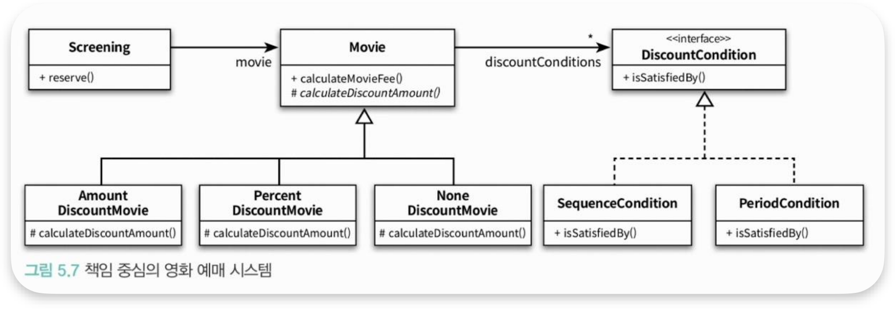

<br>

### ❐ 1. 책임 주도 설계를 향해

---

<div class="notice-box chapter" markdown="1">
데이터 중심 설계에서 책임 중심의 설계로 전환되기 위해서는 다음의 두 원칙을 따라야 한다.
- 데이터보다 행동을 먼저 결정하라
- 협력이라는 문맥 안에서 책임을 결정하라
</div>

<br>

####  1-1. 데이터 보다 행동을 먼저 결정하라

> 객체를 설계하기 위한 질문 순서

- 객체가 수행해야 하는 책임에 대해서 먼저 고민하고, 그 책임을 수행하는 데 필요한 데이터가 무엇인지 고민하라. 

<br>

####  1-2. 협력이라는 문맥 안에서 책임을 결정하라

> 협력을 시작하는 주체는 메시지 전송자

- 협력에 적합한 책임이란, **메시지 전송자**에게 적합한 책임을 의미한다.
- 즉, 객체가 메시지를 선택하는 것이 아니라 메시지가 객체를 선택하게 해야 한다.
- 객체를 가지고 있기 때문에 메시지를 보내는 것이 아니고, 메시지를 전송하기 때문에 객체를 갖게 된 것이다.

<br>
<br>

### ❐ 2. 책임 할당을 위한 GRASP 패턴

---

<div class="notice-box chapter" markdown="1">
GRASP(General Responsibility Assignment Software Pattern) 패턴
- *일반적인 책임할당 소프트웨어 패턴*의 약자
- 객체에게 책임을 할당할 때 지침으로 삼을 수 있는 원칙들의 집합을 패턴 형식으로 정리한 것
</div>

<br>

####  2-1. 도메인 개념에서 출발하기

> 도메인 개념

- 설계를 시작하기 전에 도메인에 대한 개략적인 모습을 그려 보는 것이 유용하다.
- 어떤 책임을 할당해야 할 때 가장 먼저 고민해야 하는 유력한 후보는 바로 도메인 개념이다.
- 시작하는 단계에서는 개념들의 의미와 관계가 정확하거나 완벽할 필요는 없다.
- 도메인 개념을 정리하는데 너무 많은 시작을 들이지 말고 빠르게 설계와 구헌을 진행하라.

<br>

> 올바른 도메인은 존재하지 않는다.


- 2장과 5장에서 보여주는 도메인 모델은 다르다.
  - 2장 : 할인 정책이라는 개념이 하나의 독립적인 개념으로 분리돼 있음.
  - 5장 : 할인 정책이라는 개념이 영화의 종류로 표현되어 있음.
- 그렇다면 어느 쪽이 올바른 도메인 모델일까?
  - 정답 : **둘 다** (두 도메인 모두 올바른 구현을 이끌어낼 수만 있는 경우에만)  

<br>

> 도메인 모델과 구현

- 도메인 모델과 구현은 **무관하지 않다.**
- 도메인 모델은 도메인을 개념적으로 표현한 것이지만, **그 안에 포함된 개념과 관계는 구현의 기반이 돼야 한다.**

<br>

####  2-2. 정보 전문가에게 책임을 할당하라.

> GRASP 첫 번째 원칙 : INFORMATION EXPERT(정보 전문가) 패턴

- 책임을 수행할 정보를 가지고 있는 객체에게 책임을 할당하라.
  - 정보 ≠ 데이터
  - 정보를 알고 있다고 해서 저장할 필요까진 없기 때문
- 이 패턴을 따르면
  - 정보와 행동을 최대한 가까운 곳에 위치시키기 때문에 **캡슐화를 유지**할 수 있다.
  - 필요한 정보를 가진 객체들로 책임이 분산되기 때문에 더 **응집력 있고, 이해하기 쉬워진다.**
  - 결과적으로 결합도가 낮아져서 간결하고 유지보수하기 쉬운 시스템을 구축할 수 있다. 

<br>

####  2-3. 높은 응집도와 낮은 결합도

> GRASP 두 번째 원칙 : LOW COUPLING 패턴 & HIGH COHESION 패턴

- 이 원칙은 설계를 진행하면서 책임과 협력의 품질을 검토하는데 사용할 수 있는 중요한 평가 기준 

<br>

> LOW COUPLING 패턴

- 설계의 전체적인 결합도가 낮도록 설계하라.
- 현재의 책임 할당을 검토하거나, 여러 설계 대안들이 있을 때 **낮은 결합도를 유지할 수 있는 설계를 선택**하라.

<br>

> HIGH COHESION 패턴

- 높은 응집도를 유지할 수 있게 책임을 할당하라
- 현재의 책임 할당을 검토하거나, 여러 설계 대안들이 있을 때 **높은 응집도를 유지할 수 있는 설계를 선택**하라.

<br>

####  2-4. 창조자에게 객체 생성을 할당하라

> GRASP 세 번째 원칙 : CREATOR 패턴

- 객체를 생성할 책임을 어떤 객체에게 할당할지에 대한 지침을 제공한다.
- 이미 존재하는 객체 사이의 관계를 이용하기 때문에 **설계가 낮은 결합도를 유지**할 수 있게 한다.

<br>

> 예제. Reservation의 creator 'Screening'

```java
public class Screening {
    private Movie movie;
    private int sequence;
    private LocalDateTime whenScreened;

    public Reservation reserve(Customer customer, int audienceCount) {
        return new Reservation(customer, this, calculateFee(audienceCount), audienceCount);
    }
    
    //...
}
```
- `Screening`은 
  - 예매 정보를 생성 하는데 필요한 영화, 상영 시간, 상영 순번 등의 정보에 대한 전문가이다. 
  - 예매 요금을 계 하는 데 필수적인 `Movie`에 알고 있다. 
- Reservation의 creator로 `Screening`을 선택하는 것이 적절해 보인다.

<br>
<br>

### ❐ 3. 구현을 통한 검증

---

####  3-1. 변경의 이유는 하나여야 한다. 

> 코드를 통해 변경의 이유를 파악할 수 있는 방법 

1. 인스턴스 변수가 초기화되는 시점을 잘 확인하라.
   - 응집도가 낮은 클래스는 일부는 초기화되고, 일부는 초기화 되지 않는다.
   - 함께 초기화되는 속성을 기준으로 코드를 분리해야 한다.

2. 메서드들이 인스턴스 변수를 사용하는 방식을 살펴보는 것이다.
   - 메서들이 사용하는 속성에 따라 그룹이 나뉜다면 클래스의 응집도가 낮다고 볼 수 있다.
   - 속성 그룹과 해당 그룹에 접근하는 메서드 그룹을 기준으로 코드를 분리해야 한다.

<br>

> GRASP 네 번째 원칙 : POLYMORPHISM(다형성) 패턴

- 객체의 타입에 따라 변하는 행동이 있다면 타입을 분리하고 변화하는 행동을 각 타입의 책임으로 할당하라
- 하나의 클래스가 여러 타입의 행동을 구현하고 있는 것처럼 보인다면<br>
  클래스를 분해하고 이 패턴에 따라 책임을 분산하라. 

<br>

> GRASP 다섯 번째 원칙 : PROTECTED VARIATION(변경 보호) 패턴

- 변화가 예상되는 불안정한 지점들을 식별하고 그 주위에 안정된 인터페이스를 형성하도록 책임을 할당하라.  
- 예측 가능한 변경으로 인해 여러 클래스들이 불안정해진다면<br>
  이 패턴에 따라 안정적인 인터페이스 뒤로 변경을 캡슐화하라.

<br>

> 도메인 구조가 코드의 구조를 이룬다. 




- 도메인 모델은 단순히 설계에 필요한 용어를 제공하는 것을 넘어 코드의 구조에도 영향을 미친다.
- 여기서 강조하는 것은 **변경 역시 도메인 모델의 일부라는 것**
- 따라서 **구현을 가이드 할 수 있는 모델을 선택하라.**
   
<br>

####  3-2. 변경과 유연성

> 변경에 대비할 수 있는 두 가지 방법

1. 코드를 이해하고 수정하기 쉽도록 최대한 단순하게 설계하는 것
   - 대부분의 경우 좋은 방법
2. 코드를 수정하지 않고도 변경을 수용할 수 있도록 코드를 더 유연하게 만드는 건
   - 유사한 변경이 반복적으로 발생하고 있다면 이 방법이 더 좋음  

<br>

> 의존성은 유연성 관리의 문제 

- 요소들 사이의 의존성 정도가 유연성의 정도를 결정한다.
- 유연성의 정도에 따라 결합도를 조절할 수 있는 능력은 개발자가 갖춰야하는 중요한 기술 중 하나.

<br>
<br>

### ❐ 4. 책임주도 설계의 대안

---

####  4-1. 메서드 응집도

> 응집도가 낮은 메서드는...

- 로직의 흐름을 이해하기 위해 주석이 필요한 경우가 대부분

<br>

> 응집도가 높은 메서드는...

- 전체적인 흐름을 이해하기 쉽워진다.
- 변경 가능한 설계를 이끌어 내는 기반이 된다.

<br>

####  4-2. 객체를 자윯적으로 만들자

- 자신이 소유하고 있는 데이터를 자기 스스로 처리하도록 만드는 것이 자율적인 객체를 만드는 지름길이다. 

