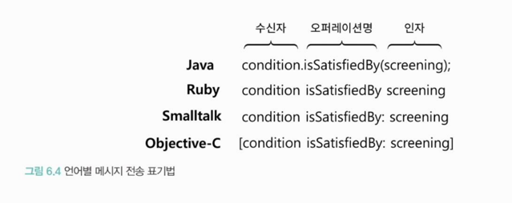
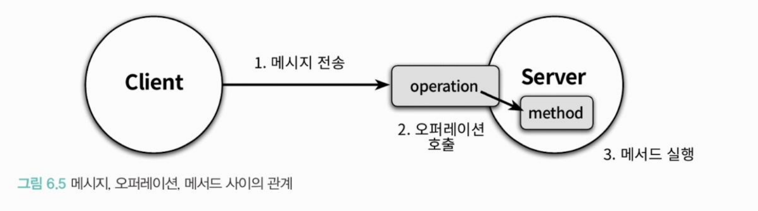

- **클래스는 단지 구현 도구**일 뿐 지나치게 집착하면 경직되고 유연한 설계를 할 수 없음.
- 훌륭한 객체지향 코드를 얻기 위해서는 클래스가 아니라 **객체에 집중**해야 함.

 

### ❐ 1. 협력과 메시지

---

####  1-1. 클라이언트 서버 모델

> 클라이언트-서버 모델

- 협력 안엔서 메시지를 보내는 쪽을 클라이언트, 수신하는 쪽을 서버라고 한다.

 

> 클라이언트와 서버를 동시에 수행하는 객체

- 대부분의 사람들은 객체가 수신하는 메시지의 집합에만 초점을 맞춤
- 하지만 협력에 객체를 설계하기 위해서는 외부에 전송하는 메시지의 집합도 함께 고려해야 함.
  
- 요점은 객체가 독립적으로 수행할 수 있는 것보다 더 큰 책임을  
  수행하기 위해서는 다른 객체와 협력해야 한다는 것이다.

 

####  1-2. 메시지와 메시지 전송

> 메시지와 메시지 전송 

- 메시지 : 객체들이 협력하기 위해 사용할 수 있는 유일한 의사소통 수단
- 메시지 = `오퍼레이션명(operation name) + 인자(argument)` 
- 메시지 전송/패싱 = `메시지 + 메시지 수신자(receiver)`
  - 한 객체가 다른 객체에게 도움을 요청하는 것 

 

####  1-3. 메시지와 메서드

> 메서드

- 메시지를 수신했을 때 실제로 실행되는 함수 또는 프로시저
- 실행 시점에 메시지와 메서드를 바인딩하는 메커니즘은 
  두 객체 사이의 결합도를 낮춤으로써 유연하고 가능한 코드를 작성할 수 있게 만든다. 

 

####  1-4. 퍼블릭 인터페이스와 오퍼레이션

> 퍼블릭 인터페이스

- 객체가 의사소통을 위해 외부에 공개하는 메시지의 집합

 

> 오퍼레이션

- 퍼블릭 인터페이스에 포함된 메시지
- 수행 가능한 어떤 행동에 대한 추상화
- 구현 코드는 제외하고 단순히 메시지와 관련된 시그니처를 가리키는 경우가 대부분

 

> 프로그래밍 언어의 관점에서...

- 객체가 다른 객체에게 메시지를 전송하면 런타임 시스템은 메시지 전송을 오퍼레이션 호출로 해석
- 메시지를 수신한 객체의 실제 타입을 기반으로 적절한 메서드를 찾다 실행

 

####  1-5. 시그니처

> 시그니처

- 오퍼레이션이나 메서드의 명세를 나타낸 것
- 이름과 인자 목록을 포함

 

####  1-6. 코드 예시

> Screening & Movie 

| 용어                   | 코드에서의 예                                                          | 설명                                  |
| -------------------- | ---------------------------------------------------------------- | ----------------------------------- |
| **메시지(Message)**     | `movie.calculateMovieFee(this)`                                  | 송신자(Screening)가 수신자(Movie)에게 보내는 요청 |
| **오퍼레이션(Operation)** | `calculateMovieFee(Screening)`                                   | Movie가 제공하는 추상적 서비스(인터페이스)          |
| **메서드(Method)**      | Movie 내부의 `calculateMovieFee` 구현부                                | 오퍼레이션의 실제 구현                        |
| **퍼블릭 인터페이스**        | `reserve`, `getWhenScreened`, `getSequence`, `calculateMovieFee` | 외부 객체가 전송 가능한 메시지의 집합               |
| **시그니처(Signature)**  | `calculateMovieFee(Screening screening)`                         | 메서드명 + 파라미터 목록                      |

 
 

### ❐ 2. 인터페이스와 설계 품질

---

####  2-1. 퍼블릭 인터페이스의 품질에 영향을 미치는 원칙과 기법

> 디미터 법칙

- 협력하는 객체의 내부 구조에 대한 결합으로 인해 발생하는 설계 문제를 해결하기 위해 제안된 원칙
- 협력하는 클래스의 캡슐화를 지키기 위해 접근해야 하는 요소를 제한한다.
  - 디미터 법칙은 캡슐화를 다른 과점에서 표현한 것
  - 클래스를 캡슐화하기 위해 따라야 하는 구체적인 지침을 제공하기 때문에 가치가 있음. 
- 기차 충돌 (train wreck)
  - 클래스의 내부 구현이 외부로 노출됐을 때 나타나는 전형적인 형태
  - 메시지 수신자의 캡슐화는 무너지고, 메시지 전송자가 메시시 주신자의 내부 구현에 강하게 결합됨.
  - ex. `screening.getMovie().getDiscountConditions();`
- 객체가 자기 자신을 책임지는 자율적인 존재여야 한다는 사실을 강조한다.
- 하지만
  - 무비판적으로 디미터 법칙을 수용하면 퍼블릭 인터페이스 관점에서 객체의 응집도가 낮아질 수 있음.

 

> 묻지 말고 시켜라 (Tell, Don't Ask)

- 객체의 외부에서 해당 객체의 상태를 기반으로 결정을 내리는 것은 객체의 캡슐화를 위반한다.
- 객체의 정보를 이용하는 행동을 객체의 외부가 아닌 내부에 위치시키기 때문에 
  자연스럽게 **정보**와 **행동**을 동일한 클래스 안에 두게 된다.
- 단순히 객체에게 시킨다고 해서 모든 문제가 해결되는 것은 아니다.
  - 결국엔 인터페이스가 구현을 드러내선 안 되고, 객체가 무엇을 하는지(의도와 결과)를 서술해야 한다

 

> 의도를 드러내는 인터페이스

1. 메서드가 작업을 어떻게 수행하는지를 나타내도록 이름 지어라.
2. '어떻게'가 아니라 '무엇'을 드러내라. (메서드의 내부 구현을 설명하는 이름을 지어라)
   - 객체가 협력 안에서 수행해야 하는 책임에 관해 고민해야 한다.
   - 인터페이스로 ‘의도’를 추상화하면 더 유연해진다
   - 잘못된 메서드 명 : isSatisfiedByPeriod(), isSatisfiedBySequence()

 

####  2-2. 함께 모으기

> 정리

- 디미터 법칙
  - 객체 간의 협력을 설계할 때 캡슐화를 위반하는 메시지가 인터페이스에 포함되지 않도록 제한한다.
- '묻지 말고 시켜라' 원칙
  - 디미터 법칙을 준수하는 협력을 만들기 위한 스타일을 제시한다.
- '의도를 드러내는 인터페이스' 원칙
  - 객체의 퍼블릭 인터페이스에 어떤 이름이 드러나야 하는지에 대한 지침을 제공한다. 
  - 결과적으로 코드의 목적을 명확하게 커뮤니케이션할 수 있게 해준다.

