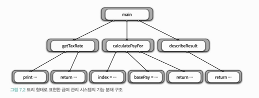

<br>

### ❐ 1. 프로시저 추상화와 데이터 추상화

---

<div class="notice-box chapter" markdown="1">
_프로그래밍 페러다임이란?_
- 적절한 추상화의 윤곽을 따라 시스템을 어떤 식으로 나눌 것인지 결정하는 원칙과 방법의 집합
</div>

<br>

####  1-1. 프로시저 추상화와 데이터 추상화 비교하기  

> 현대적 프로그래밍 언어의 특징

- “무엇을 해야 하는지(프로시저 추상화)”와 “무엇을 알아야 하는지(데이터 추상화)”라는 두 추상화 메커니즘을 제공
- 각 추상화를 기준으로 시스템을 나누는 방식이 프로그래밍 패러다임을 결정한다.

<br>

> 시스템을 분해하는 방법

- 프로시저 추상화를 중심으로 한 전통적 방식 → 기능 분해(알고리즘 분해)
- 데이터 추상화 중심 → 추상 데이터 타입(ADT)과 객체지향(클래스+다형성)

<br>

> 프로그래밍 언어의 관점에서 객체지향

- 데이터를 중심으로 '데이터 추상화'와 '프로시저 추상화'를 **통합한 객체**를 이용해 **시스템을 분해하는 방법**  
- 이런 객체를 구현하기 위해 대부분의 객체지향 언어는 **"클래스"** 라는 도구를 지원한다.

<br>
<br>

### ❐ 2. 프로시저 추상화와 기능분해 

---

####  2-1. 메인 함수로서의 시스템

> 프로시저 추상화란?

- 반복적으로 실행되거나 거의 유사하게 실행되는 작업들을 하나의 장소에 모아놓음으로써<br> 
  로직을 재사용하고 중복을 방지할 수 있는 추상화 방법 
- 내부의 상세 구현을 모르더라도 인터페이스만 알면 프로시저를 사용할 수 있음.
- 따라서 프로시저는 잠재적으로 정보은닉의 가능성을 제시하지만,<br>
  이것만으로 효과적인 정보은닉체계를 구축하는데 한계가 있음.

<br>

> 하향식 접근법(Top-Down Approach)

- 시스템을 구성하는 가장 최상위 기능을 정의하고, 이 최상위 기능을 좀 더 작은 단계의 하위 기능으로 분해해 나가는 방법

- 전통적인 기능 분해는 하향식 접근을 따른다. 
  1. 시스템의 최상위 기능을 한 문장으로 정의한다. 
  2. 그 문장을 더 구체적인 하위 기능들로 계속 쪼갠다. 
  3. 더 이상 쪼갤 수 없을 정도(프로그래밍 언어로 바로 구현 가능한 수준)까지 세분화한다.

- 각 단계에서:
  - 하위 기능은 상위 기능보다 더 구체적이고 덜 추상적이어야 한다. 
  - 전체 구조는 트리로 표현할 수 있다, 
    - 루트: 메인 함수(최상위 기능)
    - 자식 노드: 상위 기능을 구현하기 위한 절차 단계들


<br>

####  2-2. 급여관리 시스템

> 급여 계산을 위한 모든 절차


- 기능 분해의 결과
  - 최상위 기능을 수행하는 데 필요한 절차들을 실행되는 시간 순서에 따라 나열한 것.
- 기능 분해 방법에서는 기능을 중심으로 필요한 데이터를 결정한다.
  - 기능이 우선이고, 데이터는 기능을 뒤따른다.

<br>

> 기능 구현



- 직원의 급여를 계산한다.
  1. 사용자로부터 소득세율을 입력 받는다.
     - "세율을 입력하세요 : " 라는 문장을 화면에 출력한다.
     - 키보드를 통해 세율을 입력 받는다.
  2. 지원의 급여를 계산한다.
     - 전역 변수(employees, basePays)에 저장된 직원의 기본급 정보를 얻는다.
     - 급여를 계산한다.
  3. 양시에 맞게 결과를 출력한다.

```ruby
def main(name)
end
```

```ruby
def getTaxRate()
    print("세율을 입력하세요.")
    return gets().chomp().to_f
end
```

```ruby
def calculatePayFor(name, taxRate)
    index = $employees.index(name)
    basePay = $basePays[index]
    return basePay - (basePay * taxRate)
end
```

```ruby
def describeResult(name, pay)
    return "이름: #{name}, 급여: #{pay}"
end
```

<br>

####  2-3. 하향식 기능 분해의 문제점

> 하나의 메인 함수라는 비현실적 아이디어

- 실제 시스템은 하나의 메인 함수로 구성되지 않음 
- 시간이 지나면서 여러 동등한 수준의 기능들이 추가됨 
- 새 기능 추가 시마다 메인 함수를 계속 수정해야 함 (메인함수의 빈번한 재설계)
- "실제 시스템에 정상(top)이란 존재하지 않는다" - 버트랜드 마이어

<br>

> 비즈니스 로직과 사용자 인터페이스의 결합

- 기능 분해는 처음부터 입력/출력 방식을 함께 고민하게 만듦
- "소득세율을 입력받아 급여를 계산한 후 결과를 화면에 출력"에는 비즈니스 로직과 UI 로직이 혼재 
- 사용자 인터페이스는 자주 변경되지만, 비즈니스 로직은 상대적으로 안정적 
- UI 변경이 비즈니스 로직까지 영향을 미치는 구조

<br>

> 성급하게 결정된 실행 순서

- 하향식 접근법은 "무엇(what)"이 아닌 **"어떻게(how)"에 먼저 집중**
- **시간적 제약(temporal constraint)**을 강조 → 함수 실행 순서를 미리 결정 
- 중요한 제어 구조 결정이 상위 함수에 집중되는 중앙집중 제어 스타일
- 기능을 추가하거나 변경하는 작업은 매번 기존에 결정된 함수의 제어구조를 변경하도록 만든다.
  - 해결법 : **논리적 제약(logical constraint)**을 설계의 기준으로 삼기.

<br>

> 재사용성의 부재

- 하향식 설계와 관련된 모든 문제의 원인은 **결합도**다.
- 하위 함수는 항상 상위 함수가 강요하는 문맥에 종속적
- 재사용을 위해서는 일반성이 필요하지만, 하향식 분해의 하위 함수는 더 구체적
- 각 함수가 특정 문맥에 강하게 결합되어 다른 곳에서 사용 불가

<br>

> 데이터 변경으로 인한 파급효과

- **가장 심각한 문제**: 어떤 데이터를 어떤 함수가 사용하는지 추적 불가능
- 데이터 변경 시 영향받는 모든 함수를 찾아 수정해야 함
  - 이것은 '의존성', '결합도', '테스트'의 문제
- 예제: 아르바이트 직원 타입 추가 시
  - `$employees`, `$basePays` 외에 `$hourlys`, `$timeCards` 추가 (데이터 수정)
  - `calculatePay` 함수 수정 
  - `sumOfBasePays` 함수도 영향받지만 놓치기 쉬움 → 버그 발생!

<br>

####  2-4. 언제 하향식 분해가 유용한가?

> 결과적으로 하향식 분해는...

- 설계가 어느정도 안정화된 후에는 설계의 다양한 측면을 논리적으로 설명하고 문서화하기에 용이하기 때문
- 작은 프로그램과 개별 알고리즘을 위해서는 유용한 패더라임
- 그러나 실제로 동작하는 커다란 소프트웨어를 설계하는 데 적합한 방법은 아님.  
- 이 방식으로 설계된 소프트웨어는 하나의 함수에 제어가 집중되기 때문에 확장이 어려움. 


