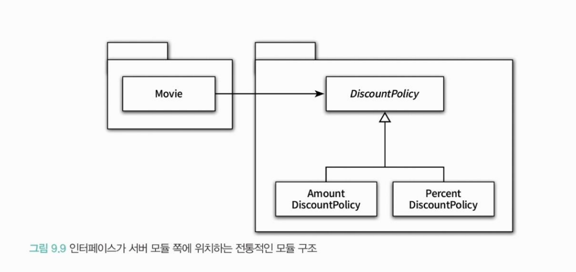
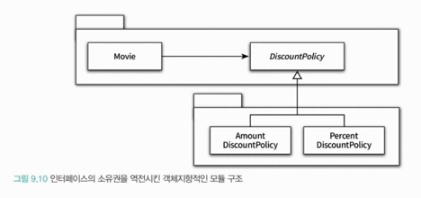

<div class="notice-box chapter" markdown="1">
8장에서 배운 기법들을 원칙이라는 관점에서 정리하는 챕터
</div>

<br>

### ❐ 1. 개방-패쇄 원칙
 
---

####  1-1. 개방-패쇄 원칙

> 개방-패쇄 원칙란?

- 소프트웨어 객체는 확장에 열려있어야 하고, 수정에 대해서는 닫혀 있어야 한다.
- 여기서 핵심은 **확장**과 **수정**
  - 확장에 대해 열려있어야 한다.
    - 요구사항이 변경될 떄 이 변경에 맞게 새로운 `동작`을 추가해서 기능을 확장시킬 수 있다.
  - 수정에 대해 닫혀있다.
    - 기존의 코드를 수정하지 않고도 애플리케이션의 동작을 추가하거나 변경할 수 있다.

<br>

####  1-2. 컴파일타임 의존성을 고정시키고 런타임 의존성을 변경하라

> 의존성 관점에서 OCP를 다르는 설계란?

- **컴파일타임 의존성은 유지하면서 런타임 의존성의 가능성을 확장하고 수정할 수 있는 구조**

<br>

####  1-3. 추상화가 핵심이다.

> OCP의 핵심은 추상화에 의존하는 것이다.

- OCP의 관점에서 '생략되지 않고 남겨지는 부분'은 다양한 상황에서의 공통점을 반영한 추상화의 결과물

```java
public abstract class DiscountPolicy { 
    private List<DiscountCondition> conditions = new ArrayList<>();
    
    public DiscountPolicy(DiscountCondition... conditions) {
        this.conditions = Arrays.asList(conditions);
    }
    
    public Money calculateDiscountAmount(Screening screening) { 
        for (DiscountCondition each : conditions) {
            if (each.isSatisfiedBy(screening)) { 
                return getDiscountAmount (screening); 
            }
        }
        return screening.getMovieFee(); 
    } 
    
    // 상속을 통해 구체화함으로써 할인 정책을 확장할 수 있다.
    abstract protected Money getDiscountAmount(Screening Screening);
}
```
- 언제라도 추상화의 생략된 부분을 채워넣음으로써 새로운 문맥에 맞게 기능을 확장할 수 있다.
- 따라서 추상화는 설계의 확장을 가능하게 한다.

<br>

> OCP 원칙에서 폐쇄를 가능하게 하는 것은 의존성의 방향이다. 

- OCP의 “폐쇄”는 변경의 영향이 어떤 경계를 넘지 않도록 막는 것
  - 그걸 가능하게 하는 유일한 수단이 **의존성 방향을 뒤집는 것**이다.
- 수정에 대한 영향을 최소화하기 위해서는 모든 요소가 추상화에 의존해야 한다. 
  - 이 말이 **무조건 인터페이스를 써라!**는 아니다.
  - 정확히 말하면, **변경 가능성이 있는 축에 대해 안쪽 정책(상위 모듈)이 바깥 구현(하위 모듈)에 의존하지 말라**
- 의존성 화살표는 항상 안쪽(정책) → 추상화로만 향해야 한다.
    ```markdown
    비즈니스 규칙
       ↓
    추상화 (인터페이스)
       ↑
    구현 기술
    ```

<br>

> 추상화를 했다고 해서 모든 수정에 대해 설계가 폐쇄되는 것은 아니다!

- 변경에 의한 파급효과를 최대한 피하기 위해서는 **변하는 것**과 **변하지 않는 것**이 무엇인지를<br>
  이해하고 이를 추상화의 목적으로 삼아야만 한다.
- 추상화가 수정에 대해 닫혀 있을 수 있는 이유는 변경되지 않을 부분을 신중하게 결정하고<br>
  올바른 추상화를 주의 깊게 선택했기 때문이다.

<br>
<br>

### ❐ 2. 생성 사용 분리

---

####  2-1. 엉뚱한 곳에서 생성하는 객체

> 문제는 부적절한 곳에서 객체를 생성한다는 것. 

- 객체 생성은 필할 수는 없다. 어딘가에서 반드시 객체를 생성해야 한다.
- 그런데 결합도가 높아지게 객체를 생성하면 OCP 원칙을 따르는 구조를 설계하기가 어려워진다.

<br>

> 생성과 사용을 분리하라.


- 유연하고 재사용 가능한 설계를 원한다면 객체와 관련된 두 가지 책임을 서로 다른 객체로 분리해야 한다.
- 하나는 객체를 생성하는 것이고, 다른 하나는 객체를 사용하는 것이다.

<br>

####  2-2. FACTORY 추가하기

> FACTORY란?


- 생성과 사용을 분리하기 위해 객체 생성에 특화된 객체
- (내 생각)복잡한 객체 생성의 경우엔 Factory가 유의미할 듯.

<br>

####  2-3. 순수한 가공물에게 책임 할당하기

> 표현적 분해(representation decomposition)

- 도메인에 존재하는 사물 또는 개념을 표현하는 객체들을 이용해 시스템을 분해하는 것.
- 목적: 
  - 도메인 모델에 담겨 있는 개념과 관계를 따르며 도메인과 소프트웨어 사이의 **표현적 차이를 최소화**하는 것
  - 따라서 표현적 분해는 객체지향 설계를 위한 가장 기본적인 접근법

<br>

> 행위적 분해(behavioral decomposition)

- 모든 책임을 도메인 객체에게 할당하면 아래와 같은 심각한 문제점에 봉착하게 될 가능성이 높아진다.
  - 낮은 응집도
  - 높은 겹합도
  - 재사용성 저하
- 이런 경우 도메인 개념을 표현한 객체가 아닌 설계자가 편의를 위해 임의로 만들어낸<br>
  가상의 객체에게 책임을 할당해서 문제를 해결해야 한다. → 순수한 가공물(Pure Fabrication)
- 어떤 행동을 추가하려고 하는데 이 행동을 책임질 마땅한 도메인 개념임 존재하지 않는다면<br>
  Pure Fabrication을 추가하고 이 객체에게 책임을 할당하라.
- 따라서 Pure Fabrication은 표현적 분해보다는 **행위적 분해에 의해 생성되는 것이 일반적**이다.

<br>
<br>

### ❐ 3. 의존성 주입

---

####  3-1. 의존성 주입

> 의존성 주입이란?

- 사용하는 객체가 아닌 외부의 독립적인 객체가 인스턴스를 생성한 후 이를 전달해서 의존성을 해결하는 방법
- 의존성 주입은 의존성을 해결하기 위해 의존성을 객체의 퍼블릭 인터페이스에 명시적으로 드러내서<br> 
  외부에서 필요한 런타임 의존성을 전달할 수 있도록 만드는 방법을 표괄하는 명칭

<br>

> 의존성 해결

- 의존성 해결은 컴파일타임 의존성과 런타임 의존성의 차이점을 해소하기 위한 다양한 메커니즘을 포괄한다.
- 왜 ‘차이점을 해소’라고 하나?
  - 코드에는 “인터페이스 A를 쓴다”라고만 적혀 있지만, 실제로는 “구현체 A1인지 A2인지”를<br>
    런타임에 선택해야 하므로, 컴파일타임과 런타임 사이에 ‘빈칸’이 생긴다.
  - 이 빈칸을 생성자 주입, 팩토리, DI 컨테이너 같은 메커니즘으로 채워서, 추상적인 타입 의존을<br>
    구체적인 객체 의존으로 이어 주는 행위를 “컴파일타임·런타임 의존성의 차이를 해소하는 것”
  - 즉 의존성 해결이라고 부를 수 있다.

<br>

> 의존성을 해결하는 3가지 방법

1. 생성자 주입(constructor injection)
   - 객체를 생성하는 시점에 생성자를 통한 의존성 해결
2. setter 주입
   - 객체 생성 후 setter 메서드를 통한 의존성 해결
3. 메서드 주입
   - 메서드 실행 시 인자를 이용한 의존성 해결

<br>

####  3-2. 숨겨진 의존성은 나쁘다.,

> Service Locator 패턴

- 의존성을 해결할 객체들을 보관하는 일종의 저장소다
- 외부에서 객체에게 의존성을 전달하는 의존성 주입과 달리<br>
  객체가 직접 Service Locator에게 의존성을 해결해줄 것을 요청한다.
- 가장 큰 단점
  - **의존성을 감춘다는 것.**

<br>

> 숨겨진 의존성의 문제점

- 의존성을 이해하기 위해 코드의 내부 구현을 이해할 것을 강요한다.
- 의존성의 대상을 설정하는 시점과 의존성이 해결되는 시점을 멀리 떨어트려 놓는다.
- 따라서 숨겨진 의존성은 **캡슐화를 위반**한다.

<br>

> 의존성을 숨기는 코드의 단점

- 디버깅이 어려움.
- 테스트 작성 어려움.

<br>

> 의존성 주입은.. 

- 필요한 의존성을 클래스의 퍼블릭 인터페이스에 명시적으로 드러낸다.
- 의존성을 이해하기 위해 코드 내부를 읽을 필요가 없기 때문에 의존성 주입은 객체의 캡슐을 단단한게 보호한다.
- 의존성과 관련된 문제도 최대한 컴파일타임에 잡을 수 있다.
  - 필요한 의존성을 인자에 추가하지 않을 경우 컴파일 에러가 발생하기 때문이다. 

<br>

> 그럼 언제 Service Locator 패턴을 쓸 수 있을까

- 의존성 지원 프레임워크를 사용하지 못하는 경우
- 깊은 호출 계층에 걸쳐 동일한 객체를 계속해서 전달해야 하는 고통을 견디기 어려운 경우

<br>
<br>

### ❐ 4. 의존성 역전 원칙

---

####  4-1. 추상화와 의존성 역전

> 상위 수준의 클래스가 하위 수준의 클래스에 의존하게 되면..

- 상위 수준의 클래스를 재사용할 때 하위 수준의 클래스도 변경이 필요하기 때문에 재사용이 어려움.
- 결국 가장 중요한건 **추상화에 의존**하라. 

<br>

> 의존성 역전(DIP, Dependency Inversion Principal)이란?

- 상위 수준의 정책(비즈니스)이 하위 수준의 구현에 의존하지 않고, 둘 다 추상화에 의존하도록 의존성의 방향을 바꾸는 것

<br>

####  4-2. 의존성 역전 원칙과 패키지

> 인터페이스의 소유권

- 객체지향 프로그래밍 언어에서 어떤 구성 요소의 소유권을 결정하는 것은 모듈이다.
  - 자바는 패키지를 이용해 모듈을 구현한다.

<br>

> 인터페이스가 서버 모듈 쪽에 위치하는 전통적인 모듈 구조



- 위 그림은 OCP 원칙과 의존성과 DIP를 모두 준수하고 있음.
- 그럼 문제가 뭐냐?
  - 🔥Movie를 다양한 컨텍스트에서 재사용할 때, 불필요한 클래스들이 Movie와 함께 배포되어야 한다!
  - `Movie → DiscountPolicy` 이기 때문에 Movie를 정상적으로 컴파일하기 위해서, DiscountPolicy가 필요하다.

<br>

> 이렇게 되면 어떤 기술적 문제가 생기는가

1. DiscountPolicy가 포함된 패키지 안의 어떤 클래스가 수정됨.
2. 패키지 전체가 재배포
3. 이로 인해 이 패키지를 의존하는 Movie 클래스가 포함된 패키지도 재컴파일 대상
4. 만약 Movie에 의존하는 또 다른 패키지가 있다면, 컴파일은 의존성을 타고 전파됨.
5. 결과적으로 불필요한 클래스들을 같은 패키지에 두게되면 **빌드 시간을 가파르게 상승** 시킴

<br>

> 인터페이스의 소유권을 이전시킨 객체지향적인 모듈 구조 



- 추상화를 별도의 독립적인 패키지가 아니라 클라이언트가 속한 패키지에 포함시켜야 한다.
- 의존성 역전 원칙에 따라 상위 수준의 협력 흐름을 재사용하기 위해서는<br>
  **추상화가 제공하는 인터페이스의 소유권 역시 역전시켜야 한다.**

<br>

> 정리

- 유연하고 재사용 가능하면 컨텍스트에 독립적인 설계는 전통적인 패러다임이 고수하는 의존성의 방향을 역전시킨다.
- 객체지향 패러다임에서는 
  - 상위 수준 모듈과 하위 수준 모듈이 **모두 추상화에 의존**한다.
  - 인터페이스가 상위 **수준 모듈**에 속한다.
- 훌륭한 객체지향 설계를 위해서는 의존성을 역전시켜야 한다.

<div class="notice-box info" markdown="1">
_**의존성 역전은**_ 
- “구현을 바꾸기 쉬운 구조”가 아니라 
- “상위 정책의 협력을 구현 변화로부터 완전히 독립시키는 구조”를 만드는 것이다.

<br>

_**인터페이스 소유권 역전은**_ 
- 의존성 역전 원칙을 패키지·빌드 단위까지 일관되게 적용한 결과다. 
</div>

<br>
<br>

### ❐ 5. 유연성에 대한 조언

---

####  5-1. 유연한 설계는 유연성이 필요할 때만 옳다.

> 유연하고 재사용 가능한 설계란?

- 런타임 의존성과 컴파일타임 의존성의 차이를 인식하고 동일한 컴파일타임 의존성으로부터<br>
  다양한 런타임 의존성을 만들 수 있는 코드 구조를 가지는 설계를 의미한다.

<br>

> 유연하고 재사용 가능한 설계가 항상 좋은건 아니다.

- 설계의 미덕은 단순함과 명료함이다.
- 오히려 변경하기 쉽고 확장하기 쉬운 구조를 만들다가 단순함과 명료함을 버리게될 수 있다. 

<br>

> 변경은 예상이 아니라 현실이어야 한다.

- 정보가 제한적인 상황에서 아래의 질문에 대답하는 것은 심리에 가깝다.
  - 이 설계가 복잡한 이유는 무엇일까?
  - 어떤 변경에 대비하기 위해 설계를 복잡하게 만들었는가?
  - 정말 유연성이 필요한가?
- 미래에 변경이 일어날지도 모른다는 **막연한 불안감은 불필요하게 복잡한 설계를 낳는다.**
  - 아직 일어나지 않은 변경은 변경이 아니다. 

<br>

> 유연성은 항상 복잡성을 수반한다.

- 유연하지 않은 설계는 단순하고 명확하다.
- 유연한 설계는 복잡하고 암시적이다.
  - 설계가 유연할 수록 클래스 구조와 객체 구조사이의 거리는 점점 멀어진다.
- 유연한 설계를 단순하고 명확하게 만드는 유일한 방법 → 긴밀한 커뮤니케이션 뿐.
- 불필요한 유연성은 불필요한 복잡성을 낳는다.
  - 단순하고 명확한 해법이 그런대로 만족스럽다면 유연성을 제거하라.

<br>

####  5-2. 협력과 책임이 중요하다.

> 객체의 협력과 책임이 중요하다.

- 설계를 유연하게 만들기 위해서는 협력에 참여하는 객체가 다른 객체에게 어떤 메시지를 전송하는지가 중요하다.
- 중요한 비즈니스 로직을 처리하기 위해 책임을 할당하고 협력의 균형을 맞추는 것이<br>
  객체 생성에 관한 책임을 할당하는 것보다 우선이다.
- 객체를 생성하는 방법에 대한 결정은 모든 책임이 자리를 잡은 후 가장 마지막 시점에 내리는 것이 적절하다.

<br>

> 정리

- 의존성을 관리해야 하는 이유는 **역할, 책임, 협력의 관점**에서 설계가 유연하고 재사용 가능하게 해야하기 때문이다.
- 따라서 `역할, 책임, 협력`에 먼저 집중하라.
