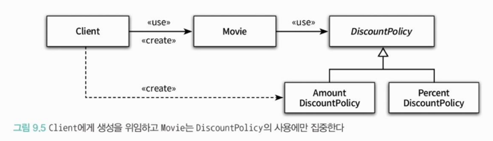
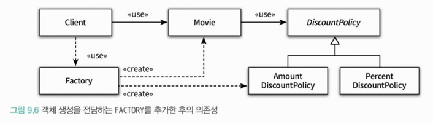

<div class="notice-box chapter" markdown="1">
- 8장에서 배운 기법들을 원칙이라는 관점에서 정리하는 챕터
</div>

<br>

### ❐ 1. 개방-패쇄 원칙
 
---

####  1-1. 개방-패쇄 원칙

> 개방-패쇄 원칙란?

- 소프트웨어 객체는 확장에 열려있어야 하고, 수정에 대해서는 닫혀 있어야 한다.
- 여기서 핵심은 **확장**과 **수정**
  - 확장에 대해 열려있어야 한다.
    - 요구사항이 변경될 떄 이 변경에 맞게 새로운 `동작`을 추가해서 기능을 확장시킬 수 있다.
  - 수정에 대해 닫혀있다.
    - 기존의 코드를 수정하지 않고도 애플리케이션의 동작을 추가하거나 변경할 수 있다.

<br>

####  1-2. 컴파일타임 의존성을 고정시키고 런타임 의존성을 변경하라

> 의존성 관점에서 OCP를 다르는 설계란?

- **컴파일타임 의존성은 유지하면서 런타임 의존성의 가능성을 확장하고 수정할 수 있는 구조**

<br>

####  1-3. 추상화가 핵심이다.

> OCP의 핵심은 추상화에 의존하는 것이다.

- OCP의 관점에서 '생략되지 않고 남겨지는 부분'은 다양한 상황에서의 공통점을 반영한 추상화의 결과물

```java
public abstract class DiscountPolicy { 
    private List<DiscountCondition> conditions = new ArrayList<>();
    
    public DiscountPolicy(DiscountCondition... conditions) {
        this.conditions = Arrays.asList(conditions);
    }
    
    public Money calculateDiscountAmount(Screening screening) { 
        for (DiscountCondition each : conditions) {
            if (each.isSatisfiedBy(screening)) { 
                return getDiscountAmount (screening); 
            }
        }
        return screening.getMovieFee(); 
    } 
    
    // 상속을 통해 구체화함으로써 할인 정책을 확장할 수 있다.
    abstract protected Money getDiscountAmount(Screening Screening);
}
```
- 언제라도 추상화의 생략된 부분을 채워넣음으로써 새로운 문맥에 맞게 기능을 확장할 수 있다.
- 따라서 추상화는 설계의 확장을 가능하게 한다.

<br>

> OCP 원칙에서 폐쇄를 가능하게 하는 것은 의존성의 방향이다. 

- OCP의 “폐쇄”는 변경의 영향이 어떤 경계를 넘지 않도록 막는 것
  - 그걸 가능하게 하는 유일한 수단이 **의존성 방향을 뒤집는 것**이다.
- 수정에 대한 영향을 최소화하기 위해서는 모든 요소가 추상화에 의존해야 한다. 
  - 이 말이 **무조건 인터페이스를 써라!**는 아니다.
  - 정확히 말하면, **변경 가능성이 있는 축에 대해 안쪽 정책(상위 모듈)이 바깥 구현(하위 모듈)에 의존하지 말라**
- 의존성 화살표는 항상 안쪽(정책) → 추상화로만 향해야 한다.
    ```markdown
    비즈니스 규칙
       ↓
    추상화 (인터페이스)
       ↑
    구현 기술
    ```

<br>

> 추상화를 했다고 해서 모든 수정에 대해 설계가 폐쇄되는 것은 아니다!

- 변경에 의한 파급효과를 최대한 피하기 위해서는 **변하는 것**과 **변하지 않는 것**이 무엇인지를<br>
  이해하고 이를 추상화의 목적으로 삼아야만 한다.
- 추상화가 수정에 대해 닫혀 있을 수 있는 이유는 변경되지 않을 부분을 신중하게 결정하고<br>
  올바른 추상화를 주의 깊게 선택했기 때문이다.

<br>
<br>

### ❐ 2. 생성 사용 분리

---

####  2-1. 엉뚱한 곳에서 생성하는 객체

> 문제는 부적절한 곳에서 객체를 생성한다는 것. 

- 객체 생성은 필할 수는 없다. 어딘가에서 반드시 객체를 생성해야 한다.
- 그런데 결합도가 높아지게 객체를 생성하면 OCP 원칙을 따르는 구조를 설계하기가 어려워진다.

<br>

> 생성과 사용을 분리하라.



- 유연하고 재사용 가능한 설계를 원한다면 객체와 관련된 두 가지 책임을 서로 다른 객체로 분리해야 한다.
- 하나는 객체를 생성하는 것이고, 다른 하나는 객체를 사용하는 것이다.

<br>

####  2-2. FACTORY 추가하기

> FACTORY란?



- 생성과 사용을 분리하기 위해 객체 생성에 특화된 객체
- (내 생각)복잡한 객체 생성의 경우엔 Factory가 유의미할 듯.

<br>

####  2-3. 순수한 가공물에게 책임 할당하기

> 표현적 분해(representation decomposition)

-

<br>

> 행위적 분해(behavioral decomposition)

- 
