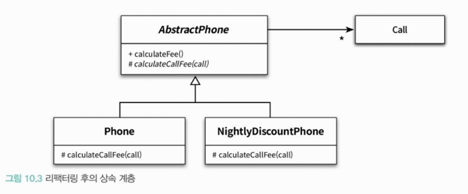

<div class="notice-box chapter" markdown="1">
10장에서는 클래스를 재사용하기 위해 새로운 클래스를 추가하는 기법인 **상속**에 대해 학습한다.
재사용 과점에서 상속이란, 클래스 안에 정의된 인스턴스 변수와 메서드를 자동으로 새로운 클래스에
추가하는 구현기법이다.
</div>

### ❐ 1. 상속과 중복 코드

---

####  1–1. DRY(Don't Repeat Yourself) 원칙

> DRY 원칙이란? 

- 모든 지식은 시스템 내에서 단일하고, 애매하지 않고, 정말로 믿을 만한 표현 양식을 가져야 한다.
- `Once and only once` 원칙 또는 `단일 지점 제어(Single Point Control)` 원칙이라고도 부른다. 

<br>

####  1-2. 중복과 변경

> 중복 코드는 새로운 중복 코드를 부른다. 

- 중복 코드를 제거하지 않은 상태에서 코드를 수정할 수 있는 유일한 방법은 새로운 중복 코드를 추가하는 것 뿐이다.
- 새로운 중복 코드를 추가하는 과정에서 코드의 일관성이 무너질 위험이 있다.
- 중복 코드가 늘어날수록 애플리케이션은 변경에 취약해지고 버그가 발생할 가능성이 높아진다. 

<br>

####  1-3. 상속을 이용해서 중복 코드 제거하기

> 상속은 결합도를 높인다.

- 오히려 상속이 코드를 수정하기 어렵게 만든다.
- 상속 관계로 연결된 자식 클래스가 부모 클래스의 변경에 취약해지는 현상을 `취약한 기반 클래스 문제`라고 부른다. 

<br>
<br>

### ❐ 2. 취약한 기반 클래스 문제

---

####  2-1. 문제점

> 캡슐화를 악화시키고 결합도를 높인다.

- 상속은 부모 클래스의 구현 세부사항에 의존하도록 하기 때문에 캡슐화를 약화시킨다.  
- 상속은 코드의 재사용을 위해 캡슐화의 장점을 희석시키고 구현에 대한 결합도를 높임으로써,<br> 
  객체지향이 가진 강력함을 반감시킨다.

<br>

####  2-2. 불필요한 인터페이스 상속 문제

> java.util.Stack 

- 자바의 초기 버전에서 상속을 잘못 사용한 대표적인 사례
- 요소의 추가, 삭제 오퍼레이션을 제공하는 Vector를 재사용하기 위해 Stack을 Vector의 자식 클래스로 구현
- 이게 왜 문제가 되는가
  - Stack에게 상속된 Vector의 퍼블릭 인터페이스를 이용하면 임의의 위치에 요소를 추가하거나 삭제할 수 있게됨.
  - 따라서 맨 마지막 위치에서만 요소를 추가하거나 제거할 수 있도록 허용하는 Stack의 규칙을 쉽게 위반할 수 있다.

<br>

####  2-3. 메서드 오버라이딩의 오작용 문제 

> InstrumentedHashSet

- HashSet의 내부에 저장된 요소의 수를 셀 수 있는 기능을 추가한 클래스(HashSet의 자식 클래스)
- 아래 코드의 결과는?
    ```java
    InstrumentedHashSet<String> languages = new InstrumentedHashSet<>();
    languages.addAll(Arrays.asList("Java", "C++", "Python");
    ```
    - 3이라고 생각하겠지만 `6`임.
    - 이유는 부모 클래스인 HashSet의 addAll 메서드 안에서 add 메서드를 호출하기 때문이다.
    - `InstrumentedHashSet#addAll` -> `HashSet#addAll` -> `HashSet#add`

<br>

> 조슈아 블로치는...

- 클래스가 상속되기를 원한다면 상속을 위해 클래스를 설계하고 문서화해야 한다.
- 이렇게 안할거면 상속을 금지시켜야 한다.

<br>

<div class="notice-box warning" markdown="1">
_**상속을 위한 경고**_
1. 자식 클래스의 메서드 안에서 super 참조를 이용해 부모 클래스의 메서드를 직접 호출하면, `강겹합`된다.
<br>
2. 상속받은 부모 클래스의 메서드가 **자식 클래스의 내부 구조에 대한 규칙을 깨트릴 수 있다.**
<br>
3. 자식 클래스가 부모 클래스의 메서드를 오버라이딩할 경우,
   부모 클래스가 자신의 메서드를 사용하는 방법에 자식 클래스가 결합될 수 있다.
<br>
4. 클래스를 상속하면 결합도록 인해 자식 클래스와 부모 클래스의 구현을 영원히 변경하지 않거나,
   자식 클래스와 부모 클래스를 동시에 변경하거나 둘 중 하나를 선택할 수밖에 없다.
</div>

<br>
<br>

### ❐ 3. Phone 다시 살펴보기

---

####  3-1. 추상화에 의존하자 

> 저자가 코드 중복을 제거하기 위해 상속을 도입할 때 따르는 두 가지 원칙

- 두 메서드가 유사하게 보인다면 차이점을 메서드로 추출하라.
- 부모 클래스의 코드를 하위로 내리지 말고 자식 클래스의 코드를 상위로 올려라.

<br>

> 차이를 메서드로 추출하라

- 가장 먼저 할 일 : 중복 코드 안에서 차이점을 별도의 메서드로 추출하는 것 

<br>

> 중복 코드를 부모 클래스로 올려라 



- 자식 클래스들 사이의 공통점을 부모 클래스로 옮김으로써 실제 코드를 기반으로 상속 계츠을 구성할 수 있다.

<br>

> 추상화가 핵심이다.

- 부모 클래스(AbstractPhone)도 추상화에 의존한다고 할 수 있다.
    ```java
    public abstract class AbstractPhone {
        private List<Call> calls = new ArrayList<>();
        
        public Money calculateFee() {
            Money result = Money.ZERO;
            for (Call call : calls) {
                result = result.plus(calculateCallFee(call));
            }
            return result;
        }
        
        abstract Money calculateCallFee(Call call);
    }
    ```
- 상속 계층이 코드를 진화시키는 데 걸림돌이 된다면 추상화를 찾아내고 상속 계층안의 클래스들이<br> 
  그 추상화에 의존하도록 코드를 리팩터링하라.
- 차이점을 메서드로 추출하고 공통적인 부분은 부모 클래스로 이동하라.

<br>
<br>

### ❐ 4. 차이에 의한 프로그래밍

---

####  4-1. 차이에 의한 프로그래밍

> 차이에 의한 프로그래밍(Programming by difference)이란?

- 정의
  - 기존 코드와 다른 부분만을 추가함으로써 애플리캐이션의 기능을 확장하는 방법
- 목표
  - 중복 코드를 제거하고 코드를 재사용하는 것
