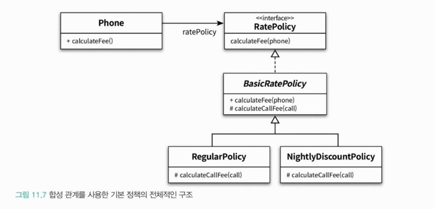
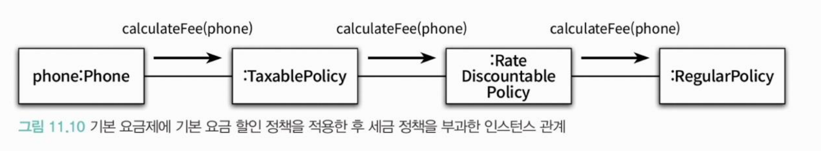
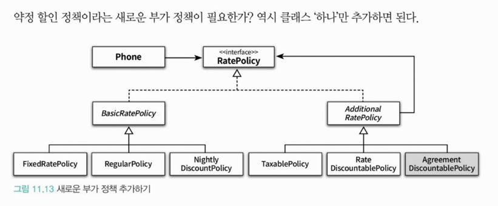

<div class="notice-box chapter" markdown="1">
상속과 합성은 재사용 대상이 다르다.
상속은 부모 클래스 안에 구현된 코드 자체를 재사용하지만 
합성은 포함되는 객체의 퍼블릭 인터페이스를 재사용한다.
</div>

<br>

### ❐ 1. 상속을 합성으로 변경하기

---

####  1-1. 불필요한 인터페이스 상속 문제

- [10장](https://gilbert9172.github.io/posts/book-object-chap10/)에서 살펴본 내용

<br>
<br>

### ❐ 2. 상속으로 인한 조합의 폭발적인 증가

---

####  2-1. 상속으로 부터 생기는 문제

> 클래스 폭발 (Class Explosion) or 조합의 폭발(Combinational Explosion)

- 상속의 남용으로 하나의 기능을 추가하기 위해 필요 이상으로 많은 수의 클래스를 추가해야 하는 경우
- 이 문제는 자식 클래스가 부모 클래스의 구현에 강하게 결합되도록 강요하는 상속의 근본적인 한계 때문에 발생하는 문제다.

<br>
<br>

### ❐ 3. 합성 관계로 변경하기

---

####  3-1. 합성

> 합성의 특징

- 구현이 아닌 퍼블릭 인터페이스에 대해서만 의존할 수 있기 때문에 컴파일타임에 객체의 관계를 변경하 수 있다.
- 조합을 구성하는 요소들을 개별 클래스로 구현한 후 실행 시점에 인스턴스를 조립하는 방법을 사용하는 것.

<br>

####  3-2. 기본 정책 합성하기

> RatePolicy & Phone

```java
// RatePolicy.java
public interface RatePolicy {
    Money calculateFee(List<Call> calls);
}
```
- Phone이 다양한 요금 정책과 협력할 수 있어야 하므로 요금 정책 인터페이스를 정의

<br>

```java
// Phone.java
public class Phone {
    private RatePolicy ratePolicy;
    private List<Call> calls = new ArrayList<>();
    
    public Phone(RatePolicy ratePolicy) {
        this.ratePolicy = ratePolicy;
    }
    
    pulbic List<Call> getCalls() {
        return calls;
    }
    
    public Money calculateFee() {
        return ratePolicy.calculateFee(calls);
    }
}
```
- Phone 내부에 RatePolicy에 대한 참조가 포함되어 있다. → 합성

<br>

> 합성 관계를 사용한 기본 정책의 전체적인 구조



<br>

####  3-3. 부가 정책 적용하기

> 부가정책을 추가하기 예시



- 부가 정책은 기본 정책에 대하나 계산이 끝난 후에 적용된다.
- 부가 정책은 기본 정책이나 다른 부가 정책의 인스턴스를 참조할 수 있어야 한다.
- 부가 정책은 기본 정책과 동일한 RatePolicy 인터페이스를 구현해야 한다.

<br>

> 부가 정책 구현하기

```java
public abstract class AdditionalRatePolicy implements RatePolicy {
    private RatePolicy next;
    
    public AdditionaRatePolicy(RatePolicy next) {
        this.next = next;
    }
    
    @Override
    public Money calculateFee(Phone phone) {
        Money fee = next.calculateFee(phone);
        return afterCalculated(fee);
    }
    
    abstract protected Money afterCalculated(Money fee);
}
```

<br>

> 새로운 정책 추가하기



- 요구사항을 변경하기 위해서 오직 하나의 클래스만 추가했다.

<br>

####  3-4. 객체 합성이 클래스 상속보다 더 좋은 방법이다.

> 합성을 쓰자

- 상속 좋음. 근데 코드 재사용을 위한 우아한 해결책은 아니다.
- 합성은 객체의 인터페이스를 재사용한다.

<br>

> 그럼 상속을 쓰지 말라는 것인가?

- 우선 상속을 `구현 상속`과 `인터페이스 상속`의 두 가지로 나누어 이해해라.
  - 참고로 이번 장에서 살펴본 상속에 대한 모든 단점들은 구현 상속에 국한된다. 
  - 인터페이스 상속은 13장에서 자세히...

<br>
<br>

### ❐ 4. 믹스인

---

####  4-1. 믹스인이란

> 정의

- 객체를 생성할 때 코드 일부를 클래스 안에 섞어 넣어 재사용하는 기법.
- 믹스인은 컴파일 시점에 필요한 코드 조각을 조합하는 재사용 방법.
- 코드 재사용에 특화된 방법이면서 상속과 같은 결합도 문제를 초래하지 않는다.
- 이해하기 쉽게 정리하면
  - 특정 기능을 담은 클래스를 다른 클래스에 섞어서(mix in) 사용하기 위한 재사용 단위
  - is-a 관계를 만들고 싶지는 않지만, 기능은 재사용하고 싶을 때 상속대신 사용하는 패턴

<br>

> 핵심 아이디어

- 기능은 상속이 아니라 조합(Combination) + 인터페이스로 제공하자
- 자바에서는 보통 아래 2가지로 구현한다.
  1. 인터페이스 + default 메서드
  2. 위임(delegation) 객체 조합

<br>

####  4-2. 예제로 이해하기

> Timestamp 기능 믹스인 (기능 조합 목적)

```java
public interface Timestamped {

    LocalDateTime getCreatedAt();

    void setCreatedAt(LocalDateTime time);

    default void markCreated() {
        setCreatedAt(LocalDateTime.now());
    }
}
```
```java
public class User implements Timestamped {

    private LocalDateTime createdAt;

    @Override
    public LocalDateTime getCreatedAt() {
        return createdAt;
    }

    @Override
    public void setCreatedAt(LocalDateTime time) {
        this.createdAt = time;
    }
}
```
```java
User user = new User();
user.markCreated(); // 믹스인 기능 사용
```
- `User`는
  - `Timestamped이다(is-a)`라고 말하고 있는게 아니라
  - `Timestamped` 기능을 가진다(has-a)에 가깝다.

<br>

> 다중 기능 조합 방식

```java
public interface SoftDeletable {

    boolean isDeleted();
    void setDeleted(boolean deleted);

    default void delete() {
        setDeleted(true);
    }
}
```
```java
public class Article implements Timestamped, SoftDeletable {
    //...
}
```

<br>

####  4-3. 믹스인은 정리.

> 정리 

- 모든 믹스인은 인터페이스이지만, 모든 인터페이스가 믹스인은 아니다.
- 문법적으로 is-a, 의미적으로 has-a인 경우가 믹스인이다.
- 믹스인은 이분법이 아니라, 스펙트럼이다.

| 분류             | 예시                           | 특징             |
| -------------- | ---------------------------- | -------------- |
| 🔴 강한 믹스인      | Timestamped, SoftDeletable   | 횡단 관심사, 부가 기능  |
| 🟡 약한 믹스인 (경계) | Comparable, ComparableEntity | 도메인 규칙 + 기능 조합 |
| 🔵 타입 인터페이스    | PaymentProcessor             | 다형성, 정체성       |

<br>

> 근데 그냥 추상화라고 부르면 안됨..? 굳이 믹스인이라고 해야하나...

- 믹스인이라는 용어가 필요한 상황은
  - "이 인터페이스는 타입을 만들기 위한 게 아니라 기능을 여러 클래스에 섞기 위한 용도다” 라는 의도를 강조하고 싶을 때
- 걍 실무에서는 추상화, 인터페이스 이렇게 말하면 될듯
  - 그리고 추상화를 구현하거나, 합성을 통해서 사용하니깐 믹스인이라는걸 생각안할거 같음.
