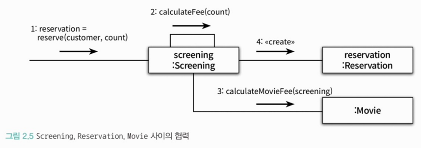
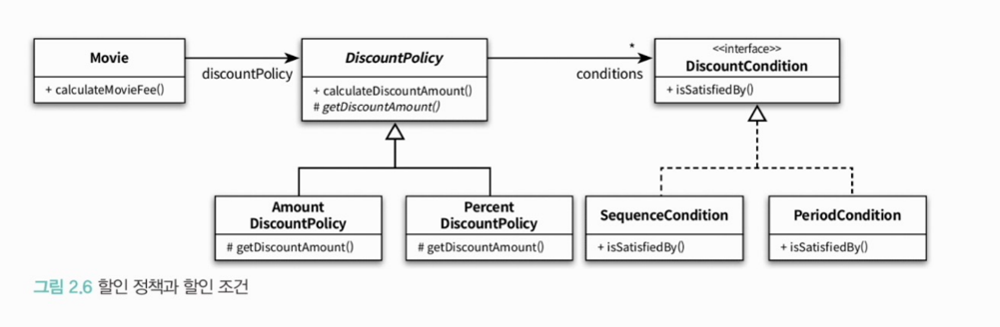
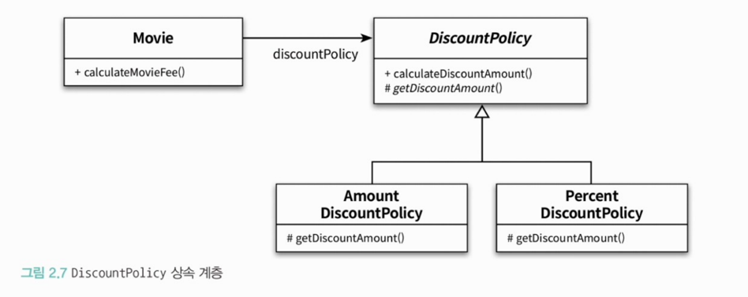
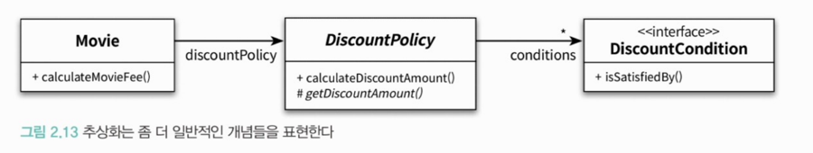

<br>

## ❐ 1. 영화 예매 시스템

---

### 🌀 1-1. 요구사항 살펴보기

> 용어 정리 

- 영화 : 영화에 대한 기본정보를 표현
- 상영 : 실제로 관객들이 영화를 관람하는 사건을 표현

<br>

> 요금 할인 관련

- 할인 조건 : 할인 여부 결정
  - 순서 조건
  - 기간 조건
- 할인 정책 : 할인 요금 결정 (1개 이하만 가능)
  - 금액 할인 정책
  - 비율 할인 정책

<br>

## ❐ 2. 객체지향 프로그래밍을 향해 

---

### 🌀 2-1. 협력, 객체, 클래스

> 진정한 객체지향 페러다임으로의 전환 : 클래스가 아닌 객체에 초점을 맞춰라.

- 어떤 객체가 필요한지 고민하라.
- 객체를 독립적인 존재가 아닌, 기능을 구현하기 위해 협력하는 공동체의 일원으로 봐라.

<br>

### 🌀 2-2. 도메인의 구조를 따르는 프로그램 구조

> 도메인 

- 문제를 해결하기 위해 사용자가 프로그램을 사용하는 분야


<br>

### 🌀 2-3. 클래스 구현하기

> 클래스의 경계를 구분지어라.

- 왜? 
  - 경계의 명확성이 객체의 자율성을 보존하기 때문.
  - (더 중요한 포인트) 프로그래머에게 구현의 자유를 제공하기 때문.

<br>

> 자율적인 객체

- 객체 내부에 대한 접근을 통제하는 이유는 객체를 자율적인 존재로 만들기 위해함이다.
- 자율적인 객체를 위해 우리는 캡슐화, 접근 제어 메커니즘을 사용한다.
- **인터페이스와 구현의 분리 원칙**은 훌륭한 객체지향 프로그래밍을 만들기 위해 따라야하는 핵심 원칙
  - 인터페이스 : 외부에서 접근 가능한 부분 
  - 구현 : 외부에서 접근할 수 없는 내부 동작
- 이 원칙은 인터페이스(외부 계약)는 그대로 두고 구현(내부 로직)만 바꾸어도 외부 코드(클라)는 아무 영향을 받지 않음.

<br>

> 프로그래머의 자유

- 두 종류의 프로그래머 
  - 클래스 작성자 (class creator)
    - 새로운 클래스(데이터 타입)를 만드는 사람 
    - 내부 구현을 어떻게 짤지 결정함 
  - 클라이언트 프로그래머 (client programmer)
    - 만들어진 클래스를 사용하는 사람 
    - 인터페이스만 보고 사용함
- 접근 제어(private 등)는 ‘구현 숨기기’를 위한 언어 지원장치

<br>

> 구현 은닉

- 클래스 내부 구현은 숨기고, 외부에는 인터페이스만 공개한다.

<br>

> 인터페이스와 구현을 분리하면 무엇이 좋아지는가?

- 비공개 영역(private)은 마음대로 바꿀 수 있다.
- 의존성을 줄여 유지보수성과 확장성이 크게 올라간다.
- 궁극적으로 “설계가 쉬워지고 변경이 쉬워진다” 
  - _(기억하기) 객체지향 설계의 목적 = “변경에 유연한 시스템 만들기”_

<br>

### 🌀 2-4. 협력하는 객체들의 공동체

> 협력 (Collaboration)


- 객체지향 프로그램을 작성할 때는
  1. 협력의 관점에서 어떤 객체가 필요한지를 결정
  2. 객체들의 공통 상태와 행위를 구현하기 위해 클래스를 작성

<br>

### 🌀 2-5. 협력에 관한 짧은 이야기

> 객체간 상호작용 

- 객체는 요청/응답을 할 수 있다.
- 서로 다른 객체가 상호작용을 할 수 있는 유일한 방법은? **메시지 전송**
- 수신된 메시지를 처리하는 자신만의 방법을 **메소드(method)**라고 한다.

<br>

> 메시지 ≠ 메서드

- 메시지(message) 
  - 한 객체가 다른 객체에게 "이 행동을 해달라"는 요청을 보내는 의사소통 방식.
  - 즉, 어떤 객체에게 어떤 동작을 요구하는 “신호”나 “명령”인 셈.
  - 예) `screening.reserve(...)`처럼 “예약해 줘”라는 메시지를 Screening 객체에게 전달하는 것. 
- 메서드(method)
  - 메시지를 받은 객체가 자신만의 방식으로 그 메시지를 처리하는 구체적인 알고리즘/함수.

<br>

## ❐ 3. 할인 요금 구하기

---

### 🌀 3-1. 할인 요금 구하기

```java
public abstract class DefaultDiscountPolicy implements DiscountPolicy {
    private final List<DiscountCondition> conditions;

    public DefaultDiscountPolicy(DiscountCondition... conditions) {
        this.conditions = Arrays.asList(conditions);
    }

    @Override
    public Money calculateDiscountAmount(Screening screening) {
        for(DiscountCondition each : conditions) {
            if (each.isSatisfiedBy(screening)) {
                return getDiscountAmount(screening);
            }
        }

        return Money.ZERO;
    }

    abstract protected Money getDiscountAmount(Screening Screening);
}
```

- 하나의 할인 정책은 여러 개의 할인 조건을 포함할 수 있음.

<br>

## ❐ 4. 상속과 다형성

---

### 🌀 4-1. Compile-time 의존성 vs Run-time 의존성 

> Movie는 어떤 구현체를 선택할까?


- 현재 Movie와 DiscountPolicy는 의존성을 가지고 있음. (Movie -> DiscountPolicy)
- 즉, 현재 구성도만으로는 Movie가 어떤 'DiscountPolicy 구현체'를 사용할지 알 수 없음.    

<br>

> Compile-time 의존성 ≠ Run-time 의존성

- 이는 다형성과 의존성 역전(DIP) 원칙 덕분에 가능하다.
- 컴파일 타임에는 추상화(인터페이스, 상위 타입)에만 의존하지만, 런타임 시점에는 실제 구현체가 결정된다. 
- SpringBoot의 의존성 주입(DI)이 대표적인 예다.

<br>

### 🌀 4-2. 차이에 의한 프로그래밍

> 차이에 의한 프로그래밍

- 부모 클래스와 다른 부분만을 추가해서 새로운 클래스를 쉽고 빠르게 만드는 방법 
- 상속 : 객체지향 코드를 재사용하기 위해 가장 널리 사용되는 방법

<br>

> 개인적인 생각 : 상속 별로임

- 부모에 너무 종속적임
- 그리고 변화에 굉장히 취약함.
- 상속 보다는 구성(Composition)을 사용해서 개발하는게...

<br>

### 🌀 4-3. 상속과 인터페이스

> 상속 & 인터페이스

- 인터페이스는 객체가 이해할 수 있는 **메시지의 목록을 정의**한다는 것을 기억해라.
- 상속을 통해 자식클래스는 자신의 인터페이스 + 부모의 인터페이스를 포함하게 된다.
  - 즉, 자식은 부모가 수신할 수 있는 모든 메시지를 수신할 수 있음.
  - 고로 자식과 부모는 같은 타입으로 간주함.

<br>

### 🌀 4-4. 다형성

> 다형성에 대해서...

- 다형성은
  - 객체지향 프로그램의 compile-time 의존성과 run-time 의존성이 다를 수 있음을 기반으로 한다.
  - 동일한 메시지를 수신했을 때 객체의 타입에 따라 다르게 응답할 수 있는 능력을 의미한다.
- 다형성을 구현하는 방법은 매우 다양하지만 
  - 메시지에 응답하기 위해 실행될 메서드를 컴파일 시점이 아닌 실행 시점에 결정한다는 공통점이 있다.
    
<br>

> 지연 바인딩(lazy binding) or 동적 바인딩(dynamic binding)

- 객체지향이 compile-time 의존성과 run-time 의존성을 분리하고,<br>
  하나의 메시지를 선택적으로 서로 다른 메서드에 연결할 수 있는 이유
- 다시 말해 **메시지와 메서드를 실행 시점에 바인딩한다**는 것이다. 

<br>

> 다형성이란 추상적인 개념일 뿐!

- 클래스를 상속받는 것 만이 다형성을 구현할 수 있는 유일한 방법이 아님. 
- 다른 방법들에 뭐가 있을까? 
  - 인터페이스(Interface)
  - 추상 클래스(Abstract Class)
  - 구성(Composition)과 위임(Delegation)
  - 함수형 프로그래밍의 함수 객체, 람다(Function Object, Lambda)

<br>

## ❐ 5. 추상화와 유연성

---

### 🌀 5-1. 추상화의 힘

> 추상화를 사용할 때의 장점



1. 추상화 계층만 따로 떼어놓고 보면 요구사항의 정책을 높은 수준에서 서술할 수 있다.
   - 이런 특징은 세부사항이 없음에도, **상위 개념만으로 도메인의 중요한 개념을 설명**할 수 있게 한다.
   - 상위 정책을 기술한다는 것은? 애플리케이션 협력 흐름을 기술한다는 것.
2. 설계가 유연해진다.
   - 추상화를 이용한 설계는 필요에 따라 **표현의 수준을 조정**하는 것을 가능하게 해준다.
     - 추상화 수준을 올리면 ➔ 여러 구체적인 것들을 하나의 타입으로 다루고, 변화에 유연해짐
     - 추상화 수준을 내리면 ➔ 개별적인 특성을 더 세밀하게(상세하게) 표현

<br>

### 🌀 5-2. 유연한 설계

> 일관성 있던 협력 방식이 깨지는 케이스

```java
public class Movie {
    private Money fee;
    private DiscountPolicy discountPolicy;
    
    public Money calculateDiscountAmount(Screening screening) {
        if (discountPolicy == null) {
            return fee;
        }
        
        return fee.minus(discountPolicy.calculateDiscountAmount(screening));
    }
}
```
- `discountPolicy == null` 일 때는 discountPolicy 와의 협력이 깨지게 됨.
- discountPolicy가 결정하지 않고, Movie 객체에서 그냥 `fee`를 반환함. 

<br>

> 다시 일관성 있는 협력을 하게 하려면

```java
public class NoneDiscountPolicy implements DiscountPolicy {
    @Override
    public Money calculateDiscountAmount(Screening screening) {
        return Money.ZERO;
    }
}
```
- DiscountPolicy가 결정을 하도록, 새로운 구현체를 추가하면 됨.
- 여기서 중요한 포인트
  - Movie, DiscountPolicy는 **수정하지 않았다.**
  - 단지 새로운 DiscountPolicy 구현체(`NoneDiscountPolicy`)를 추가하여 애플리케이션의 기능을 확장했다.

<br>

> 결론 

- 추상화는 구체적인 상황에 결합되는 것을 방지하기 때문에 유연한 설계를 가능하게 한다.
- **유연성이 필요한 곳**에 추상화를 사용하라.

<br>

### 🌀 5-3. 추상 클래스와 인터페이스 트레이드 오프

> 개념이 다르다면 인터페이스로 역할을 분리하라.

- AmountDiscountPolicy, PercentDiscountPolicy는 “조건을 만족하면 할인 계산을 한다”라는 공통된 개념을 가진다.
  - NoneDiscountPolicy는 개념적으로 다른 정책이다.
  - “무조건 0원을 반환한다”라는 완전히 다른 개념
- 기존 설계에서는 
  - NoneDiscountPolicy가 DiscountPolicy 추상 클래스의 구현 방식에 의존하고 있었다
  - 즉, **개념적 결합 + 잘못된 상속**
- 따라서 개념이 다른 두 역할은 상속으로 묶이지 말아야 한다.
- 해결책은 전략 패턴
  - 공통된 역할 = 인터페이스(DiscountPolicy)
  - 공통 구현 = DefaultDiscountPolicy 
  - 변화되는 구현 = 각 정책 클래스로 구조를 재정립하는 것.

<br>

### 🌀 5-4. 코드 재사용

> 상속의 문제점 (두 가지 관점에서 설계에 안좋은 영향을 미친다.)

1. 캡슐화 위반
   - 부모의 구현이 자식에게 노출
2. 설계를 유연하지 못하게 만듬.
   - 상속은 부모와 자식의 관계를 compile-time에 결정한다.
   - 따라서, 실행 시점에 객체의 종류를 변경하는 것은 불가능

<br>

> 합성

- 인터페이스에 정의된 메시지를 통해서만 코드를 재사용하는 방법 
- 합성은 위에서 언급한 상속의 두 가지 문제를 모두 해결한다.
- 상속은 클래스를 통해 강결합되어 있는데 비해, 합성은 **메시지를 통해 느슨한 결합**을 한다.
- 따라서 코드 재사용을 위해서는 상속 보다는 합성을 선호하는 것이 좋다.

<br>

> 그렇다 상속을 쓰지 말라는 건 아님.

- 다형성을 위해 인터페이스를 재사용하는 경우에는 상속과 합성을 조합해서 쓸 수 밖에 없음.
- 중복되는 로직이 모든 구현체에 필요한 경우에는 상속을 쓰는 방향


