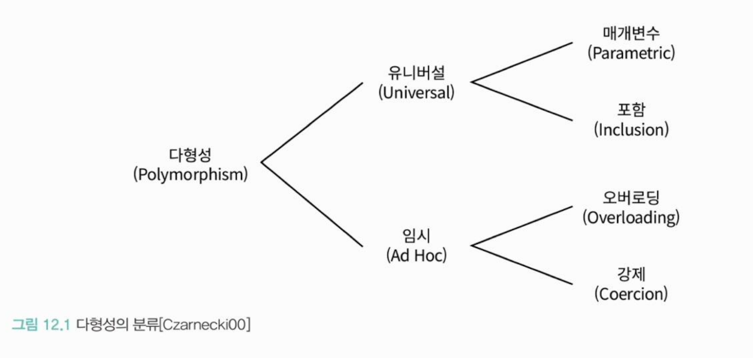
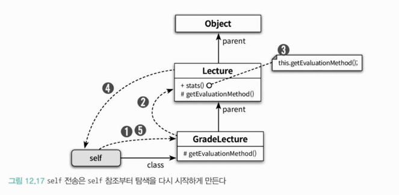

<div class="notice-box chapter" markdown="1">
상속과 합성은 재사용 대상이 다르다.
상속은 부모 클래스 안에 구현된 코드 자체를 재사용하지만 
합성은 포함되는 객체의 퍼블릭 인터페이스를 재사용한다.
</div>

<br>

### ❐ 1. 다형성

---

####  1-1. 들어가기

> 다형성이란?

- 여러 타입을 대상으로 동작할 수 있는 코드를 작성할 수 있는 방법

<br>

> 다형성의 분류



- 오버로딩 다형성
  - 하나의 클래스 안에 동일한 이름의 메서드가 존재하는 경우
- 강제 다형성
  - 서로 다른 타입을 강제 변환해서 동일한 연산을 수행
- 매개변수 다형성
  - 제네릭과 관련된 다형성 → 타입을 나중에 구체화하여 재사용 
- 포함 다형성
  - 객체지향에서 가장 대표적인 다형성
  - 메시지는 같지만, 수신 객체의 실제 타입에 따라 실행 메서드가 달라짐 
  - 일반적으로 말하는 “다형성”은 이걸 의미
  - 보통 상속 + 메서드 오버라이딩으로 구현

<br>
<br>

### ❐ 2. 상속의 양면성

---

####  2-1. 들어가기 

> 상속이 무엇이며 언제 사용해야 하는지에 대한 이해가 중요

- 객체지향의 기본 아이디어는 **데이터와 행동을 객체라는 하나의 실행 단위로 통합**하는 것
- 상속은 부모 클래스의 **데이터와 메서드(행동)**를 자식 클래스가 자동으로 포함·공유하는 메커니즘이다.
- 하지만 상속을 코드 재사용 수단으로만 보는 것은 오해다.
- 상속의 진짜 목적은 다형성을 가능하게 하는 타입 계층(type hierarchy)을 구성하는 데 있다.
- 타입 계층에 대한 고민 없이 상속을 남용하면 이해하기 어렵고 유지보수하기 힘든 코드가 된다.

<br>
<br>

### ❐ 3. 업캐스팅과 동적바인딩

---

####  3-1. 같은 메시지, 다른 메서드

> 한 줄 요약

- 같은 메시지(evaluate)를 보내도, 실제 실행되는 메서드는 객체의 실제 타입에 따라 달라진다.

<br>

> 핵심 포인트

- Professor는 Lecture 타입에만 의존 
- Professor는 lecture.evaluate()를 호출할 뿐
- 실제로는 Professor 코드는 전혀 바뀌지 않음 
  - Lecture 인스턴스 → Lecture.evaluate()
  - GradeLecture 인스턴스 → GradeLecture.evaluate()

<br>

> 왜 중요한가?

- 클라이언트(Professor)는 구현을 몰라도 된다. 
- 새로운 Lecture 하위 클래스가 추가돼도 → Professor는 수정 없음

<br>

> 메시지 중심 사고

- “어떤 메서드를 호출할까?” ❌
- “누구에게 어떤 메시지를 보낼까?” ✅

<br>

####  3-2. 업캐스팅

> 한 줄 요약

```java
Lecture lecture = new GradeLecture(...); // 업캐스팅
```
- 부모 타입 변수에 자식 객체를 넣는 것 → 객체지향 다형성의 출발점

<br>

> 특징

- 명시적 캐스팅 불필요
- 컴파일 타임에 안전
- 부모가 이해하는 메시지만 보낼 수 있음.

<br>

####  3-3. 동적 바인딩

> 한 줄 요약

- 실행할 메서드는 컴파일 시점이 아니라, 실행 시점에 “객체의 실제 타입”으로 결정된다.

<br>

> 정적 바인딩 vs 동적 바인딩

| 구분    | 정적 바인딩 | 동적 바인딩    |
| ----- | ------ | --------- |
| 결정 시점 | 컴파일 타임 | 런타임       |
| 기준    | 변수 타입  | 객체 실제 타입  |
| 대표    | 함수 호출  | 객체 메시지 전송 |

<br>

####  3-4. 세 개념의 연결 관계

> 한 문장으로 정리

- 업캐스팅 덕분에 부모 타입으로 협력할 수 있고
- 동적 바인딩 덕분에 실행 시점에 올바른 메서드가 선택되며,
- 그 결과 같은 메시지가 다른 행동으로 이어진다.

<br>
<br>

### ❐ 4. 동적 메서드 탐색과 다형성

---

####  4-1. 들어가기

> self를 기준으로 한 “동적 메서드 탐색” 흐름

1. 메시지를 받으면 
2. self가 가리키는 실제 객체의 메모리 위치로 이동 
3. 그 객체가 가리키는 class 포인터를 따라 클래스 정보 확인 
4. 그 클래스에 정의된 메서드 목록에서 탐색 시작 
5. 없으면 parent를 따라 상위 클래스로 이동

<br>

> 동적 메서드 탐색의 핵심 원리 2가지

1. 자동적인 메시지 위임
   - 자식 클래스가 메시지를 이해하지 못하면
   - 프로그래머 개입 없이
   - 자동으로 부모 클래스에게 처리를 위임한다.
2. 실행 시점에 결정되는 동적 문맥
   - 어떤 메서드를 실행할지는 컴파일 시점이 아닌 실행 시점(runtime)에 결정
   - 기준은 오직 하나 : self를 가리키는 실제 객체
    
<br>

####  4-2. 자동적인 메시지 위임

> 자동적인 메시지 위임 (핵심 개념)

- 객체가 이해하지 못하는 메시지는, 상속 계층을 따라 부모 클래스로 자동 위임된다.
- 메시지를 받은 객체가 해당 메서드를 알고 있으면 실행, 모르면 부모 클래스로 위임
- 이 과정을 적절한 메서드를 찾을 때까지 반복. 즉, `상속 계층 == 메서드 탐색 경로`

<br>

> 동적 메서드 탐색 (Dynamic Method Lookup)

```java
Lecture lecture = new GradeLecture();
lecture.evaluate();
```
- 메서드 탐색은 변수의 타입이 아니라, 실제 객체의 클래스에서 시작한다
- 탐색 순서
  1. GradeLecture 클래스에서 evaluate() 찾기
  2. 없으면 → 부모 Lecture 
  3. 없으면 → Object
  4. 끝까지 없으면 → RuntimeException 

<br>

> 이 챕터의 진짜 메시지 (중요 ⭐️)

- 메서드는 “호출”되는 게 아니라 **탐색**된다
- 상속은 코드 재사용이 아니라 **메시지 위임 구조**
- 다형성은 `if/else`가 아니라 탐색 경로를 맡기는 것. 

<br>

####  4-3. 동적인 문맥

> self가 문맥을 만든다

- self → 메시지를 “받은 객체” 
- 메서드 탐색은 항상 self의 클래스에서 시작

<br>

> 중요한 전환점: self 전송 (self send)

```java
public String stats() {
    return String.format(
        "Title: %s, Evaluation Method: %s",
        title,
        getEvaluationMethod()
    );
}
```
- 많은 사람들은 “Lecture 클래스의 getEvaluationMethod를 호출한다”라고 해석한다.
- 하지만 실제 의미는 "self에게 getEvaluationMethod 메시지를 다시 보낸다."이다.
  
<br>

> self 전송이 일어나면 **탐색이 다시 시작**된다.



- 최악의 경우에는 실제로 실행될 메서드를 이해하기 위해 상속 계층 전체를 훑어가며 코드를 이해해야 한다.

<br>

####  4-4. 이해할 수 없는 메시지

> 이해할 수 없는 메시지란? 

- 객체가 메시지를 받았는데 자기 자신도, 부모 클래스들도 그 메시지를 처리할 메서드를 가지고 있지 않은 경우

<br>

> 정적 타입 언어 vs 동적 타입 언어

- 정적
  - 컴파일 시점에 메시지 처리 가능 여부를 판단 
  - 상속 계층 전체를 컴파일러가 미리 검사
- 동적
  - 컴파일 단계 자체가 없음 
  - 메시지 처리 가능 여부는 실행 시점에만 알 수 있음

<br>

> self vs super 한 방에 비교

| 구분       | self 전송        | super 전송           |
| -------- | -------------- | ------------------ |
| 탐색 시작 위치 | 실행 시점에 동적으로 결정 | 컴파일 시점에 부모 클래스로 고정 |
| 다형성      | 매우 강함          | 제한적                |
| 목적       | 행동의 확장/변경      | 코드 재사용             |
| 안정성      | 낮음             | 높음                 |

<br>
<br>

### ❐ 5. 상속 대 위임

---

####  5-1. 위임과 self 참조

> “위임”이란 정확히 뭐고, “포워딩”과 뭐가 다른가?

- 위임(Delegation)
  - 다른 객체에게 일을 시키지만, 실행 문맥(self/this)을 유지시키는 갓
- 포워딩(Forwarding)
  - 다른 객체에게 그냥 넘김
  - 실행 문맥(self/this) 까지 유지하지 않음.

<br>

####  5-2. 프로토타입 기반의 객체지향 언어

> 자바스크립트에서 상속

- "클래스 간 관계"가 아니라 "객체 사이의 메시지 위임(prototype chain)"으로 구현된다.

<br>

> prototype 이란?

- 모든 자바스크립트 객체는 내부적으로 `Prototype 링크`를 가진다 
- 코드에서는 이것을 prototype으로 다룬다 
- 이 링크는 “부모 객체”를 가리킨다

<br>

> 클래스 기반 상속과의 정확한 대응

| 클래스 기반 언어      | 프로토타입 기반 JS            |
| -------------- | ---------------------- |
| 클래스 간 상속       | 객체 간 위임                |
| 메서드 오버라이딩      | prototype 체인 상 메서드 재정의 |
| this = 현재 인스턴스 | this = 메시지 수신 객체       |
| 정적 구조          | 동적 연결                  |
