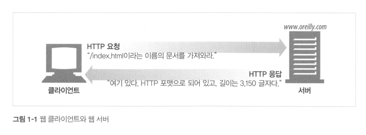

 

### ❐ 1. HTTP 개관

---

####  1-1. HTTP: 인터넷의 멀티미디어 배달부

> 간단 정리

- HTTP는 인터넷의 멀티미디어 전달부로, 이미지·HTML·텍스트·동영상·음성 등 다양한 데이터를 전 세계 웹 서버에서 사용자에게 전달한다.
- 빠르고 간단하며 정확하게 대량의 정보를 웹브라우저로 전송하는 역할을 한다.
- 신뢰성 있는 전송 프로토콜(TCP) 위에서 동작하므로, 데이터가 전송 중 손상·누락·중복될 걱정이 적다. 
- 덕분에 사용자와 개발자 모두 네트워크 오류를 크게 신경 쓰지 않고, 애플리케이션의 본질적인 기능 구현에 집중할 수 있다.

 

####  1-2. 웹 클라이언트와 서버

> 간단 정리

- 웹 서버는 인터넷의 데이터를 저장하고, HTTP 클라이언트가 요청한 데이터를 제공한다.  

 

####  1-3. 리소스

> 리소스
- 웹 서버가 **관리하고 제공하는 웹 콘텐츠의 원천**
- 가장 단순한 형태는 **정적 파일** (HTML, 텍스트, 이미지, 동영상 등)
- 반드시 파일일 필요는 없으며, **요청에 따라 콘텐츠를 생성하는 프로그램**일 수도 있음
- 사용자, 요청 정보, 시간 등에 따라 **동적으로 다른 결과를 생성**할 수 있음
- 데이터베이스 조회, 실시간 영상, 주식 거래, 전자상거래 등도 모두 리소스에 해당

 

>  미디어 타입
- HTTP는 전송되는 데이터의 형식을 **MIME 타입(Content-Type)** 으로 명시
- MIME 타입은 `주 타입/서브 타입` 형식으로 구성됨
- 웹 브라우저는 MIME 타입을 보고 **어떻게 처리할지 판단**
- 서버는 항상 응답 데이터와 함께 MIME 타입을 전송

 

> URI
- **통합 자원 식별자(Uniform Resource Identifier)**
- 웹 상의 리소스를 **고유하게 식별**하기 위한 이름
- 인터넷의 “우편 주소” 개념에 가까움
- URI에는 두 가지 종류가 있음: **URL, URN**

 

>  URL
- **통합 자원 지시자(Uniform Resource Locator)**
- 리소스의 **정확한 위치와 접근 방법**을 명시
- URI 중 가장 널리 사용되는 형태
- 일반적인 URL 구성
    - 스킴 (프로토콜): `http://`
    - 서버 주소: `www.example.com`
    - 리소스 경로: `/images/logo.gif`
- 오늘날 대부분의 URI는 URL을 의미함

 

>  URN
- **통합 자원 이름(Uniform Resource Name)**
- 리소스의 **위치와 무관한 고유한 이름**
- 리소스가 이동해도 이름이 변하지 않음
- 예: `urn:ietf:rfc:2141`
- 이론적으로 강력하지만, **위치 해석을 위한 인프라 부족**으로 널리 사용되지는 않음
- 실무에서는 대부분 URL 중심으로 사용됨

 

####  1-4. 트랜잭션

> 트랜잭션
- 클라이언트가 **웹 서버의 리소스를 요청하고 응답을 받는 한 번의 HTTP 상호작용**
- HTTP 트랜잭션은 **요청 메시지 + 응답 메시지**로 구성
- 요청에는 메서드와 URI가 포함되고, 응답에는 상태 코드와 데이터가 포함됨
- HTTP 메시지는 **구조화된 데이터 덩어리**로 전송됨

 

> 메서드
- HTTP는 서버에 **어떤 동작을 수행할지**를 메서드로 지정
- 자주 사용하는 메서드
    - GET : 서버에서 리소스를 조회
    - POST : 데이터를 서버로 전송(처리 요청)
    - PUT : 지정한 리소스를 생성 또는 수정
    - DELETE : 지정한 리소스를 삭제
    - HEAD : 본문 없이 헤더만 요청
- 메서드는 **요청의 의도를 명확히 표현**함

 

> 상태 코드
- 모든 HTTP 응답에는 **상태 코드**가 포함됨
- 요청의 성공/실패 여부와 추가 조치 필요 여부를 전달
- 대표적인 상태 코드
    - 200 : 성공
    - 302 : 리다이렉션(다른 위치로 이동)
    - 404 : 리소스를 찾을 수 없음
- 상태 코드는 숫자이며, **사유 구절(reason phrase)** 은 설명용 텍스트일 뿐 의미는 동일

 

> 웹페이지는 여러 트랜잭션으로 이루어진다
- 하나의 웹페이지를 표시하기 위해 **여러 HTTP 트랜잭션**이 필요
- HTML 문서 요청 후 이미지/CSS 등 기타 리소스를 각각 **별도의 HTTP 요청**으로 가져옴   
- 즉, 웹페이지는 단일 리소스가 아니라 **여러 리소스의 집합**

 

####  1-5. 메시지

> 메시지
- HTTP 메시지는 **요청(Request)** 과 **응답(Response)** 두 종류뿐
- 사람이 읽을 수 있는 **일반 텍스트 기반(line-based)** 구조
- 요청은 클라이언트 → 서버, 응답은 서버 → 클라이언트로 전달
- 요청과 응답 메시지의 형식은 매우 유사함

 

> 메시지의 구성
- HTTP 메시지는 **3가지 구성 요소**로 이루어짐
    1. 시작줄(Start line)
    2. 헤더(Header)
    3. 본문(Body)

 

> 시작줄
- 메시지의 **첫 번째 줄**
- 요청 메시지
    - 무엇을 할지 명시 (메서드 + 리소스 + HTTP 버전)
    - 예: `GET /tools.html HTTP/1.0`
- 응답 메시지
    - 요청 결과를 명시 (HTTP 버전 + 상태 코드 + 사유 구절)
    - 예: `HTTP/1.0 200 OK`

 

> 헤더
- 시작줄 다음에 오는 **0개 이상의 헤더 필드**
- 각 헤더는 `이름: 값` 형태
- 메시지에 대한 **부가 정보(metadata)** 전달
    - 콘텐츠 타입
    - 콘텐츠 길이
    - 클라이언트 정보 등
- 헤더 영역은 **빈 줄(CRLF)** 로 끝남

 

> 본문
- 헤더 뒤의 **실제 데이터 영역**
- 요청 본문
    - 서버로 전송할 데이터 포함 (예: 폼 데이터)
- 응답 본문
    - 클라이언트로 반환할 데이터 포함
- 텍스트뿐 아니라 **이진 데이터도 포함 가능**
    - 이미지, 동영상, 오디오, 실행 파일 등
- 본문이 없는 메시지도 존재 가능

 

> 간단한 메시지의 예
- 클라이언트는 `GET /tools.html HTTP/1.0` 요청을 전송
- 서버는 상태 코드(200 OK), 헤더, HTML 문서가 담긴 본문을 포함한 응답을 반환
- 응답 본문의 길이는 `Content-Length` 헤더로,
  데이터 형식은 `Content-Type(MIME 타입)` 으로 명시됨

 

####  1-6. TCP 커넥션

> TCP 커넥션
- HTTP 메시지는 **TCP 커넥션 위에서 전송**
- HTTP는 전송 방식의 세부 사항을 직접 처리하지 않고,
  **신뢰성 있는 데이터 전달을 TCP에 위임**
- 즉, HTTP는 “무엇을 보낼지”, TCP는 “어떻게 안전하게 보낼지”를 담당

 

> TCP/IP
- HTTP는 **애플리케이션 계층 프로토콜**
- TCP/IP는 인터넷의 핵심 전송 프로토콜 스택
- TCP가 제공하는 기능
    - 오류 없는 데이터 전송
    - 순서 보장(보낸 순서대로 도착)
    - 끊기지 않는 데이터 스트림
- HTTP는 **TCP 위에서 동작**, TCP는 **IP 위에서 동작**
- 이 구조 덕분에 네트워크·하드웨어 차이를 신경 쓰지 않아도 됨

 

> 프로토콜 계층 구조
- 구조
  - 애플리케이션 계층 : HTTP
  - 전송 계층 : TCP
  - 네트워크 계층 : IP
  - 데이터 링크 / 물리 계층 : 실제 네트워크 하드웨어
- 각 계층은 **자기 역할에만 집중**하도록 분리됨

 

> 접속, IP 주소 그리고 포트번호
- HTTP 통신 전, 클라이언트와 서버는 **TCP/IP 커넥션을 먼저 수립**
- TCP 커넥션에는 두 가지 정보가 필요
    - 서버의 IP 주소
    - 서버에서 실행 중인 프로그램의 포트 번호
- URL은 이 정보를 제공함
    - IP 주소 직접 명시 가능
    - 또는 도메인 이름(호스트명) 사용 → DNS로 IP 변환
- HTTP URL에서 포트 번호가 생략되면 **기본값 80** 사용

 

> 웹브라우저의 기본 동작 흐름
- (a) URL에서 호스트명 추출
- (b) DNS를 통해 호스트명을 IP 주소로 변환
- (c) URL에서 포트 번호 추출 (없으면 80)
- (d) 서버와 TCP 커넥션 수립
- (e) HTTP 요청 전송
- (f) HTTP 응답 수신
- (g) 커넥션 종료 후 문서 표시

 

####  1-7. 프로토콜 버전

> 프로토콜 버전
- HTTP는 **여러 버전이 공존**하며 발전해 옴
- 웹의 성장과 요구 변화에 따라 **기능 추가, 성능 개선, 구조 보완**이 반복됨
- HTTP 애플리케이션은 다양한 버전을 고려해야 함

 

> HTTP/0.9
- 1991년의 **초기 HTTP 프로토타입**
- 기능이 매우 제한적
    - GET 메서드만 지원
    - 헤더, MIME 타입, 버전 정보 없음
- 단순한 HTML 문서 전송 목적
- 곧바로 HTTP/1.0으로 대체됨

 

> HTTP/1.0
- 최초로 **널리 사용된 HTTP 버전**
- 추가된 기능
    - HTTP 버전 번호
    - 헤더
    - 추가 메서드
    - 멀티미디어 객체 처리
- 시각적으로 풍부한 웹페이지와 폼 처리 가능
- 명확한 공식 명세라기보다는
  **급성장하던 웹 환경에서의 관행 모음**에 가까움

 

> HTTP/1.0+
- 1990년대 중반, 웹의 폭발적 성장으로
  **비공식 확장 기능**들이 사실상 표준처럼 사용됨
- 대표적인 확장
    - keep-alive 커넥션
    - 가상 호스팅
    - 프락시 지원
- 이러한 확장된 형태를 관례적으로 **HTTP/1.0+**라 부름

 

> HTTP/1.1
- HTTP 설계의 **구조적 결함 수정**
- 성능 최적화 및 불필요한 기능 제거
- 더 복잡한 웹 애플리케이션과 배포 환경 지원
- 1990년대 후반부터 사용
- **현재까지 가장 널리 사용되는 HTTP 버전**

 

> HTTP/2.0
- HTTP/1.1의 **성능 문제를 개선**하기 위해 등장
- 구글의 **SPDY 프로토콜**을 기반으로 설계
- 전송 효율과 속도 개선에 초점
- 상세 내용은 이후 장에서 다룸

 

> HTTP/3.0

- [길버트 티스토리 정리본](https://gilbert9172.tistory.com/manage/newpost/48?type=post&returnURL=ENTRY)

 

####  1-8. 웹의 구성요소

> 웹의 구성요소
- 웹 애플리케이션은 **클라이언트–서버**만으로 이루어지지 않음
- HTTP 트랜잭션을 둘러싼 다양한 **중간 구성요소**들이 함께 동작
- 주요 구성요소
    - 프락시
    - 캐시
    - 게이트웨이
    - 터널
    - 에이전트

 

> 프락시
- **클라이언트와 서버 사이에 위치한 HTTP 중개자**
- 클라이언트의 요청을 받아 서버로 전달(필요 시 수정)
- 주요 목적
    - 보안 강화
    - 트래픽 제어
    - 콘텐츠 필터링
- 요청·응답을 검사 및 필터링 가능
    - 악성 코드 검사
    - 유해 콘텐츠 차단
- 사용자 대신 서버에 접근하는 역할

 

> 캐시
- **자주 요청되는 리소스를 저장하는 HTTP 저장소**
- 클라이언트 가까운 위치에 사본을 보관
- 장점
    - 응답 속도 향상
    - 서버 부하 감소
- HTTP는 캐시 제어를 위해
    - 최신성 유지
    - 프라이버시 보호
      기능을 함께 정의함

 

> 게이트웨이
- **다른 프로토콜과 연결되는 특별한 서버**
- HTTP 트래픽을 다른 프로토콜로 변환
- 클라이언트 입장에서는
    - 게이트웨이가 **일반 웹 서버처럼 보임**
- 예
    - HTTP ↔ FTP 게이트웨이
- 내부적으로는 다른 프로토콜을 사용해 리소스를 가져옴

 

> 터널
- HTTP 메시지를 **해석하지 않고 그대로 전달**
- 두 커넥션 사이에서 raw 데이터를 중계
- 주 용도
    - 비 HTTP 트래픽을 HTTP 연결 위로 전달
- 대표 사례
    - **HTTP/SSL 터널**
    - 방화벽이 HTTP만 허용하는 환경에서
      암호화된 SSL 트래픽 전달

 

> 에이전트
- **HTTP 요청을 생성하는 클라이언트 프로그램**
- 웹브라우저도 하나의 HTTP 에이전트
- 자동화된 에이전트도 존재 (웹 크롤러 / 스파이더 / 웹 로봇)
- 사용자 개입 없이
    - 웹을 탐색
    - 콘텐츠 수집
    - 검색엔진 인덱스 구축 등에 사용
