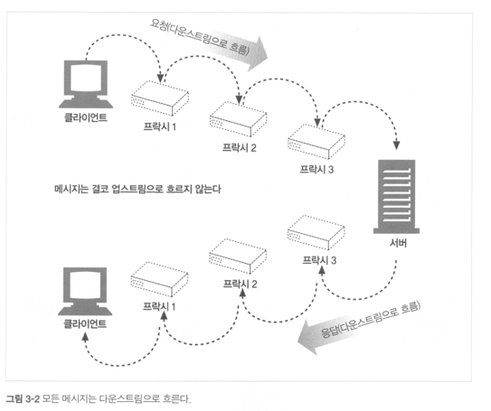
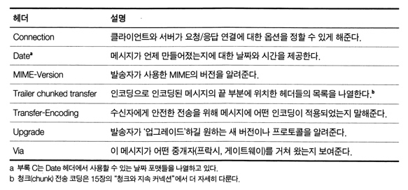

<div class="notice-box chapter" markdown="1">
- 메시지가 어떻게 흘러가는가
- HTTP 메시지의 세 부분(시작줄, 헤더, 개체 본문)
- 요청과 응답 메시지의 차이
- 요청 메시지가 지원하는 여러 기능(메서드)들
- 응답 메시지가 반환하는 여러 상태 코드들
- 여러 HTTP 헤더들은 무슨 일을 하는가
</div>

<br>

### ❐ 1. 메시지의 흐름

---

####  1-1. 메시지는 원 서버 방향을 인바운드로 하여 통신한다

> HTTP 메시지의 인바운드 / 아웃바운드 개념

- HTTP는 트랜잭션의 **방향**을 설명하기 위해 인바운드, 아웃바운드 용어를 사용한다
- 메시지가 **원 서버를 향해 이동**하면 인바운드이다
- 모든 처리가 끝난 뒤 메시지가 **사용자 에이전트로 돌아오면** 아웃바운드이다
- 중간에 프락시가 여러 개 있더라도 방향의 기준은 항상 **원 서버**이다

<br>

> 요청과 응답의 방향성

- 요청 메시지는 클라이언트에서 서버로 이동하므로 인바운드
- 응답 메시지는 서버에서 클라이언트로 이동하므로 아웃바운드
- 요청과 응답은 서로 반대 방향으로 흐르지만 하나의 트랜잭션을 이룬다

<br>

####  1-2. 다운스트림으로 흐르는 메시지

> HTTP 메시지의 업스트림 / 다운스트림 개념



- HTTP 메시지는 강물처럼 **항상 다운스트림 방향으로 흐른다**
- 메시지의 송신자는 수신자의 **업스트림**
- 메시지를 받는 쪽은 항상 **다운스트림**

<br>
<br>

### ❐ 2. 메시지의 각 부분

---

####  2-1. HTTP 메시지는 구조화된 데이터 블록이다

> HTTP 메시지의 본질

- HTTP 메시지는 단순하지만 **구조화된 데이터 블록**
- 각 메시지는 **요청** 또는 **응답** 중 하나
- 메시지는 시작줄, 헤더 블록, 본문으로 구성된다
- 본문은 선택 사항이며, 없는 경우도 있다

<br>

> 텍스트 기반 프로토콜

- 시작줄과 헤더는 줄 단위로 구분된 **ASCII 문자열**
- 각 줄은 캐리지 리턴(CR)과 개행(LF)으로 끝난다
- 견고한 구현은 CRLF가 아닌 개행 문자만 와도 처리 가능해야 한다

---

####  2-2. 메시지 문법

> 요청 메시지와 응답 메시지

- 모든 HTTP 메시지는 요청 메시지 또는 응답 메시지
- 요청 메시지는 서버에게 동작을 요구
- 응답 메시지는 요청 처리 결과를 클라이언트에게 반환
- 두 메시지는 구조는 같고 **시작줄 문법만 다르다**

<br>

####  2-3. 시작줄

> 요청줄(Request Line)

- 서버에게 **무엇을 할지**를 설명
- 메서드, 요청 URL, HTTP 버전을 포함
- 모든 필드는 공백으로 구분된다
- HTTP/1.0 이전에는 버전 정보가 없었다

<br>

> 응답줄(Status Line)

- 요청 처리 결과를 설명
- HTTP 버전, 상태 코드, 사유 구절로 구성
- 모든 필드는 공백으로 구분된다
- HTTP/1.0 이전에는 응답줄이 없었다

<br>

####  2-4. 메서드

> 메서드의 역할

- 클라이언트가 서버에게 수행해 달라고 요청하는 동작
- 한 단어로 표현된다 (GET, POST 등)
- HTTP 명세는 공통 메서드 집합을 정의한다

<br>

> 주요 HTTP 메서드

- `GET`: 서버에서 문서를 가져온다
- `HEAD`: 문서에 대한 헤더만 가져온다
- `POST`: 서버가 처리해야 할 데이터를 전송
- `PUT`: 요청 메시지 본문을 저장
- `DELETE`: 서버에서 문서를 제거
- `TRACE`: 프락시 경로 추적
- `OPTIONS`: 서버가 지원하는 메서드 확인

<br>

> 메서드 확장성

- 모든 서버가 모든 메서드를 구현할 필요는 없다
- HTTP는 확장을 고려해 설계됨
- 서버별로 추가 메서드를 정의할 수 있다

<br>

####  2-5. 상태 코드

> 상태 코드의 의미

- 요청 처리 결과를 나타내는 **세 자리 숫자**
- 응답 메시지의 시작줄에 위치
- 첫 번째 숫자는 상태 코드의 분류를 나타낸다

<br>

> 상태 코드 분류

- `100–199`: 정보
- `200–299`: 성공
- `300–399`: 리다이렉션
- `400–499`: 클라이언트 에러
- `500–599`: 서버 에러

<br>

> 상태 코드 처리 원칙

- 알 수 없는 상태 코드는 **같은 범주의 일반 코드처럼 처리**
- 숫자 코드는 기계 처리에 적합
- 사유 구절은 사람을 위한 설명일 뿐, 의미 판단 기준이 아니다

<br>

####  2-6. 사유 구절 (Reason Phrase)

> 사유 구절의 역할

- 상태 코드에 대한 **사람이 읽기 쉬운 설명**
- 상태 코드 이후에 위치
- 상태 코드와 1:1로 대응되지 않을 수 있다

<br>

> 사유 구절의 특징

- 애플리케이션 로직 판단 기준으로 사용하면 안 된다
- 동일한 상태 코드라도 사유 구절은 달라질 수 있다
- HTTP는 사유 구절에 대해 엄격한 규칙을 두지 않는다

<br>

####  2-7. 버전 번호

> HTTP 버전의 의미

- 요청과 응답 메시지 양쪽에 포함된다
- 애플리케이션이 **지원하는 HTTP 프로토콜 수준**을 나타낸다
- 형식: `HTTP/<메이저>.<마이너>`

<br>

> 버전 비교 규칙

- 버전은 **소수가 아니라 숫자 쌍**
- 메이저와 마이너를 각각 비교해야 한다
- 예: HTTP/2.22 > HTTP/2.3

<br>

> 호환성 주의 사항

- 응답의 버전은 서버가 이해할 수 있는 수준을 의미
- 버전 불일치로 인한 혼란이 발생할 수 있다

<br>

####  2-8. 헤더

> 헤더의 역할

- 요청과 응답에 **추가 정보**를 제공
- 이름과 값의 쌍으로 구성
- 시작줄 다음에 0개 이상 존재 가능

<br>

> 헤더의 기본 문법

- `이름: 값`
- 헤더 블록은 빈 줄(CRLF)로 끝난다
- 일부 HTTP 버전은 특정 헤더의 존재를 요구한다

---

####  2-9. 헤더 분류

> 헤더 분류

- 일반 헤더
  - 요청과 응답 모두에 사용 가능
- 요청 헤더
  - 요청에 대한 부가 정보 제공
- 응답 헤더
  - 응답에 대한 부가 정보 제공
- 엔터티 헤더
  - 본문 크기, 타입, 리소스 자체를 설명
- 확장 헤더
  - 명세에 정의되지 않은 사용자 정의 헤더

<br>

####  2-10. 헤더 줄 나누기

> 긴 헤더 처리

- 긴 헤더는 여러 줄로 나눌 수 있다
- 다음 줄은 반드시 공백 또는 탭으로 시작해야 한다
- 가독성을 높이기 위한 문법이다

<br>

####  2-11. 엔터티 본문

> 엔터티 본문의 개념

- HTTP 메시지의 **화물(payload)**
- 선택적인 데이터 블록
- 이미지, HTML, 비디오, 소프트웨어 등 다양한 데이터 가능

<br>

> 본문 존재 여부

- 모든 메시지가 엔터티 본문을 가지는 것은 아니다
- 본문이 없으면 헤더 뒤에 바로 CRLF로 종료된다

<br>

####  2-12. HTTP/0.9 메시지

> HTTP/0.9의 특징

- HTTP의 초기 버전
- 요청은 메서드와 URL만 포함
- 응답은 **엔터티 본문만** 존재

<br>

> HTTP/0.9의 한계

- 상태 코드, 헤더, 버전 정보 없음
- 다양한 상황을 표현할 수 없음
- 오늘날의 HTTP 기능 대부분을 지원하지 못함

<br>

> HTTP/0.9의 존재 이유

- 여전히 일부 오래된 애플리케이션이 사용
- HTTP 발전 과정을 이해하기 위한 참고 대상

<br>
<br>

### ❐ 3. 메서드

---

####  3-1. HTTP 메서드 개요

> 메서드의 역할

- 클라이언트가 서버에게 **무엇을 할지 요청하는 수단**
- 모든 서버가 모든 메서드를 구현할 필요는 없다
- HTTP/1.1 호환 서버는 최소한 **GET, HEAD**를 구현해야 한다
- 메서드 사용은 서버 설정과 정책에 따라 제한될 수 있다

<br>

####  3-2. 안전한 메서드 (Safe Method)

> 안전한 메서드의 의미

- 서버의 **상태를 변경하지 않는** 메서드
- 대표적으로 **GET, HEAD**
- 서버에 부작용이 없어야 한다는 **의도적 약속**

<br>

> 주의할 점

- 안전한 메서드라도 실제 구현에 따라 서버 동작이 발생할 수 있다
- 안전한 메서드는 **사용자에게 위험이 없음을 알리기 위한 개념**

<br>

####  3-3. GET

> GET 메서드의 특징

- 가장 널리 사용되는 메서드
- 서버로부터 **리소스를 조회**
- HTTP/1.1 서버는 반드시 GET을 지원해야 한다
- 요청 본문은 보통 사용하지 않는다

<br>

####  3-4. HEAD

> HEAD 메서드의 특징

- GET과 동일하게 동작하지만 **본문은 반환하지 않음**
- 오직 **헤더만 반환**

<br>

> 사용 목적

- 리소스 존재 여부 확인
- 리소스 타입, 크기 확인
- 리소스 변경 여부 확인

<br>

> 구현 규칙

- HEAD 응답 헤더는 GET 응답 헤더와 **완전히 동일해야 한다**

<br>

####  3-5. PUT

> PUT 메서드의 특징

- 서버에 **리소스를 생성하거나 교체**
- 요청 URL이 리소스의 위치를 직접 지정
- 본문에 저장할 데이터 포함

<br>

> 주의 사항

- 서버의 리소스를 변경하므로 보안 제약이 필요
- 많은 서버는 PUT 사용 전에 인증을 요구한다

<br>

####  3-6. POST

> POST 메서드의 특징

- 서버에 **데이터를 전송**
- 서버는 데이터를 가공하거나 다른 시스템으로 전달할 수 있다.

<br>

> PUT과의 차이

- PUT: 리소스를 URL에 직접 저장
- POST: 서버가 데이터 처리 방식을 결정

<br>

####  3-7. TRACE

> TRACE 메서드의 목적

- 요청이 서버까지 어떻게 전달되는지 **경로 추적**
- 서버는 받은 요청을 그대로 응답 본문에 반환

<br>

> 특징

- 주로 **진단 및 디버깅용**
- 요청 본문을 가질 수 없다
- 보안상 비활성화되는 경우가 많다

<br>

####  3-8. OPTIONS

> OPTIONS 메서드의 목적

- 서버 또는 특정 리소스가 **지원하는 메서드 목록 확인**
- 실제 리소스를 접근하지 않고 기능만 조회

<br>

> 응답 특징

- `Allow` 헤더에 지원 메서드 목록 포함

<br>

####  3-9. DELETE

> DELETE 메서드의 특징

- 지정한 URL의 **리소스 삭제 요청**
- 삭제가 반드시 수행된다는 보장은 없다.

<br>

> 특징

- 서버는 요청을 무시할 수도 있다.
- 응답 메시지는 성공 여부만 전달할 수 있다.

<br>

####  3-10. 확장 메서드

> 확장 메서드의 개념

- HTTP 명세에 정의되지 않은 메서드
- 서버가 자체적으로 정의하여 사용

<br>

> 특징

- 프락시는 모르는 메서드를 **관대하게 전달**해야 한다
  - 프락시는 중간자일 뿐, 프로토콜 확장을 막는 게이트키퍼가 되면 안 됨 
  - 그래서 모르는 메서드는 ‘최대한 있는 그대로’ 전달 
  - 단, 전달 불가/정책 차단 같은 예외 상황에서는 실패 응답 가능
- 처리할 수 없으면 `501 Not Implemented` 반환
- WebDAV 메서드(LOCK, COPY, MOVE 등)가 대표적 예

<br>
<br>

### ❐ 4. 상태 코드

---

####  4-1. 상태 코드 개요

> 상태 코드의 역할

- 상태 코드는 클라이언트에게 **요청 처리 결과를 요약해서 전달**
- 클라이언트가 트랜잭션의 결과를 빠르게 이해하도록 돕는다
- 상태 코드는 **다섯 가지 범주(1xx~5xx)**로 나뉜다
- 사유 구절은 사람이 읽기 위한 설명이며, 의미 판단의 기준은 상태 코드이다

<br>

####  4-2. 100–199: 정보성 상태 코드

> 정보성 상태 코드의 특징

- HTTP/1.1에서 도입된 비교적 새로운 코드
- 요청이 **계속 진행 중**임을 알리기 위한 목적
- 실제 응답이라기보다는 **중간 신호**

<br>

> 100 Continue

- 클라이언트가 엔터티 본문을 보내기 전에 서버의 수락 의사를 확인하기 위해 사용
- 클라이언트는 `Expect: 100-continue` 헤더를 포함해 요청을 보낸다
- 서버가 본문을 받을 의사가 있으면 `100 Continue` 응답을 보낸다
- 혼란과 호환성 문제로 인해 **신중하게 사용해야 함**

<br>

> 클라이언트 / 서버 / 프락시의 주의점

- 클라이언트는 100 Continue를 **무한정 기다리면 안 됨**
- 서버는 100 Continue를 기대하지 않은 클라이언트에게 보내면 안 됨
- 프락시는 다음 홉 서버의 HTTP 버전을 고려해 전달 또는 오류 응답을 결정해야 함

<br>

####  4-3. 200–299: 성공 상태 코드

> 성공 상태 코드의 의미

- 요청이 **성공적으로 처리되었음**을 의미
- 각 코드는 서로 다른 성공 시나리오를 표현한다

<br>

> 주요 성공 상태 코드

- 200 OK
    - 요청 성공, 엔터티 본문에 요청한 리소스 포함
- 201 Created
    - 새로운 리소스 생성 성공
    - `Location` 헤더로 생성된 리소스의 URL 제공
- 202 Accepted
    - 요청은 수락되었으나 처리는 아직 완료되지 않음
- 204 No Content
    - 성공했지만 본문은 없음
- 206 Partial Content
    - 범위 요청(range request)이 성공함

<br>

####  4-4. 300–399: 리다이렉션 상태 코드

> 리다이렉션 상태 코드의 목적

- 클라이언트에게 **다른 위치에서 리소스를 가져오라고 안내**
- 보통 `Location` 헤더와 함께 사용된다
- 브라우저는 자동으로 새 URL로 이동할 수 있다

<br>

> 주요 리다이렉션 상태 코드

- 301 Moved Permanently
    - 리소스가 영구적으로 이동
- 302 Found
    - 임시 이동 (HTTP/1.0과의 호환성 이슈 존재)
- 303 See Other
    - POST 요청 후 결과를 GET으로 조회하도록 유도
- 304 Not Modified
    - 리소스가 변경되지 않음 (캐시 사용)
- 307 Temporary Redirect
    - 임시 리다이렉션, 메서드 유지

<br>

> 리다이렉션 설계 시 주의점

- 서버는 클라이언트의 HTTP 버전에 따라 적절한 상태 코드를 선택해야 한다
- 302/303/307은 의미가 미묘하게 다르다 ([관련 정리 글](https://gilbert9172.github.io/posts/cs-network-3xx-redirect/))

<br>

####  4-5. 400–499: 클라이언트 에러 상태 코드

> 클라이언트 에러의 의미

- 요청 자체에 **문제가 있음**
- 서버는 요청을 이해했거나 이해하려 했지만 처리하지 않는다

<br>

> 주요 클라이언트 에러 상태 코드

- 400 Bad Request
    - 잘못된 요청
- 401 Unauthorized
    - 인증 필요
- 403 Forbidden
    - 요청은 이해했지만 거부
- 404 Not Found
    - 요청한 리소스가 존재하지 않음
- 405 Method Not Allowed
    - 해당 URL에서 지원하지 않는 메서드
- 406 Not Acceptable
    - 클라이언트가 수용할 수 없는 응답
- 408 Request Timeout
    - 요청 시간 초과
- 409 Conflict
    - 리소스 상태 충돌
- 410 Gone
    - 리소스가 영구적으로 제거됨
- 417 Expectation Failed
    - Expect 헤더의 요구를 충족하지 못함

<br>

####  4-6. 500–599: 서버 에러 상태 코드

> 서버 에러의 의미

- 요청은 올바르지만 **서버가 처리 중 실패**
- 서버 내부 문제이거나, 중간 구성 요소의 문제일 수 있다

<br>

> 주요 서버 에러 상태 코드

- 500 Internal Server Error
    - 서버 내부 오류
- 501 Not Implemented
    - 서버가 요청 메서드를 지원하지 않음
- 502 Bad Gateway
    - 프락시/게이트웨이가 잘못된 응답을 받음
- 503 Service Unavailable
    - 일시적으로 서비스 불가
    - `Retry-After` 헤더를 포함할 수 있음
- 504 Gateway Timeout
    - 다음 서버로부터 응답을 받지 못함
- 505 HTTP Version Not Supported
    - 지원하지 않는 HTTP 버전

<br>
<br>

### ❐ 5. 헤더

---

####  5-1. 일반 헤더

> 메시지 종류와 무관하게 공통으로 적용되는 정보



- 요청 메시지와 응답 메시지 모두에 사용 가능
- 메시지의 메타 정보를 제공 

<br>

> 일반 캐시 헤더

- HTTP/1.0에서 최초 도입 
- 매번 원 서버에 요청하지 않고 로컬 복사본을 재사용할 수 있도록 설계 
- 최신 HTTP에서는 훨씬 풍부한 캐시 제어 헤더 제공
- Cache-Control 
  - 캐시 동작에 대한 명시적인 지시자 전달
  - (예: 캐시 가능 여부, 유효 기간 등)
- Pragma 
  - 캐시 지시자를 전달하는 구식 방식 
  - 캐시에만 국한되지 않음 
  - 현재는 사실상 Cache-Control로 대체됨 → deprecated로 간주


<br>

####  5-2. 요청 헤더

> 요청 헤더

- **요청 메시지에서만 의미를 가지는 헤더**
- 요청이 어디서 시작되었는지, 누가 보냈는지에 대한 정보 제공
- 서버가 클라이언트 특성에 맞는 응답을 만들기 위한 입력 정보
- 예시:
    - `Host`: 요청 대상 서버의 호스트명과 포트
    - `User-Agent`: 요청을 보낸 애플리케이션(브라우저, 클라이언트)
    - `From`: 사용자 이메일 주소(드물게 사용)
    - `Referer`: 현재 요청이 발생한 이전 문서의 URL

<br>

> Accept 관련 헤더

- **클라이언트의 선호(preference)와 처리 능력(capability)을 서버에 전달**
- 서버가 어떤 표현(representation)을 반환할지 결정하는 데 사용
- 클라이언트와 서버 모두에게 이득:
    - 클라이언트: 사용할 수 없는 데이터를 받지 않음
    - 서버: 불필요한 전송 방지
- 주요 헤더:
    - `Accept`: 허용 가능한 미디어 타입 (예: `text/html`, `application/json`)
    - `Accept-Charset`: 허용 가능한 문자 집합
    - `Accept-Encoding`: 허용 가능한 인코딩 방식 (gzip 등)
    - `Accept-Language`: 허용 가능한 언어
    - `TE`: 허용 가능한 전송 인코딩 확장

<br>

> 조건부 요청 헤더

```http
GET /manual.pdf HTTP/1.1
Host: docs.example.com
If-Modified-Since: Wed, 21 Oct 2025 07:28:00 GMT
```

- **요청에 제약 조건을 추가하여 불필요한 전송을 방지**
- 서버는 조건을 먼저 평가한 뒤, 충족될 때만 본문을 전송
- 캐시, 변경 여부 확인에 핵심적인 역할
- 주요 헤더:
    - `If-Match`: ETag가 일치할 때만 요청 수행
    - `If-None-Match`: ETag가 일치하지 않을 때만 요청 수행
    - `If-Modified-Since`: 지정 시점 이후 변경된 경우에만 전송
    - `If-Unmodified-Since`: 지정 시점 이후 변경되지 않았을 때만 전송
    - `If-Range`: 조건이 만족될 때 범위 요청 허용
    - `Range`: 리소스의 특정 범위만 요청

<br>

> 요청 보안 헤더

- **클라이언트가 서버에 자신을 인증하기 위한 정보 전달**
- HTTP 자체 인증 메커니즘의 일부
- 주요 헤더:
    - `Authorization`: 인증 정보(토큰, 자격 증명 등)
    - `Cookie`: 서버에 저장된 상태 정보(세션, 토큰 등)
    - `Cookie2`: 쿠키 버전 정보(현재는 거의 사용되지 않음)
- 보안 헤더는 잘못 사용될 경우 보안 사고로 이어질 수 있음

<br>

> 프락시 요청 헤더

- **프락시 서버 환경에서 요청 제어 및 인증을 위해 사용**
- 중간 프락시가 요청을 어떻게 처리할지에 대한 정보 제공
- 주요 헤더:
    - `Max-Forwards`: TRACE/OPTIONS 요청의 최대 전달 횟수
    - `Proxy-Authorization`: 프락시 인증 정보
    - `Proxy-Connection`: 프락시와의 연결 관리 옵션

<br>
<br>

####  5-3. 응답 헤더

> 응답 헤더

- 응답 메시지에만 의미를 가지는 헤더들로, 클라이언트에게 **부가 정보**를 제공한다.
- 누가 응답을 보냈는지, 응답의 상태나 특성은 무엇인지에 대한 정보를 담는다.
- 클라이언트가 응답을 이해하고, 이후 요청을 더 잘 구성하도록 돕는 역할을 한다.

<br>

> 응답 정보 헤더

- **Age**
    - 응답이 생성된 후 얼마나 오래되었는지를 나타낸다(주로 캐시와 관련).
- **Public**
    - 서버가 특정 리소스에 대해 지원하는 요청 메서드의 목록을 알려준다.
- **Retry-After**
    - 현재 리소스를 사용할 수 없는 경우, 언제 다시 시도할 수 있는지를 날짜나 시간으로 알려준다.
- **Server**
    - 응답을 생성한 서버 애플리케이션의 이름과 버전을 알려준다.
- **Title**
    - HTML 문서의 제목과 같은 정보를 제공한다(표준 HTTP 헤더는 아님).
- **Warning**
    - 사유 구절보다 더 상세한 경고 정보를 전달한다(캐시나 변환 과정에서의 경고 등).

<br>

> 협상 헤더

- 서버와 클라이언트가 **가장 적절한 표현(버전, 범위 등)**을 선택하도록 돕는다.
- 콘텐츠 협상이나 부분 응답 처리에서 중요한 역할을 한다.

- **Accept-Ranges**
    - 서버가 리소스에 대해 받아들일 수 있는 범위 요청(range request)의 형태를 알려준다.
- **Vary**
    - 응답이 어떤 요청 헤더들에 따라 달라질 수 있는지를 명시한다.
    - 캐시가 올바른 응답을 선택하기 위해 반드시 고려해야 할 헤더 목록을 제공한다.

```http
# Request
Accept: text/html
Accept-Language: ko
Accept-Encoding: gzip

# Response
Content-Type: text/html; charset=UTF-8
Content-Encoding: gzip
Vary: Accept-Language, Accept-Encoding 
Accept-Ranges: bytes
```
- `Vary` : 값에 따라 응답 값이 달라질 수 있기 때문에 캐시는 이 헤더들 기준으로 저장해야 함.
- `Accept-Ranges` : 이 서버는 Range 요청(부분 다운로드)을 받아들일 수 있다 

<br>

> 응답 보안 헤더

- HTTP 인증요구/응답 체계에서 **응답 측**에 해당하는 보안 관련 헤더들이다.
- 클라이언트에게 인증을 요구하거나, 세션/토큰 정보를 전달하는 데 사용된다.

- **Proxy-Authenticate**
    - 프락시가 클라이언트에게 보내는 인증 요구 목록을 담는다.
- **WWW-Authenticate**
    - 원 서버가 클라이언트에게 인증을 요구할 때 사용하는 헤더이다.
- **Set-Cookie**
    - 서버가 클라이언트 측에 쿠키를 설정하기 위해 사용한다.
    - 직접적인 인증 헤더는 아니지만, 보안과 밀접한 관련이 있다.
- **Set-Cookie2**
    - RFC 2965에 정의된 쿠키 설정 방식으로, Set-Cookie와 유사하다.

<br>
<br>

####  5-4. 엔터티 헤더

> 엔터티 헤더

- HTTP 메시지의 **엔터티(본문)** 자체를 설명하는 헤더들이다.
- 요청/응답 **양쪽 메시지 모두**에 나타날 수 있다.
- 수신자에게 “이 본문이 무엇인지, 어떻게 해석해야 하는지”를 알려주는 역할을 한다.
- 엔터티의 타입, 위치, 길이, 캐시 가능성 등 **본문 중심 정보**를 제공한다.

<br>

> 엔터티 정보 헤더

- **Allow**
    - 이 엔터티에 대해 서버가 허용하는 HTTP 메서드 목록을 나타낸다.
    - 예시:
      ```http
      Allow: GET, POST, PUT
      ```

- **Location**
    - 엔터티가 실제로 위치한 URI를 알려준다.
    - 주로 리소스가 새 위치로 생성되었거나 이동했을 때 사용된다.
    - 예시:
      ```http
      Location: https://api.example.com/resources/123
      ```

<br>

> 콘텐츠 헤더

- 엔터티 **본문의 내용 자체**에 대한 구체적인 정보를 제공한다.
- 브라우저나 클라이언트가 본문을 **어떻게 처리·표시할지** 결정하는 데 사용된다.

- **Content-Type**
    - 본문의 미디어 타입을 나타낸다.
- **Content-Length**
    - 본문의 바이트 단위 크기를 나타낸다.
- **Content-Encoding**
    - 본문에 적용된 인코딩 방식을 나타낸다.
    - 예시: `Content-Encoding: gzip`
- **Content-Language**
    - 본문을 이해하기 가장 적절한 자연어를 나타낸다.
- **Content-Location**
    - 이 엔터티가 실제로 참조되는 위치를 나타낸다.
- **Content-MD5**
    - 본문의 무결성을 검증하기 위한 MD5 체크섬 값이다.
    - 예시: `Content-MD5: Q2hlY2tTdW1WYWx1ZQ==`
- **Content-Range**
    - 전체 리소스 중 이 엔터티가 차지하는 범위를 나타낸다.
- **Content-Base** *(비표준)*
    - 본문 내 상대 URL을 계산하기 위한 기준 URL이다.

<br>

> 엔터티 캐싱 헤더

- 엔터티가 **언제까지 유효한지**, **다시 검증이 필요한지** 등을 알려준다.
- 캐시 서버나 브라우저가 재요청 여부를 판단하는 핵심 정보이다.

- **ETag**
    - 엔터티의 특정 버전을 식별하는 태그이다.
    - 조건부 요청에서 자주 사용된다.
    - 예시: `ETag: "v2.1-abc123"`

- **Last-Modified**
    - 엔터티가 마지막으로 변경된 시점을 나타낸다.

- **Expires**
    - 이 엔터티가 더 이상 유효하지 않은 시점을 나타낸다.
