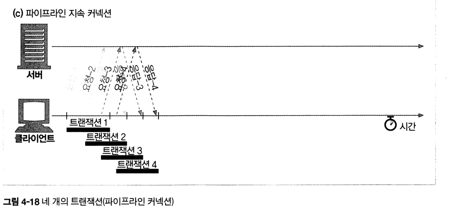
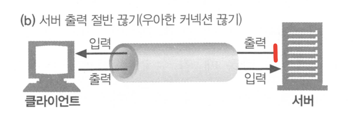

- HTTP는 어떻게 TCP 커넥션을 사용하는가
- TCP 커넥션의 지연, 병목, 막힘
- 병렬 커넥션, keep-alive 커넥션, 커넥션 파이프라인을 활용한 HTTP의 최적화
- 커넥션 관리를 위해 따라야 할 규칙들

 

### ❐ 1. TCP 커낵션

---

####  1-1. 신뢰할 수 있는 데이터 전송 통로인 TCP

> TCP와 HTTP의 관계

- 전 세계의 모든 HTTP 통신은 TCP/IP 프로토콜 위에서 이루어진다.
- HTTP는 자체적으로 신뢰성 있는 전송을 제공하지 않으며, TCP의 신뢰성에 의존한다.
- 따라서 HTTP 커넥션은 본질적으로 TCP 커넥션이다.

 

> TCP 커넥션의 특징

- TCP는 클라이언트와 서버 간에 **신뢰할 수 있는 연결 지향 통신**을 제공한다.
- 데이터는 손실되거나 손상되지 않고, **보낸 순서 그대로** 상대방에게 전달된다.
- 한쪽에서 보낸 바이트 스트림은 반대쪽에서 정확히 동일한 순서로 수신된다.

 

> 웹 요청 시 TCP 커넥션 동작 흐름

- 브라우저는 URL에서 호스트 이름을 추출한다.
- DNS 조회를 통해 호스트 이름에 해당하는 IP 주소를 찾는다.
- URL에 명시된 포트 번호(기본값 80)를 확인한다.
- 클라이언트는 서버의 IP 주소와 포트로 TCP 커넥션을 생성한다.
- 생성된 TCP 커넥션을 통해 HTTP 요청 메시지를 전송한다.
- 서버로부터 HTTP 응답 메시지를 수신한다.
- 응답이 완료되면 TCP 커넥션을 종료한다.

 

> 신뢰성 있는 데이터 전송의 의미

- TCP는 인터넷 환경에서도 데이터를 안정적으로 전달하기 위해 설계되었다.
- 패킷 손실, 중복, 순서 뒤바뀜이 발생하더라도 이를 감지하고 복구한다.
- 이 특성 덕분에 HTTP는 복잡한 오류 처리 없이 애플리케이션 로직에 집중할 수 있다.

 

####  1-2. TCP 스트림은 세그먼트로 나뉘어 IP 패킷을 통해 전송된다

> 프로토콜 스택에서의 HTTP와 HTTPS

- HTTP는 IP, TCP, HTTP로 구성된 프로토콜 스택의 **최상위 계층(애플리케이션 계층)**이다.
- HTTPS는 HTTP에 보안 기능을 추가한 형태로, **HTTP와 TCP 사이에 TLS(SSL) 암호화 계층**이 위치한다.
- TLS/SSL은 전송되는 데이터를 암호화하여 도청이나 변조를 방지한다.

 

> TCP 데이터 전송 방식

- HTTP 메시지는 이미 연결된 TCP 커넥션을 통해 **바이트 스트림 형태로 순차 전송**된다.
- TCP는 이 바이트 스트림을 **세그먼트(segment)**라는 단위로 잘게 나눈다.
- 각 TCP 세그먼트는 다시 **IP 패킷(IP 데이터그램)**에 담겨 인터넷을 통해 전달된다.
- 이 모든 과정은 TCP/IP 스택이 처리하며, HTTP 애플리케이션에는 보이지 않는다.

 

> IP 패킷의 구성 요소

- IP 패킷 헤더 (보통 20바이트)
- TCP 세그먼트 헤더 (보통 20바이트)
- TCP 데이터 조각 (0바이트 혹은 그 이상의 데이터)

 

> IP 헤더와 TCP 헤더의 역할

- **IP 헤더**
    - 발신지 IP 주소와 목적지 IP 주소
    - 패킷 크기, TTL(Time To Live), 기타 제어 플래그 포함
- **TCP 세그먼트 헤더**
    - 발신지 포트와 목적지 포트 번호
    - TCP 제어 플래그(SYN, ACK, FIN 등)
    - 데이터의 순서와 무결성을 검증하기 위한 순서 번호와 체크섬 포함

 

> 세그먼트 기반 전송의 의미

- TCP는 큰 데이터 스트림을 네트워크 전송에 적합한 크기로 분할한다.
- 각 세그먼트는 서로 다른 경로로 전달될 수 있지만,
  수신 측에서는 TCP가 이를 **순서대로 재조립**한다.
- 이를 통해 HTTP는 안정적이고 연속적인 데이터 전송 통로를 확보한다.

 

####  1-3. TCP 커넥션 유지하기

> TCP 커넥션의 식별 방식

- 컴퓨터는 동시에 여러 개의 TCP 커넥션을 유지할 수 있다.
- TCP는 **포트 번호**를 사용해 여러 커넥션을 구분하고 관리한다.
- IP 주소는 컴퓨터(호스트)를 식별하고, 포트 번호는 해당 컴퓨터 내의 **애플리케이션**을 식별한다.

 

> TCP 커넥션을 구분하는 4가지 요소

- 발신지 IP 주소
- 발신지 포트
- 수신지 IP 주소
- 수신지 포트

 

> 4-튜플(4-tuple)의 의미

- TCP 커넥션은 위 네 가지 값의 조합으로 **유일하게 식별**된다.
- 서로 다른 두 개의 TCP 커넥션은 네 가지 값이 모두 동일할 수 없다.
- 일부 값(IP 주소 또는 포트)이 같을 수는 있지만, 네 값이 모두 같은 경우는 없다.

 

> 여러 TCP 커넥션이 공존할 수 있는 이유

- 같은 목적지 포트(예: 80)를 사용하는 여러 커넥션이 동시에 존재할 수 있다.
- 같은 발신지 IP 주소를 사용하는 커넥션도 여러 개일 수 있다.
- 같은 목적지 IP 주소를 사용하는 커넥션 역시 여러 개 존재할 수 있다.
- 각 커넥션은 4-튜플 조합이 다르기 때문에 충돌 없이 유지된다.

 

> TCP 커넥션 관리의 핵심 요약

- TCP는 `IP 주소 + 포트 번호` 조합을 통해 커넥션을 관리한다.
- 이를 통해 하나의 서버는 수많은 클라이언트 요청을 동시에 처리할 수 있다.
- HTTP 서버는 이러한 TCP 커넥션 식별 메커니즘 위에서 동작한다.

 

####  1-4. TCP 소켓 프로그래밍

> 소켓 API의 역할

- 운영체제는 TCP 커넥션 생성과 관리에 필요한 기능들을 **소켓 API** 형태로 제공한다.
- 소켓 API는 HTTP 프로그래머에게 TCP/IP의 내부 동작을 숨기고, 단순한 인터페이스만 노출한다.
- 이 API는 처음에는 유닉스 운영체제용으로 개발되었지만, 현재는 대부분의 운영체제와 프로그래밍 언어에서 지원된다.

 

> 소켓 API와 TCP/IP 추상화

- 소켓 API를 사용하면 TCP 종단점(endpoint) 데이터 구조를 생성하고 관리할 수 있다.
- TCP 세그먼트 분할, IP 패킷 캡슐화, 재전송, 순서 보장 등의 세부 사항은 모두 운영체제가 처리한다.
- HTTP 애플리케이션은 이러한 네트워크 세부 구현을 알 필요가 없다.

 

> 클라이언트–서버 간 TCP 소켓 흐름

- 서버는 소켓을 생성하고(`socket`), 포트를 바인딩한 뒤(`bind`), 커넥션을 기다린다(`listen`).
- 클라이언트는 URL에서 IP 주소와 포트를 얻고, 소켓을 생성한 뒤 서버로 연결을 시도한다(`connect`).
- 서버는 클라이언트의 요청을 받아 새로운 커넥션을 생성한다(`accept`).
- 커넥션이 성립되면:
    - 클라이언트는 HTTP 요청 메시지를 전송한다(`write`).
    - 서버는 요청을 읽고 처리한 뒤(`read`), HTTP 응답을 전송한다(`write`).
    - 클라이언트는 응답을 읽어 처리한다(`read`).
- 트랜잭션이 끝나면 양쪽 모두 커넥션을 종료한다(`close`).

 

> TCP 소켓 프로그래밍의 핵심 요약

- 소켓 API는 TCP/IP 네트워크 프로그래밍의 표준 인터페이스다.
- HTTP는 소켓 API 위에서 동작하며, TCP 커넥션을 직접 제어하지 않는다.
- 이 추상화 덕분에 HTTP 애플리케이션은 네트워크 세부 구현과 독립적으로 작성될 수 있다.

 
 

### ❐ 2. TCP의 성능에 대한 고려

---

####  2-1. TCP 커넥션 핸드셰이크 지연

> TCP 커넥션 핸드셰이크란

- 새로운 TCP 커넥션을 생성할 때, 데이터 전송에 앞서 **연결을 설정하기 위한 패킷 교환 과정**이 필요하다.
- 이 과정은 TCP 소프트웨어가 자동으로 수행하며, HTTP 애플리케이션에는 직접 보이지 않는다.
- 하지만 이 단계에서 발생하는 지연은 **HTTP 성능에 직접적인 영향**을 준다.

 

> TCP 3-way 핸드셰이크 과정

- **1단계 (SYN)**
    - 클라이언트는 새로운 TCP 커넥션을 요청하기 위해 서버에 작은 TCP 패킷(보통 40~60바이트)을 보낸다.
    - 이 패킷에는 커넥션 생성을 요청한다는 의미의 `SYN` 플래그가 포함된다.
- **2단계 (SYN + ACK)**
    - 서버는 커넥션 요청을 수락하면, 커넥션 매개변수를 계산하고  
      `SYN`과 `ACK` 플래그가 함께 설정된 TCP 패킷을 클라이언트로 보낸다.
- **3단계 (ACK)**
    - 클라이언트는 서버에게 커넥션이 정상적으로 설정되었음을 알리기 위해  
      최종 확인 응답(`ACK`) 패킷을 다시 전송한다.
    - 최신 TCP에서는 이 `ACK` 패킷에 **HTTP 요청 데이터**를 함께 실어 보낼 수도 있다.

 

> 핸드셰이크 지연이 HTTP 성능에 미치는 영향

- TCP 핸드셰이크 동안에는 **실제 HTTP 데이터 전송이 불가능**하다.
- 작은 크기의 HTTP 트랜잭션에서는 이 패킷 교환 시간이 전체 응답 시간의 큰 비중을 차지한다.
- 특히 요청·응답 데이터가 작은 경우, 전체 처리 시간의 **50% 이상이 TCP 커넥션 설정에 소비**될 수 있다.

 

####  2-2. 확인응답 지연

> TCP의 확인응답(ACK) 메커니즘

- 인터넷은 패킷 전달을 완벽히 보장하지 않기 때문에, TCP는 신뢰성을 확보하기 위한 **자체 확인응답 체계**를 가진다.
- 각 TCP 세그먼트는 **순번(sequence number)**과 **무결성 체크섬**을 포함한다.
- 수신자는 세그먼트를 정상적으로 수신하면, 송신자에게 **확인응답(ACK)** 패킷을 전송한다.
- 송신자가 일정 시간 내에 ACK를 받지 못하면, 패킷 손실 또는 오류로 판단하고 **데이터를 재전송**한다.

 

> 확인응답 편승(piggyback) 방식

- 확인응답 패킷은 크기가 작기 때문에, TCP는 **같은 방향으로 전송되는 데이터 패킷에 ACK를 함께 실어 보낸다**.
- 이를 **편승(piggyback)** 이라고 하며, 네트워크 효율을 높이는 기법이다.
- 데이터와 ACK를 하나의 패킷으로 묶으면, 패킷 수가 줄어들어 네트워크 부하가 감소한다.

 

> 확인응답 지연 알고리즘(Delayed ACK)

- 많은 TCP 스택은 ACK를 즉시 보내지 않고, **짧은 시간(보통 0.1~0.2초)** 동안 버퍼에 저장한다.
- 이 시간 동안 같은 방향으로 전송할 데이터 패킷이 있으면, ACK를 해당 패킷에 **편승**시킨다.
- 일정 시간 내에 편승할 데이터가 없으면, ACK는 **독립된 패킷**으로 전송된다.

 

> HTTP 트랜잭션과 확인응답 지연의 문제

- HTTP는 기본적으로 **요청 → 응답**의 단순한 통신 패턴을 가진다.
- 이 구조에서는 ACK가 편승할 수 있는 반대 방향 데이터가 적다.
  - 따라서, 확인응답 지연 알고리즘으로 인한 **추가 지연이 자주 발생**한다.
- 결과적으로 지연 알고리즘으로 인한 네크워크 지연이 자주 발생한다.

 

> TCP 설정 조정에 대한 주의점

- 운영체제에 따라 확인응답 지연 기능을 조정하거나 비활성화할 수 있다.
- 그러나 TCP 내부 알고리즘은 **인터넷 전체의 안정성을 보호하도록 설계**되어 있다.
- TCP 설정을 변경할 경우, 애플리케이션이 TCP의 동작 가정을 깨지 않는지
  충분히 이해하고 신중하게 접근해야 한다.

 

####  2-3. TCP 느린 시작(Slow Start)

> TCP 느린 시작의 개념

- TCP의 데이터 전송 속도는 커넥션이 생성된 직후부터 최대치로 시작하지 않는다.
- 새로운 TCP 커넥션은 처음에 **보수적으로 낮은 전송 속도**로 시작한다.
- 전송이 성공적으로 이루어질수록 점진적으로 속도를 높이는데,
  이 과정을 **TCP 느린 시작(Slow Start)** 이라고 한다.
- 이는 인터넷에서의 **급격한 부하와 혼잡을 방지**하기 위한 메커니즘이다.

 

> 느린 시작의 동작 방식

- TCP는 한 번에 전송할 수 있는 패킷 수를 제한한다.
- 처음에는 **1개의 패킷**만 전송하고, 확인응답(ACK)을 기다린다.
- ACK를 받으면 다음 단계에서 **2개의 패킷**을 전송할 수 있다.
- 각 패킷에 대해 다시 ACK를 받으면, **4개 > 8개 > …** 식으로
  전송 가능한 패킷 수가 증가한다.
- 이 과정을 **혼잡 윈도우를 연다(opening the congestion window)** 라고 표현한다.

 

> HTTP 트랜잭션에 미치는 영향

- 전송할 데이터가 많은 HTTP 트랜잭션의 경우,
  모든 데이터를 한 번에 보낼 수 없다.
- 초기에는 소량의 데이터만 전송되고,
  전송이 성공할수록 점점 더 많은 데이터를 보낼 수 있다.
- 이 때문에 **새로운 TCP 커넥션은 이미 튜닝된 커넥션보다 느리다**.

 

> 튜닝된 커넥션과의 차이

- 오랫동안 유지된 TCP 커넥션은 네트워크 상태에 맞게 이미 전송 속도가 조정되어 있다.
- 반면, 새로 생성된 커넥션은 매번 느린 시작 과정을 다시 거쳐야 한다.
- 따라서 HTTP는 성능 향상을 위해
  **이미 존재하는 TCP 커넥션을 재사용**하려는 전략을 사용한다.

 

####  2-4. 네이글(Nagle) 알고리즘과 TCP_NODELAY

> 네이글 알고리즘의 등장 배경

- TCP는 애플리케이션이 **아주 작은 크기의 데이터**라도 전송할 수 있도록 데이터 스트림 인터페이스를 제공한다.
- 하지만 각 TCP 세그먼트에는 약 **40바이트 이상의 헤더와 플래그**가 포함된다.
- 이로 인해 작은 데이터 조각을 다수의 패킷으로 전송하면 네트워크 효율과 성능이 크게 저하된다.
- 이러한 비효율을 해결하기 위해 **네이글(Nagle) 알고리즘**이 도입되었다.

 

> 네이글(Nagle) 알고리즘이란

- 네이글 알고리즘은 **작은 TCP 데이터들을 하나의 큰 세그먼트로 묶어 전송**하는 기법이다.
- 패킷을 즉시 전송하지 않고, **충분한 데이터가 모이거나** 기존에 전송한 패킷이 확인응답(ACK)을 받을 때까지 대기한다.
- 이 알고리즘은 RFC 896 “Congestion Control in IP/TCP Internetworks” 에 정의되어 있다.
- 목적은 네트워크 효율을 해치는 **실리 윈도 증후군(silly window syndrome)** 을 방지하는 것이다.

 

> 네이글 알고리즘의 동작 방식

- TCP 세그먼트가 **최대 크기(MSS)** 가 되기 전까지는 전송을 지연한다.
    - LAN 환경에서는 보통 약 1500바이트
    - 인터넷 환경에서는 수백 바이트 수준
- 아직 전송 중인 패킷이 있고 ACK를 받지 못한 상태라면,
  새로 생성된 데이터는 **버퍼에 저장**된다.
- 기존 패킷이 ACK를 받거나, 충분한 데이터가 모이면
  버퍼에 있던 데이터가 하나의 패킷으로 전송된다.

 

> 네이글 알고리즘과 HTTP 성능 문제

- HTTP 메시지는 크기가 작은 경우가 많아,
  네이글 알고리즘으로 인해 **불필요한 전송 지연**이 발생할 수 있다.
- 특히 작은 HTTP 요청은:
    - 패킷을 채우기 위해 **추가 데이터가 생기기를 기다리며 지연**될 수 있다.
- 네이글 알고리즘은 **확인응답 지연**과 함께 사용될 경우, 서로를 기다리며 성능이 급격히 저하되는 현상이 발생한다.
    - 네이글: ACK가 오기 전까지 전송을 멈춤
    - 확인응답 지연: ACK를 100~200ms 지연시킴

 

> TCP_NODELAY 옵션

- HTTP 애플리케이션은 성능 향상을 위해 `TCP_NODELAY 옵션`을 설정하여 네이글 알고리즘을 비활성화할 수 있다.
- 이 옵션을 사용하면 작은 데이터도 **즉시 전송**된다.
- 단, 이 경우 네트워크 효율 저하를 방지하기 위해
  애플리케이션이 **의미 있는 크기의 데이터 덩어리**를 만들어 전송해야 한다.

 

####  2-5. TIME_WAIT의 누적과 포트 고갈

> TIME_WAIT 상태의 목적

- TCP 커넥션이 정상적으로 종료되면, 종료한 쪽은 해당 커넥션을 **TIME_WAIT 상태**로 유지한다.
  - [참고 : 4-way handshake](https://gilbert9172.tistory.com/42#%E2%9D%92%204-way%20handshake-1)
- 이 상태에서는 커넥션의 **IP 주소와 포트 번호 조합(4-튜플)**을
  커널의 제어 블록(control block)에 기록해 둔다.
- 목적은 이전 커넥션에서 지연 도착한 패킷이
  **새로 생성된 동일한 주소/포트 커넥션에 섞이는 것을 방지**하는 것이다.
- TIME_WAIT의 유지 시간은 보통 **2MSL(Maximum Segment Lifetime)** 로,
  일반적으로 약 **2분(120초)** 정도다.

 

> TIME_WAIT가 성능 문제로 보이는 이유

- 실제 서비스 환경에서는 TIME_WAIT로 인한 문제는 드물다.
- 그러나 **성능 측정이나 부하 테스트** 환경에서는 예상하지 못한 성능 저하의 원인으로 보일 수 있다.
- 짧은 시간에 많은 커넥션을 생성/종료하면, TIME_WAIT 상태의 커넥션이 빠르게 누적된다.

 

> 포트 고갈(port exhaustion)이 발생하는 조건

- TCP 커넥션은 다음 네 가지 값으로 식별된다.  
  - `발신지 IP`, `발신지 포트`, `목적지 IP`, `목적지 포트`
- 일반적인 HTTP 서버 환경에서는 다음 세 값이 고정된다.
    - 클라이언트 IP
    - 서버 IP
    - 목적지 포트(보통 80)
- 따라서 **발신지 포트만 변경 가능**하다.
- **사용 가능한 발신지 포트 수가 제한되어 있기 때문에**
  - TIME_WAIT 동안 포트를 재사용할 수 없으면 **동시에 생성할 수 있는 커넥션 수에 한계**가 생긴다.

 

> 수치로 보는 TIME_WAIT 포트 고갈 예시

- 사용 가능한 발신지 포트 수: 약 **60,000개**
- TIME_WAIT 유지 시간: 약 **120초**
- 이 경우 초당 생성 가능한 최대 커넥션 수는  
  `60,000 / 120 = 초당 약 500개`
- 서버가 ***초당 500개 이상***의 새로운 TCP 커넥션을 처리해야 한다면,
  TIME_WAIT 포트 고갈 문제가 발생할 수 있다.

 

> TIME_WAIT 문제의 완화 방법

- 부하를 생성하는 **클라이언트 수를 늘린다**.
  - 각 클라이언트가 사용하는 발신지 포트 풀이 따로 생기기 때문에  한 대당 초당 생성 가능한 커넥션 수 한계를 나눠 가지게 된다.
- 여러 개의 **가상 IP 주소**를 사용해 더 많은 커넥션 조합을 만들 수 있도록 한다.
- 가능한 경우, **TCP 커넥션 재사용(지속 커넥션)** 을 활용한다.

 

> 주의 사항

- 포트 고갈이 발생하지 않더라도, **커넥션이나 제어 블록이 지나치게 많아지면** 운영체제 성능이 급격히 저하될 수 있다.
- 일부 운영체제는 대량의 커넥션 상태를 관리하는 데 특히 취약하므로 주의가 필요하다.

 
 

### ❐ 3. HTTP 커넥션 관리

---

####  3-1. 흔히 잘못 이해하는 커넥션 헤더

> Connection 헤더의 역할

- HTTP는 클라이언트와 서버 사이에 **중개 서버(hop)** 가 존재하는 구조를 허용한다.
- HTTP 메시지는 클라이언트에서 서버(또는 리버스 프락시)까지 여러 중개 서버를 거쳐 전달된다.
- 이 과정에서 **특정 커넥션에만 적용되는 옵션**을 명확히 구분할 필요가 있다.
- 이를 위해 사용되는 것이 **Connection 헤더**다.

 

> Connection 헤더의 기본 개념

- Connection 헤더는 **커넥션 단위(hop-by-hop)** 로 적용될 헤더를 지정한다.
- Connection 헤더에 명시된 값들은 **다음 커넥션으로 전달되면 안 된다**.

 

> Connection 헤더에 포함될 수 있는 토큰 종류

- HTTP 헤더 필드 이름
    - 현재 커넥션에만 적용되는 헤더들의 목록
- 임시 토큰 값
    - 커넥션에 대한 비표준 옵션을 의미
- close
    - 작업이 끝나면 커넥션을 종료해야 함을 의미

 

> hop-by-hop 헤더와 전달 규칙

- Connection 헤더에 나열된 헤더들은 **hop-by-hop 헤더**라고 부른다.
- hop-by-hop 헤더는:
    - 현재 커넥션에서만 유효하고
    - **다음 hop으로 전달되기 전에 반드시 제거**되어야 한다
- 이는 커넥션 전용 옵션이 **의도치 않게 전파되는 것을 방지하기 위함**이다.

 

> 프락시(중개 서버)의 처리 방식

- 프락시는 Connection 헤더를 포함한 메시지를 받으면:
    - Connection 헤더에 기술된 옵션을 현재 커넥션에 적용한다.
    - 다음 hop으로 메시지를 전달하기 전에
        - Connection 헤더 자체를 제거하고
        - Connection 헤더에 명시된 모든 헤더도 함께 제거한다.
- 이를 통해 각 커넥션은 **서로 독립적으로 관리**된다.

 

> 대표적인 hop-by-hop 헤더 예시

- 다음 헤더들은 Connection 헤더에 명시되지 않았더라도 관례적으로 **hop-by-hop 헤더**로 취급된다.
  - `Proxy-Authenticate`
  - `Proxy-Connection`
  - `Transfer-Encoding`
  - `Upgrade`

 

> 흔히 발생하는 오해

- Connection 헤더의 옵션이 **전체 HTTP 트랜잭션이나 end-to-end 요청에 적용된다고 오해**하기 쉽다.
- 실제로 Connection 헤더는 **현재 커넥션 하나에만 영향을 미치는 제어 수단**이다.

 

####  3-2. 순차적인 트랜잭션 처리에 의한 지연

> 순차적 HTTP 트랜잭션의 문제점

- 커넥션 관리가 제대로 이루어지지 않으면 TCP 성능은 크게 저하될 수 있다.
- 각 트랜잭션마다 **새로운 TCP 커넥션**이 필요하다면, 커넥션 설정 지연 + 느린 시작 지연이 매번 반복된다.

 

> 순차 처리 방식의 동작 흐름

- 브라우저는 하나의 리소스를 모두 받은 뒤에 다음 리소스를 요청한다.
- 결과적으로 트랜잭션은 **순차적으로(serial)** 처리된다.
- 이 방식에서는:
    - 네트워크 대역폭을 충분히 활용하지 못하고
    - 각 요청 사이에 불필요한 대기 시간이 발생한다.

 

> 순차 처리의 한계

- 순차적인 HTTP 트랜잭션 처리는 아래의 문제를 유발한다.
    - TCP 커넥션 지연
    - 느린 시작
    - 네트워크 자원 미활용
    - 사용자 체감 성능 저하
- 이러한 문제를 해결하기 위해 HTTP는 다양한 **커넥션 최적화 기법**을 도입하게 된다.

 

> HTTP 성능 개선을 위한 커넥션 기법들

- 병렬(parallel) 커넥션
    - 여러 개의 TCP 커넥션을 사용해 동시에 HTTP 요청을 전송
- 지속(persistent) 커넥션
    - 커넥션을 재사용하여 연결/종료 지연을 제거
- 파이프라인(pipelined) 커넥션
    - 하나의 TCP 커넥션에서 여러 HTTP 요청을 연속으로 전송
- 다중(multiplexed) 커넥션
    - 하나의 커넥션에서 요청과 응답을 뒤섞어 처리 (실험적 기법)

 
 

### ❐ 4. 병렬 커넥션

---

####  4-1. 병렬 커넥션

> 병렬 커넥션의 개념

- 순차적으로 리소스를 내려받는 방식은 매우 느리다.
- HTTP는 클라이언트가 **여러 개의 TCP 커넥션을 동시에 맺어** 여러 HTTP 트랜잭션을 **병렬로 처리**할 수 있도록 한다.

 

> 병렬 커넥션이 페이지를 더 빠르게 내려받는 이유

- 단일 커넥션의 **대역폭 제한과 대기 시간**을 우회할 수 있다.
- 각 커넥션의 지연 시간을 **겹쳐서(overlap)** 처리할 수 있다.
- 한 커넥션이 대역폭을 모두 사용하지 않으면, 남은 대역폭을 다른 객체 다운로드에 활용할 수 있다.
- 결과적으로 여러 객체를 포함한 웹페이지의 **총 로딩 시간이 감소**한다.

 

> 순차 커넥션과의 차이

- 순차 처리 방식
    - 하나의 트랜잭션이 끝나야 다음 요청이 시작된다.
    - 커넥션 설정 지연과 느린 시작 지연이 누적된다.
- 병렬 처리 방식
    - 여러 트랜잭션이 동시에 진행된다.
    - 커넥션 지연이 겹쳐져 전체 지연 시간이 줄어든다.

 

> 병렬 커넥션이 항상 더 빠르지는 않은 이유

- 클라이언트의 네트워크 **대역폭이 좁은 경우**, 여러 커넥션이 대역폭을 나눠 사용하면서 효과가 줄어든다.
- 다수의 TCP 커넥션은 아래의 문제를 유발한다.
    1. 메모리 사용 증가
    2. 커넥션 관리 오버헤드
- 서버는 여러 사용자를 동시에 처리해야 하므로, 한 클라이언트가 과도한 커넥션을 여는 것은 부담이 된다.

 

> 브라우저와 서버의 현실적인 제한

- 대부분의 브라우저는 병렬 커넥션을 지원하지만, **허용 개수는 제한적**이다. (보통 4~8개)
- 서버는 특정 클라이언트가 과도한 수의 커넥션을 생성하면, 일부 커넥션을 강제로 종료할 수 있다.

 
 

### ❐ 5. 지속 커넥션

---

####  5-0. 개요

> 지속 커넥션이란

- 처리 완료 후에도 계속 연결된 상태로 유지되는 TCP 커넥션
- 클라이언트는 하나의 페이지를 로드하는 과정에서 **같은 서버로 여러 HTTP 요청**을 연속해서 보낸다.
  - 이러한 특성을 **사이트 지역성(site locality)** 이라고 한다.
- HTTP/1.1(HTTP/1.0의 개선 버전)을 지원하는 클라이언트와 서버는    
  요청 처리가 끝난 후에도 **TCP 커넥션을 유지**하고 이후 요청에 재사용할 수 있다.

 

> 지속 커넥션의 효과

- 매 요청마다 TCP 커넥션을 새로 맺고 끊는 데서 발생하는 **지연 시간 감소**
- 이미 연결된 커넥션은:
    - TCP 핸드셰이크 지연이 없고
    - 느린 시작(slow start)을 통과한 **튜닝된 커넥션**
- 결과적으로 데이터 전송 속도가 더 빨라진다.
- 필요한 TCP 커넥션 수 자체를 줄일 수 있다.

 

####  5-1. 지속 커넥션 vs 병렬 커넥션

> 병렬 커넥션의 특징과 한계

- 여러 개의 TCP 커넥션을 동시에 열어 여러 HTTP 트랜잭션을 병렬로 처리한다.
- 객체가 많은 웹페이지를 더 빠르게 전송할 수 있다.
- 하지만 다음과 같은 단점이 있다.
    - 각 트랜잭션마다 커넥션을 새로 생성·종료 → **시간과 대역폭 소모**
    - 각 커넥션마다 TCP 느린 시작이 반복 → 성능 저하
    - 실제로 열 수 있는 병렬 커넥션 수에는 **제한**이 있다.

 

> 지속 커넥션의 장점

- 커넥션을 맺기 위한 사전 작업과 지연을 줄인다.
- 이미 튜닝된 TCP 커넥션을 유지하며 재사용한다.
- 동시에 유지해야 할 커넥션 수를 줄일 수 있다.

 

> 지속 커넥션의 주의점

- 지속 커넥션을 잘못 관리하면:
    - 사용되지 않는 커넥션이 계속 유지된다.
    - 이는 클라이언트와 서버 모두의 **리소스 낭비**로 이어진다.
- 대규모 서비스에서는 커넥션 수와 유지 시간을 적절히 관리해야 한다.

 

> 권장되는 사용 방식

- 지속 커넥션은 **병렬 커넥션과 함께 사용할 때** 가장 효과적이다.
- 애플리케이션은:
    - 적은 수의 병렬 커넥션만 유지하고
    - 해당 커넥션을 지속적으로 재사용한다.
- 이것이 현대 웹 애플리케이션에서 일반적으로 사용하는 방식이다.

 

####  5-2. HTTP/1.0의 Keep-Alive 커넥션

> HTTP/1.0 Keep-Alive의 배경

- 많은 HTTP/1.0 브라우저와 서버는 **실험적으로 keep-alive 커넥션**을 지원하도록 확장되었다(1996년경).
- 이는 HTTP/1.0의 기본 동작(요청마다 커넥션 종료)으로 인한 성능 저하를 완화하기 위한 시도였다.
- 초기 keep-alive 설계에는 **상호 운용성 및 설계상의 문제**가 있었다.
- 이러한 문제는 이후 **HTTP/1.1에서 공식적으로 수정·정비**되었다.
- 그럼에도 불구하고, 아직도 일부 클라이언트와 서버는 HTTP/1.0 keep-alive를 사용한다.

 

> 성능상의 이점

- 여러 HTTP 트랜잭션을 처리할 때:
    - 매번 새 커넥션을 생성·종료하는 방식보다
    - **하나의 지속 커넥션**으로 처리하는 방식이 훨씬 빠르다.
- 커넥션을 맺고 끊는 데 필요한 작업이 제거되어 **전체 처리 시간이 단축**된다.

 

####  5-3. Keep-Alive 동작

> HTTP/1.0 Keep-Alive의 기본 동작 방식

- keep-alive는 최종적으로 HTTP/1.1 명세에서는 제외되었지만, 
  브라우저–서버 간 관행적으로 널리 사용되어 왔다.
- 따라서 HTTP 애플리케이션은 keep-alive 요청을 처리할 수 있어야 한다.

 

> 요청과 응답의 헤더 규칙

- HTTP/1.0에서 keep-alive 커넥션을 사용하려면:
    - 클라이언트는 요청 메시지에 `Connection: Keep-Alive` 헤더를 포함해야 한다.
- 서버가 이 커넥션을 계속 유지하고 싶다면:
    - 응답 메시지에도 `Connection: Keep-Alive` 헤더를 포함해 응답한다.
- 만약 응답에 `Connection: Keep-Alive` 헤더가 없다면:
    - 클라이언트는 서버가 keep-alive를 지원하지 않으며
    - 응답 전송 후 **커넥션이 종료될 것**이라고 가정한다.

 

####  5-4. Keep-Alive 옵션

> Keep-Alive 커넥션의 동작을 제어하기 위한 선택적 옵션

- Keep-Alive 헤더는 **커넥션 유지를 요청**할 뿐, 이를 강제하지는 않는다.
- 클라이언트나 서버는 언제든지 keep-alive 커넥션을 종료할 수 있다.
- keep-alive 커넥션에서 처리할 **트랜잭션 수를 제한**할 수도 있다.
- keep-alive의 동작은 `Keep-Alive` 헤더에 포함된 **콤마(,)로 구분된 옵션들**로 제어된다.
- `timeout` 옵션은 커넥션을 **얼마 동안 유지할지**를 의미하지만, 실제 유지 시간을 보장하지는 않는다.
- `max` 옵션은 하나의 커넥션으로 **최대 몇 개의 HTTP 트랜잭션을 처리할지**를 의미한다.
- Keep-Alive 헤더는 진단이나 디버깅 목적의 **임의 속성(name=value)** 도 허용한다.
- Keep-Alive 옵션은 반드시 `Connection: Keep-Alive` 헤더가 있을 때만 의미를 가진다.

 

####  5-5. Keep-Alive 커넥션 제한과 규칙

> Keep-Alive 커넥션을 안전하게 사용하기 위해 확인해야 할 제약 사항과 동작 규칙

- Keep-Alive는 **HTTP/1.0의 기본 동작이 아니다**.
  - 사용하려면 반드시 `Connection: Keep-Alive` 요청 헤더를 보내야 한다.
- 커넥션을 계속 유지하려면 **모든 요청 메시지에** `Connection: Keep-Alive` 헤더를 포함해야 한다.  
  → 누락되면 서버는 응답 후 커넥션을 종료할 수 있다.
- 클라이언트는 **응답에 `Connection: Keep-Alive` 헤더가 없을 경우**, 서버가 커넥션을 종료할 것이라고 가정해야 한다.
- 커넥션을 유지하려면 **엔터티 본문의 길이를 정확히 알아야 한다**.  
  → 이를 위해 다음 중 하나가 필요하다.
    - 정확한 `Content-Length`
    - `multipart` 미디어 타입
    - `chunked transfer encoding`
- Keep-Alive 커넥션에서 **잘못된 Content-Length를 보내는 것은 위험**하다.  
  → 메시지 경계를 정확히 구분할 수 없어 다음 요청이 깨질 수 있다.
- 프락시와 게이트웨이는 **Connection 헤더 규칙을 엄격히 준수**해야 한다.  
  → 전달 또는 캐시 전에 `Connection` 헤더와 그에 명시된 모든 헤더 필드를 제거해야 한다.
- Keep-Alive 커넥션은 **Connection 헤더를 이해하지 못하는 프락시(dumb proxy)** 와 함께 사용하면 안 된다.  
  → 현실적으로 이를 완전히 피하기는 어렵다.
- 기술적으로 HTTP/1.0 기반 장비에서 전달된 **모든 Connection 헤더는 무시하는 것이 안전**하다.  
  → 오래된 프락시로 인해 커넥션이 멈추는(hang) 문제를 방지하기 위함이다.
- 클라이언트는 **응답을 모두 받기 전에 커넥션이 끊어질 가능성**을 항상 고려해야 하며,  
  문제가 없다면 요청을 **다시 전송할 수 있도록 준비**되어 있어야 한다.

 

####  5-6. Keep-Alive와 멍청한 프락시

- [티스토리 블로그 정리 내용](https://gilbert9172.tistory.com/43#%E2%9D%92%20Http%20Connection-1:~:text=2%2D1.%20HTTP/1.0%20keep%2Dalive)

 

####  5-7. Proxy-Connection 살펴 보기 

- [티스토리 블로그 정리 내용](https://gilbert9172.tistory.com/43#%E2%9D%92%20Http%20Connection-1:~:text=%EA%B7%B8%EB%9E%98%EC%84%9C%20%EC%9D%B4%20%EB%AC%B8%EC%A0%9C%EB%A5%BC%20%ED%95%B4%EA%B2%B0%ED%95%98%EA%B8%B0%20%EC%9C%84%ED%95%B4%20Intelligent%20Proxy%EA%B0%80%20%EB%82%98%EC%99%94%EB%8B%A4.)

 

####  5-8. HTTP/1.1의 지속 커넥션

> HTTP/1.1에서 기본 동작으로 채택된 지속 커넥션의 개념과 동작 방식

- HTTP/1.1은 HTTP/1.0의 keep-alive 확장 대신, 설계가 개선된 **지속 커넥션(persistent connection)** 을 기본으로 사용한다.
- HTTP/1.1에서는 별도의 설정이 없으면 **모든 커넥션을 지속 커넥션으로 간주**한다.
- 트랜잭션이 끝난 후 커넥션을 끊고 싶다면, 명시적으로 `Connection: close` 헤더를 보내야 한다.
- 응답에 `Connection: close` 헤더가 없다면, 클라이언트는 **커넥션이 유지된다고 가정**한다.
  - 단, `Connection: close`를 보내지 않았다고 해서 서버가 커넥션을 영구적으로 유지해야 하는 것은 아니다.
- 클라이언트와 서버는 **언제든지 커넥션을 종료할 수 있다**.

 

####  5-9. 지속 커넥션의 제한과 규칙

> HTTP/1.1 지속 커넥션을 안전하게 사용하기 위한 제약 조건과 운영 규칙

- 클라이언트가 요청에 `Connection: close` 헤더를 포함해 보내면, 해당 커넥션으로 **추가 요청을 보낼 수 없다**.
- 더 이상 요청을 보내지 않을 경우, **마지막 요청에 `Connection: close` 헤더를 포함**해야 한다.
- 커넥션을 유지하려면, 커넥션 상의 **모든 메시지가 자신의** 길이 정보를 정확히 알고 있어야 **한다**.
    - 엔터티 본문은 정확한 `Content-Length`를 가지거나, `chunked transfer encoding`으로 인코딩되어야 한다.
- HTTP/1.1 프락시는 **클라이언트–프락시**, **프락시–서버** 각각에 대해 **별도의 지속 커넥션을 관리**해야 한다.
- 프락시는 클라이언트가 지원하는 커넥션 기능을 정확히 알지 못하면 지속 커넥션을 맺어서는 안 된다.
    - 오래된 프락시가 `Connection` 헤더를 잘못 전달하는 문제를 방지하기 위함이다.
- 서버는 메시지 전송 중간에 커넥션을 끊지 않는 것이 이상적이지만,
    - HTTP/1.1 기기는 `Connection` 헤더 값과 무관하게 **언제든 커넥션을 끊을 수 있다**.
- HTTP/1.1 애플리케이션은 **중간에 끊어진 커넥션을 복구할 수 있어야 한다**.
- 클라이언트는 전체 응답을 받기 전에 커넥션이 끊어졌다면,
    - 요청을 반복해서 보내도 문제가 없는 경우에 한해 **재요청할 준비가 되어 있어야 한다**.
- 하나의 사용자 클라이언트는 서버 과부하를 방지하기 위해 **적당한 수의 지속 커넥션만 유지**해야 한다.
- N명의 사용자가 서버에 접근한다면,
    - 프락시는 서버나 상위 프락시에 대해 **대략 2N개의 커넥션을 유지**해야 할 수 있다.

 
 

### ❐ 6. 파이프라인 커넥션

---

####  6-1. 파이프라인 커넥션 개요

> HTTP/1.1에서 **지속 커넥션을 기반으로 여러 요청을 연속적으로 전송**하여,
> 응답을 기다리지 않고 다음 요청을 보내는 방식

- HTTP/1.1은 지속 커넥션 위에서 요청을 **파이프라이닝(pipelining)** 할 수 있음
- 첫 번째 요청의 응답을 기다리지 않고, 여러 요청을 네트워크로 연속 전송
- 네트워크 왕복 지연(RTT)이 큰 환경에서 **대기 시간 감소 → 성능 향상**
- keep-alive 커넥션의 성능을 한 단계 더 끌어올리는 기법

 

####  6-2. 파이프라인의 성능 이점

> 요청 전송 대기 시간을 줄여 전체 처리 시간을 단축

- 요청들이 큐(queue)에 쌓여 서버로 연속 전달됨
- 첫 요청이 서버에 도달한 뒤, 두 번째·세 번째 요청도 바로 전달 가능
- TCP 연결 지연 + 요청 간 대기 시간을 줄여 체감 성능 향상
- 특히 **지연(latency)이 큰 네트워크 환경**에서 효과적

 

####  6-3. 파이프라인의 제약 사항

> 파이프라인은 강력하지만, 엄격한 제약을 가진다

- 지속 커넥션임이 확인되기 전까지는 파이프라인 사용 불가
- **응답은 반드시 요청 순서대로 도착해야 함**
    - HTTP 메시지는 순번 정보가 없어 재정렬 불가
- 커넥션이 중간에 끊기면,
  완료되지 않은 요청은 **재전송 준비**가 되어 있어야 함
- 서버는 임의로 커넥션을 끊을 수 있음
    - 일부 요청만 처리되고 나머지는 실패할 수 있음

 

####  6-4. 파이프라인에서 위험한 요청

> 재전송 시 문제가 되는 요청은 파이프라인에 부적합

- POST와 같은 **비멱등(non-idempotent)** 요청은 사용하면 안 됨
- 에러 발생 시, 어떤 요청이 서버에서 처리되었는지 알 수 없음
- 동일 요청을 재전송하면 **중복 처리 문제** 발생 가능
- 따라서:
    - GET, HEAD처럼 **멱등(idempotent)** 요청에만 적합

 

####  6-5. 파이프라인의 현실적 한계

> 이론적으로는 훌륭하지만, 실제 사용에는 어려움이 많음

- 구현 난이도와 오류 처리 복잡성
- 프록시·서버·클라이언트 간 호환성 문제
- 이로 인해 실제 웹에서는 널리 사용되지 않음
- 이후 HTTP/2의 **멀티플렉싱**이 파이프라인의 한계를 근본적으로 해결

 
 

### ❐ 7. 커넥션 끊기에 대한 미스테리

---

####  7-1. 마음대로 커넥션 끊기

> 커넥션은 언제든지 예고 없이 끊어질 수 있다.

- HTTP 클라이언트, 서버, 프락시는 언제든지 TCP 커넥션을 끊을 수 있다.
- 보통은 메시지를 모두 보낸 뒤 커넥션을 끊지만, 에러 상황에서는 헤더 중간이나 예기치 않은 시점에도 끊길 수 있다.
- `파이프라인 지속 커넥션`에서는 서버가 유휴 상태라고 판단해 커넥션을 끊을 수 있다.
- 서버는 클라이언트가 더 이상 데이터를 보내지 않을 것이라고 확신할 수 없기 때문에, 
  이 시점의 커넥션 종료는 요청 처리 중 문제를 유발할 수 있다.

 

####  7-2. Content-Length와 Truncation

> 커넥션 종료로 메시지의 끝을 판단하면 안 된다.

- 모든 HTTP 응답은 정확한 본문 길이를 나타내는 Content-Length 헤더를 가져야 한다.
- 일부 오래된 서버는 **커넥션 종료를 데이터 전송 완료로 간주**하지만, 이는 **잘못된 방식**이다.
- 수신자는 실제 수신한 엔터티 길이와 Content-Length 값이 다르거나 Content-Length가 없으면 
  메시지가 손상되었음을 인지해야 한다.
- 캐시 프락시는 Content-Length가 불일치하는 응답을 캐시하면 안 된다.
  - 프락시는 Content-Length를 수정하지 말고 받은 그대로 전달해야 한다.

 

####  7-3. 커넥션 끊기의 허용, 재시도, 멱등성

> 커넥션이 끊겨도 안전하게 재시도할 수 있어야 한다.

- HTTP 커넥션은 에러가 없어도 언제든 끊어질 수 있으므로, 애플리케이션은 이에 대비해야 한다.
- 전송 중 커넥션이 끊기면 클라이언트는 요청을 재시도할 수 있어야 한다.
- 파이프라인 커넥션에서는 서버가 아직 처리하지 않은 요청을 남긴 채 커넥션을 끊을 수 있다.
- GET, HEAD, PUT, DELETE 등 멱등(idempotent) 메서드는 재시도해도 안전하다.
- POST처럼 비멱등(non-idempotent) 요청은 파이프라인을 통해 보내면 안 된다.
- 비멱등 요청은 이전 요청의 결과를 알 수 없으므로 자동 재시도를 하면 안 된다.

 

####  7-4. 우아한 커넥션 끊기

> 출력 채널을 먼저 끊는 것이 가장 안전하다.

- TCP 커넥션은 입력 채널과 출력 채널을 각각 가진 양방향 구조이다.
- 전체 끊기(close)는 입력·출력 채널을 모두 종료한다.
- 절반 끊기(shutdown)는 한쪽 채널만 종료할 수 있다.
- 일반적으로는 **출력 채널을 먼저 끊는 것이 안전**하다.
- 출력 채널을 끊으면 상대는 모든 데이터를 읽은 뒤 커넥션 종료를 인지한다.
- 입력 채널을 먼저 끊으면 상대가 데이터를 보내는 중일 수 있어 `connection reset by peer` 에러가 발생할 수 있다.
- 우아한 종료를 위해 애플리케이션은 **출력 채널을 절반 끊기 한 뒤**
  - 입력 채널의 종료 여부를 일정 시간 동안 감시해야 한다.
  - 입력 채널이 끝나지 않으면 리소스 보호를 위해 강제로 커넥션을 종료할 수 있다.
