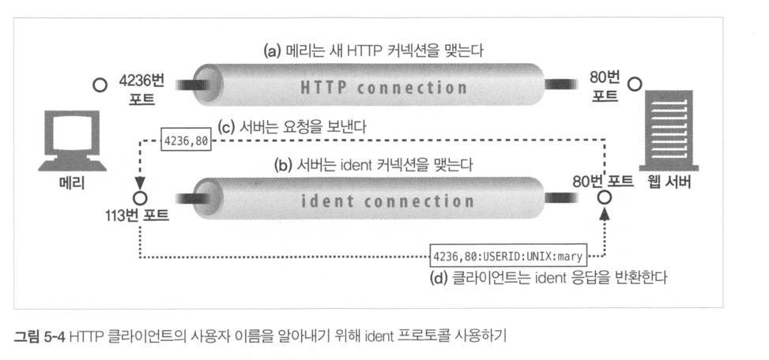
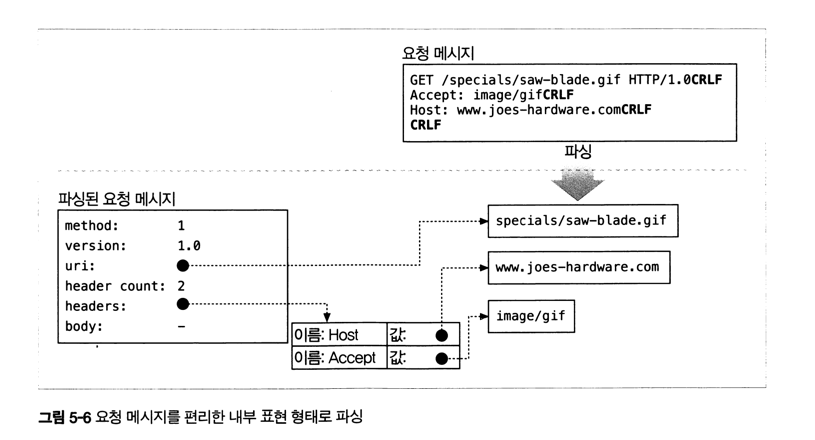

- 여러 종류의 소프트웨어 및 하드웨어 웹 서버에 대해 조사한다.
- HTTP 통신을 진단해주는 간단한 웹 서버를 Perl로 작성해본다.
- 어떻게 웹 서버가 HTTP 트랜잭션을 처리하는지 단계별로 설명한다.

 
 

### ❐ 1. 다채로운 웹 서버

---

####  1-1. 웹 서버 구현

> 웹 서버의 기본 역할과 책임

- HTTP 요청을 처리하고 응답을 반환하는 소프트웨어/시스템
- HTTP 프로토콜 구현 + 웹 리소스 관리
- TCP 처리 책임은 운영체제와 분담
- 설정, 제어, 확장 등 관리 기능 제공

 

####  1-2. 다목적 소프트웨서 웹 서버

> 일반 컴퓨터에서 동작하는 범용 웹 서버

- 표준 컴퓨터 시스템에 설치되어 동작
- 오픈소스(Apache) 또는 상용(Microsoft IIS) 서버 사용
- 대부분의 운영체제에서 실행 가능
- 인터넷 웹 사이트의 주된 서버 유형

 

####  1-3. 임베디드 웹 서버

> 기기에 내장된 소형 웹 서버

- 프린터, 가전제품 등 소비자 기기에 내장
- 웹 브라우저를 통한 간단한 관리 인터페이스 제공
- 매우 작고 최소한의 기능만 제공
- 특정 목적에 특화된 서버

 
 

### ❐ 3. 진짜 웹 서버가 하는 일

---

####  2-1. 웹 서버의 기본 처리 흐름

> 웹 서버가 공통적으로 수행하는 핵심 단계

- 클라이언트 커넥션을 수락한다
- HTTP 요청 메시지를 수신한다
- 요청을 파싱하고 처리한다
- 요청된 리소스에 접근한다
- HTTP 응답 메시지를 생성한다
- 응답을 클라이언트에게 전송한다
- 트랜잭션을 로그로 남긴다

 
 

### ❐ 4. 단계 1: 클라이언트 커넥션 수락

---

####  4-1. 커넥션 수락

> 클라이언트의 연결 요청을 받아들이는 단계

- 기존 지속 커넥션이 있으면 재사용한다
- 없으면 새로운 TCP 커넥션을 수락한다
- 커넥션 상태를 관리 목록에 등록한다

 

####  4-2. 클라이언트 식별

> 커넥션의 상대를 식별하는 방법

- IP 주소를 기반으로 클라이언트를 구분한다
- 역방향 DNS로 호스트명을 알아낼 수 있다
- 호스트명 룩업은 시간이 오래걸려서 웹 트랜잭션을 느려지게 한다.
  - 많은 대용량 웹 서버는 `호스트 명 분석`을 꺼두거나, 특정 컨텐츠에서만 켜둔다.

 

####  4-3. ident 사용자 식별

> 사용자 이름을 알아내는 보조적인 방법

- ident 프로토콜을 사용한다
- TCP 113 포트를 사용한다
- 보안·성능·프라이버시 문제로 거의 사용되지 않는다
- 로그에는 보통 `-` 로 기록된다

 
 

### ❐ 5. 단계 2: 요청 메시지 수신

---

####  5-1. 요청 메시지 읽기

> 네트워크로부터 HTTP 요청을 읽는 과정

- 요청줄에서 메서드, URI, 버전을 읽는다.
- 각 헤더를 CRLF 단위로 읽는다.
- 빈 줄을 만나면 헤더가 끝났음을 인식한다.
- Content-Length 기준으로 본문을 읽는다.

 

####  5-2. 요청 메시지 파싱

> 요청 메시지를 의미 단위로 분해

- 메서드, URI, HTTP 버전을 분리한다
- 헤더 이름과 값을 구조화한다
- 요청 본문을 별도로 저장한다
- 요청 메시지를 파싱할 때
  - 웹 서버는 입력 데이터를 네트워크로 부터 불규칙하게 받는다.

 

####  5-3. 요청 메시지 내부 표현

> 서버 내부에서 요청을 다루는 방식

- 요청 메시지를 내부 자료구조로 변환한다
- 헤더는 빠른 조회를 위해 테이블 형태로 저장한다
- 이후 처리 단계에서 재사용한다

 
 

### ❐ 6. 커넥션 입출력 처리 아키텍처

---

####  6-1. 단일 스레드 서버

> 한 번에 하나의 요청만 처리

- 구현이 단순하다.
- 처리 중 다른 커넥션은 대기한다.
- 성능이 낮아 진단용 서버에 적합하다.

 

####  6-2. 멀티프로세스 / 멀티스레드 서버

> 여러 요청을 동시에 처리

- 요청마다 프로세스 또는 스레드를 할당한다.
- 동시성은 높지만 자원 소모가 크다.
- 스레드/프로세스 수에 제한을 둔다.

 

####  6-3. 다중 I/O 서버

> 이벤트 기반으로 커넥션 처리

- 모든 커넥션을 동시에 감시한다.
- 실제 작업이 필요할 때만 처리한다.
- 대량의 커넥션 처리에 유리하다.

 

####  6-4. 다중 멀티스레드 I/O 서버

> 멀티플렉싱과 멀티스레드 결합

- 여러 스레드가 커넥션 집합을 나눠 처리한다.
- CPU 자원을 효율적으로 활용한다.
- 고성능 웹 서버에서 주로 사용된다.

 
 

### ❐ 7. 단계 4: 리소스의 매핑과 접근

---

####  7-1. 리소스 매핑의 개념

> 요청 URI에 대응하는 리소스를 찾는 단계

- 웹 서버는 리소스 서버다
- 정적 콘텐츠와 동적 콘텐츠를 모두 제공한다
- 요청 URI에 맞는 콘텐츠 원천을 식별해야 한다

 

####  7-2. Docroot

> Docroot(Document Root)란?

- 웹 서버가 “외부 요청에 대해 직접 공개해도 되는 파일들의 최상위 디렉터리”.

  

> docroot에 두면 안 되는 것

- 비밀키/인증정보: `.env`, `*.pem`, `*.key`, keystore, credentials
- 설정 파일: `application.yml`, `config/*.yml`
- 서버 코드, 템플릿 원본(특히 SSR 템플릿)
- 로그/덤프/백업: `*.log`, `*.sql`, `*.dump`, `*.tar.gz`
- 레포 메타: `.git`, `.github`

 

> URI를 파일 시스템 리소스로 매핑하는 기본 방식

- 요청 URI를 docroot 뒤에 붙인다.
- docroot는 웹 콘텐츠 전용 디렉터리다.
- 파일 시스템의 다른 영역 노출을 방지한다.

 

####  7-3. 가상 호스팅된 docroot

> 하나의 서버에서 여러 사이트를 분리하는 방식

- Host 헤더나 IP 주소로 사이트를 구분한다.
- 각 사이트마다 다른 docroot를 사용한다.
- 사이트 간 콘텐츠가 완전히 분리된다.

 

####  7-4. 사용자 홈 디렉터리 docroot

> 사용자별 개인 웹 사이트 제공 방식

- `/~username` 형태의 URI를 사용한다.
- 각 사용자의 홈 디렉터리를 문서 루트로 사용한다.
- 보통 `public_html` 디렉터리를 사용한다.

 

####  7-5. 디렉터리 목록

> 디렉터리 URI 요청 시 서버의 처리 방식

- 기본 색인 파일(index.html 등)을 찾는다.
- 없으면 디렉터리 목록을 생성할 수 있다.
- 보안상 디렉터리 목록 생성을 비활성화하기도 한다.

 

####  7-6. 동적 콘텐츠 리소스 매핑

> URI를 프로그램에 매핑하는 방식

- 요청에 따라 콘텐츠를 동적으로 생성한다.
- CGI, 애플리케이션 서버와 연동한다.
- 실행 가능한 스크립트나 프로그램을 호출한다.

 

####  7-7. 서버사이드 인클루드(SSI)

> 서버에서 콘텐츠를 조합하는 방식

- HTML 내 특수 패턴을 서버가 처리한다.
- 변수 값이나 스크립트 결과를 삽입한다.
- 간단한 동적 콘텐츠 생성에 사용된다.

 

####  7-8. 접근 제어

> 리소스 접근을 제한하는 기능

- 클라이언트 IP 주소 기반 제어
- 사용자 인증을 통한 접근 제한
- 보호된 리소스에 대한 접근 통제

 
 

### ❐ 8. 단계 5: 응답 만들기

---

####  8-1. 응답 메시지 구성

> 서버가 요청 처리 후 생성하는 HTTP 응답

- 상태 코드, 응답 헤더, 응답 본문으로 구성된다.
- 응답 본문이 없는 경우도 있다.
- 상태 코드는 요청 처리 결과를 나타낸다.

 

####  8-2. 응답 엔터티

> 응답 본문이 있을 때 포함되는 정보

- Content-Type 헤더로 MIME 타입을 명시한다.
- Content-Length 헤더로 본문 길이를 명시한다.
- 실제 응답 본문 데이터를 포함한다.

 

####  8-3. MIME 타입 결정

> 응답 본문의 타입을 결정하는 방법

- 파일 확장자를 기반으로 MIME 타입을 결정한다.
- 파일 내용을 검사하는 매직 타이핑을 사용할 수 있다.
- 설정을 통해 MIME 타입을 명시적으로 지정할 수 있다.
- 클라이언트와 타입 협상을 수행할 수 있다.

 

####  8-4. 리다이렉션

> 클라이언트를 다른 URI로 이동시키는 응답

- 3xx 상태 코드를 사용한다.
- Location 헤더에 새 URI를 포함한다.
- 영구 이동은 301 상태 코드를 사용한다.
- 임시 이동은 303, 307 상태 코드를 사용한다.
- URL 정규화, 부하 분산 등에 활용된다.

 
 

### ❐ 9. 단계 6: 응답 보내기

---

####  9-1. 커넥션을 통한 응답 전송

> 생성된 응답을 네트워크로 전송하는 단계

- 커넥션을 통해 응답 데이터를 전송한다.
- 여러 클라이언트 커넥션을 동시에 처리한다.
- 커넥션 상태를 지속적으로 추적한다.

 

####  9-2. 커넥션 종료 처리

> 응답 전송 후 커넥션 관리

- 비지속 커넥션은 응답 후 닫는다.
- 지속 커넥션은 열린 상태를 유지한다.
  - 따라서, **Content-Length 계산에 주의**해야 한다.

 
 

### ❐ 10. 단계 7: 로깅

---

####  10-1. 트랜잭션 로그 기록

> 요청-응답 트랜잭션에 대한 기록

- 요청 처리 결과를 로그 파일에 남긴다.
- 접근 로그와 오류 로그를 기록한다.
- 서버 동작 분석과 문제 추적에 사용된다.
