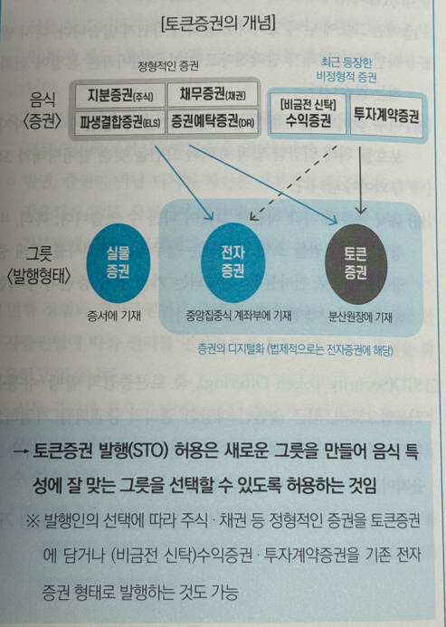

 
 

### ❐ 1. 토큰 증권의 개념

---

> 위쪽: “음식(증권의 종류)”

- 정형적인 증권 → 우리가 기존에 알고 있는 전통적인 증권들 
  - 지분증권(주식)
  - 채무증권(채권)
  - 파생결합증권(ELS)
  - 증권예탁증권(DR)
- 최근 등장한 비정형 증권 → 뮤직카우 같은 구조가 여기에 해당 
  - 비금전 신탁 수익증권 
  - 투자계약증권

 

> 아래쪽: “그릇(발행 형태)”

- 증권을 어디에 기록하느냐의 문제

| 형태    | 기록 위치       |
|-------|-------------|
| 실물증권  | 종이 증서       |
| 전자증권  | 중앙집중식 계좌부   |
| 토큰증권  | 분산원장(블록체인)  |

 

> 그림이 말하는 진짜 핵심

- 이미지 중앙에 화살표가 여러 개 그어져 있는 이유는:
  - 주식도 → 토큰으로 발행 가능 
  - 채권도 → 토큰으로 발행 가능 
  - 투자계약증권도 → 토큰으로 발행 가능
- 즉, `증권의 종류`와 `발행 방식`은 서로 **독립적**인 개념이다.

 

> 아래 문장의 의미

- 마지막 문장을 쉽게 말하면:
  - 기존에는 실물증권 or 전자증권만 가능했음. 
  - 하지만 이제는 블록체인이라는 새로운 그릇(토큰증권)을 추가로 허용해준 것.
- 즉, STO는 “새로운 투자상품을 만든 것”이 아니라 **“기존 증권을 블록체인에 담을 수 있게 해준 것”**
