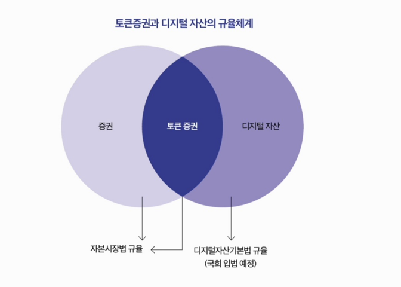
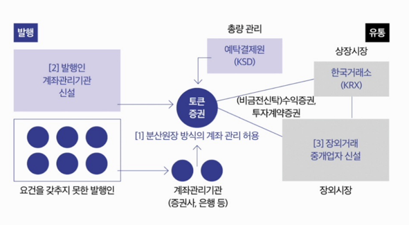
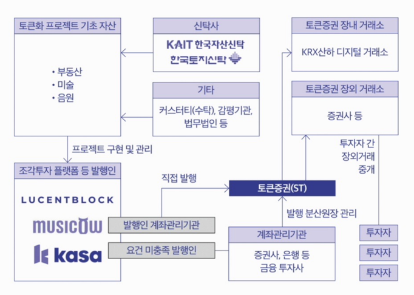

 
 

### 한국형 STO 토큰증권의 개념과 원리 

---

####  1. 한국 STO를 어떻게 알아볼까?

- STO(토큰증권)는 국가마다 제도 적용 방식과 기술 구조가 다르며, 아직 형성 초기 단계에 있는 시장이다.

- 향후 5년간 정책·기술·시장 구조에서 큰 변화가 예상되므로 종합적인 이해가 필요하다.

- 한국형 STO의 핵심 기준
  - 2023년 2월 금융위원회·금융감독원·한국거래소·예탁결제원이 공동 발표한 「토큰증권 발행·유통 규율체계 정비방안」 
  - 한국 STO는 자본시장법 체계 안에서 제도권 금융 중심으로 설계되고 있다.

- 국내 STO 사업의 핵심 주체는 증권사다. 
  - 발행·유통 구조가 기존 금융 인프라 중심으로 구성되기 때문에, 
  - 주요 증권사의 전략과 플랫폼 준비 상황이 시장 방향을 좌우한다.

- 미국·일본·싱가포르 등 해외 STO 사례는 참고 대상이지만, 법·정책·유통 구조가 서로 다르다. 
  - 따라서 동일한 기준으로 비교하면 안 되며, 
  - 한국은 한국의 제도 환경 속에서 이해해야 한다.

- 세금 및 자본시장법 관련 제도는 향후 3~5년간 변화 가능성이 높다. 
  - 과세 여부·방식·시점에 따라 시장 분위기가 크게 달라질 수 있으므로 정책 변화를 지속적으로 확인해야 한다.

- STO는 단순한 디지털 증권이 아니라, 블록체인을 활용해 권리를 프로그래밍할 수 있는 구조다. 
  - 향후 공연·전시·굿즈·숙박권 등 다양한 권리와 결합된 확장형 모델로 발전할 가능성이 있다.

 

####  2. STO 토큰증권이란?

- STO는 **주식, 채권, 부동산 등 전통 금융 자산을 블록체인 기반 디지털 토큰으로 발행하는 것**이다.
- 자산을 블록체인에 표현하여 **소유권과 거래를 디지털 방식으로 관리**한다.
- 이를 통해 **투자 효율성 향상, 거래 투명성 확보, 안전한 거래 구조**를 만든다.
- 기존 금융 시스템(증권 시장)과 블록체인 기술을 결합한 새로운 자산 관리 방식이다.

- 기존 코인과의 차이점
    - 비트코인, 알트코인 등은 백서 기반으로 발행되어 거래소에서 유통되는 구조가 중심이었다.
    - 초기 코인들은 대부분 **재산적 담보 없이 발행**되었다.
    - 반면 STO는 **실질적인 자산 가치 또는 자산 담보가 존재**해야 한다.
    - 발행 단계에서 **금융당국의 엄격한 심사와 승인**을 거친다.

- 제도적 차이
    - STO는 정부의 감시·감독 하에 발행·유통된다.
    - 증권과 동일하게 관리되며, 일반 코인 거래소(업비트, 빗썸 등)에서는 거래할 수 없다.
    - 금융당국은 **토큰증권 시장과 코인 시장을 명확히 분리**하려 한다.
 
 

####  3. 한국형 STO 제도 방향

- 가장 큰 특징은 **발행과 유통의 분리**이다.
    - 기존 조각투자 플랫폼(뮤직카우, 아트투게더 등)은 발행·유통·정산을 모두 한 회사가 담당했다.
    - 한국형 STO는 투자자 보호를 위해 **입법 단계부터 발행과 유통을 명확히 구분**한다.
    - 대형 증권사가 발행과 유통을 동시에 하는 구조는 지양한다.
    - 이는 중소·신규 기업의 참여 기회를 넓히기 위한 정책적 판단이다.

- 토큰증권은 **새로운 증권 상품(투자계약증권)** 개념으로 정립된다.
    - 기존 주식·채권과는 다른 형태지만 자본시장법상 ‘증권’으로 본다.
    - 단순 가상자산이 아니라 **증권의 디지털 발행 형태**로 규정된다.

- 별도의 STO 장외거래소 신설 계획
    - 기존 증권시장과는 별도로 **토큰증권 전용 장외거래소**를 설립한다.
    - 입법 및 시행령 정비 후, 새로운 기준에 맞춰 운영할 예정이다.

- 2023년 2월 4일 금융당국 가이드라인 발표
    1. 디지털자산의 증권성 판단 원칙 제시
    2. 토큰증권 발행·유통 규율 체계 정비 방안 포함

- 금융당국이 정의한 토큰증권
    - 분산원장 기술을 활용한 것
    - 자본시장법상 증권을 디지털화한 것
    - 디지털자산 중에서도 ‘증권’에 해당하는 영역

- 규제 적용 원칙
    - 토큰증권은 발행 형태와 관계없이 **자본시장법 적용 대상**
    - 공시, 인허가, 불공정거래 금지 등 기존 증권 규제 모두 적용
    - 반면 증권이 아닌 디지털자산은 자본시장법 적용 대상이 아니며,
      향후 ‘디지털자산 기본법’에 따라 규율될 예정

 

####  4. 금융위원회 발표 한국 STO 구조

- 2023년 2월 ‘토큰증권 발행·유통 규율체계 정비방안’에서 STO의 기본 구조 제시
    - **증권에 해당하는 것만 STO로 발행·유통 가능**
    - 블록체인 기술을 활용하되, 관리·감독은 **현행 증권 관련 법(자본시장법)**으로 통제

- 증권 여부 판단 원칙 제시
    - 증권에 해당하는 디지털 자산은 현재도 증권 규제 전면 적용
    - 다만 디지털 자산의 증권성 판단이 어려운 사례가 존재
    - 특히 ‘투자계약증권’ 적용 범위에 대한 명확화 필요

- 판단 및 사후관리 체계
    - 기본 판단 원칙을 제시해 법 위반 가능성 최소화
    - 발행 후에도 개별 사업별로 증권성 판단 및 후속조치 진행
    - 자본시장법 + 디지털자산 기본법이 함께 시장 전반을 규율
    
- 규율 체계 구조 (핵심 개념)
  
  - 전통적 ‘증권’ 영역 → 자본시장법 규율
  - ‘디지털 자산’ 중 증권에 해당하지 않는 영역 → 디지털자산 기본법(입법 예정) 규율
  - 두 영역이 겹치는 부분이 바로 **토큰증권(STO)**

- 신규 제도 특징
    - 그림, 음원 사용료 등 조각투자 상품을 증권 체계 안으로 편입
    - 새로운 형태의 권리 발행이 가능하되, 지속적 관리체계 구축 예정

 

####  5. 금융위원회 발표 한국 STO 발행과 유통 구조

- 발행
    - 토큰증권을 최초로 만들어 시장에 내놓는 단계
    - 자산을 블록체인 기반 디지털 증권 형태로 구조화하는 과정

- 발행인
    - 토큰증권을 발행하는 주체 (기업, 플랫폼 등)
    - 기초자산(음원, 부동산, 수익권 등)을 보유하거나 구조화함

- 발행인 계좌관리기관
    - 일정 요건을 갖춘 발행인이 직접 계좌를 관리할 수 있도록 허용된 기관
    - 블록체인 기반으로 투자자 권리(잔고)를 기록·관리
    - 기존 중앙집중식 장부 대신 분산원장 활용 가능

- 계좌관리기관 (증권사, 은행 등)
    - 발행 요건을 갖추지 못한 발행인을 대신해 계좌를 관리하는 기관
    - 투자자별 보유 수량, 이전 내역 등을 공식 장부로 관리
    - 증권 시스템의 핵심 인프라 역할

- 분산원장 방식의 계좌 관리 허용
    - 블록체인 기반으로 권리와 거래 기록을 관리하는 것
    - 다만, 법적 효력은 자본시장법 체계 안에서 인정

- 총량 관리
    - 발행된 전체 물량이 임의로 증가·감소하지 않도록 관리하는 체계

- 예탁결제원(KSD)
    - 한국 증권의 중앙 예탁·결제 기관
    - 토큰증권의 전체 발행량 및 권리 총량을 통제
    - 이중발행·과다발행 방지 역할
    - 예탁 :  실물 증권이나 투자 자금(예수금)을 맡겨두는 것을 의미

- 유통
    - 발행된 토큰증권이 투자자 간 거래되는 단계

- 상장시장 (한국거래소 KRX)
    - 일정 요건을 충족한 토큰증권이 상장되어 거래되는 공식 시장
    - 기존 주식시장과 유사한 구조

- 장외시장
    - 거래소 상장 없이 거래되는 시장
    - 비상장 토큰증권 거래 가능

- 장외거래 중개업자
    - 토큰증권 전용 중개 사업자 (신설 예정)
    - 투자자 간 매매를 연결해주는 역할
    - 기존 코인 거래소는 참여 불가

- 2023년 2월 ‘토큰증권 발행·유통 규율체계 정비방안’에서 제시된 핵심 구조

- 가장 큰 특징: **발행과 유통의 철저한 분리**
    - 발행인, 계좌관리기관, 유통 중개업자가 각각 분리된다.
    - 미국처럼 발행사가 유통까지 담당하는 구조를 허용하지 않는다.
    - 목적: `증권사 독점 방지`, `시장 투명성 확보`, `투자자 보호 강화`

- 발행 구조
    - 일정 요건을 갖춘 발행인은 ‘계좌관리기관’을 통해 발행
    - 요건을 갖추지 못한 발행인은 증권사·은행 등 계좌관리기관을 통해 발행
    - 분산원장(블록체인) 방식의 계좌 관리 허용

- 총량 관리
    - 예탁결제원(KSD)이 토큰증권 총량 관리 역할 수행

- 유통 구조
    - 상장 시장: 한국거래소(KRX)
    - 장외 시장: 새로운 ‘장외거래 중개업자’ 신설
    - 기존 코인 거래소는 참여 불가

- 장외거래 중개업자 특징
    - 신규 사업자로 별도 허가 체계 적용
    - 기존 가상자산 거래소의 참여는 허용하지 않는 방향

- 핵심 정리
    - 한국 STO는 블록체인을 활용하되,
    - 발행은 증권 체계 안에서,
    - 유통은 별도 중개업자를 통해,
    - 관리·감독은 기존 자본시장법 틀 안에서 이루어진다.

 

####  6. 금융 위원회 발표 한국 STO 상품

- STO 대상 상품
    - 비정형적 증권인 **(비금전신탁) 수익증권**
    - **투자계약증권**
    - 기존 정형적 증권(주식, 채권 등)도 선택적으로 STO 형태 발행 가능

- 정형적 증권
    - 지분증권(주식)
    - 채무증권(채권)
    - 파생결합증권(ELS)
    - 증권예탁증권(DR)
    - 기존에는 실물증권 → 전자증권 → 향후 토큰증권으로 확장 가능

- 비정형적 증권 (STO 핵심 영역)
    - (비금전신탁) 수익증권
        - 현금이 아닌 자산(음원, 그림 등)을 신탁하고 그 수익을 나눠 갖는 구조
    - 투자계약증권
        - 타인의 노력으로 발생하는 수익을 기대하고 투자하는 구조
        - 조각투자, 공동투자 상품 다수 해당

- 예시 이해
    - BTS가 속한 하이브 주식에 투자하는 대신
    - 특정 BTS 앨범 수익에만 투자하는 상품을 만들 수 있음
    - 즉, 기업 전체가 아닌 **특정 사업·콘텐츠 단위 투자 가능**

- 제도화 목적
    - 현재 시범 운영·조각투자 형태로 존재하는 상품을
      → 자본시장법 체계 안으로 편입
    - 금융당국 사전 심사·검증을 거쳐
      → 투자자 보호 강화
    - 계약 내용 명확화 및 정산·회수 구조 안정화

- 향후 확장 가능성
    - 기존 전자증권도 발행인이 원하면 STO 형태로 전환 가능
    - 다양한 수익권 기반 증권이 토큰 형태로 발행·유통될 수 있음

- 정책적 의의
    - 기존에는 기관·전문투자자 중심이던 투자 기회를
    - 일반 국민도 접근 가능하도록 확대

 

####  7. 토큰증권(STO) 생태계

> 토큰증권(STO) 생태계

- 토큰화 프로젝트 기초자산
    - 부동산, 미술품, 음원 등 실제 실물 가치가 있는 자산
    - 토큰 발행 전 자산 가치평가 진행
    - 유동화가 어려웠던 자산일수록 자산 소싱 역량 중요

- 신탁사
    - 한국자산신탁, 한국토지신탁 등
    - 기초자산을 신탁 구조로 관리
    - 투자자 보호를 위한 법적 안전장치 역할

- 기타 참여기관
    - 커스터디(수탁기관), 감평기관, 법무법인 등
    - 자산 보관, 가치평가, 법적 검토 수행

- 토큰증권 발행사 (Issuer / 발행 프로토콜)
    - 블록체인 네트워크 및 발행 규칙 설계
    - 실제 토큰(ST)을 발행
    - KYC(실명인증), AML(자금세탁방지) 기능 포함 필요

- 발행인 계좌관리기관
    - 일정 요건을 갖춘 경우 직접 계좌 관리 가능
    - 분산원장 기반으로 투자자 권리 기록

- 계좌관리기관 (증권사·은행 등)
    - 발행 요건 미충족 시 계좌 관리 담당
    - 투자자별 보유 내역을 공식 장부로 관리

- 토큰증권(ST)
    - 자본시장법상 증권을 블록체인 기반으로 디지털화한 형태
    - 수익증권, 투자계약증권 등 포함

- 토큰증권 장내 거래소
    - KRX 산하 디지털 거래소(상장시장)
    - 요건 충족 시 상장 거래 가능

- 토큰증권 장외 거래소
    - 증권사 등 ‘투자매매 중개업자’ 라이선스 보유 주체
    - 투자자 간 장외거래 중개

- 투자자
    - 1차 발행 참여
    - 2차 시장(장내·장외) 거래 참여

 

> 생태계 핵심 구조 (3대 축)

- 기초자산 공급자  
- 토큰 발행자(프로토콜/플랫폼)
- 유통 플랫폼(거래소/중개업자)

 

####  8. 수익증권, 투자계약증권

- STO 대상 자산은 **수익증권·투자계약증권** 형태로 발행되며, 비정형적 증권에 해당함
 
- 현재 시장에서는 ‘조각투자’라는 개념으로 다양한 자산(미술품, 부동산, 음원, 와인 등)에 적용됨
 
- 법적으로 명확히 제도화되지 않았던 영역이었으나, 샌드박스를 통해 시범 발행 및 유통이 진행됨
 
- 예시
  - 뮤직카우의 음원 공동투자 → 전체 지식재산권을 보유하는 구조가 아니라는 점에서 금융당국의 검토 대상이 됨

- 금융당국은 조각투자 상품을 **신규 투자계약증권 형태로 인정**하고 제도권 편입을 추진

- 2023년 8월 10일, 금융감독원은 투자계약증권 관련 업무 교육 실시
    - 조각투자 상품을 투자계약증권으로 보고 별도 심사 부서 구성
    - 변호사 계약 검토 의견서, 피해 방지 대책 등 제출 필요
    - 심사 비용 및 심사 기간 고지

- 핵심 기조: **투자자 보호와 안정성 확보가 최우선 과제**

 

####  9. 디지털 자산의 증권 판단 예시

- 디지털 자산이 ‘증권’인지 여부는 **권리 구조와 수익 귀속 방식**에 따라 판단됨

- 증권에 해당할 가능성이 높은 경우
    - 사업 운영에 대한 지분권, 배당권, 잔여재산 분배청구권을 가지는 경우 (지분증권)
    - 일정 기간 후 투자금 상환을 받을 수 있는 구조 (채무증권)
    - 신탁 수익권을 부여받는 경우 (수익증권)
    - 기초자산 가격 변동에 연동해 회수금액이 달라지는 구조 (파생결합증권)
    - 신규 발행 증권을 청약·취득할 권리가 부여된 경우
    - 다른 증권에 대한 계약상 권리·지분 관계를 가지는 경우 (증권예탁증권 등)
    - 발행인이 투자금을 활용해 사업을 수행하고, 그 성과에 따른 수익을 투자자에게 귀속시키는 경우 (투자계약증권)
        - 특히 발행인의 노력·경험·능력에 따라 수익이 발생하는 구조
        - 형식은 ‘보상’처럼 보여도, 실질이 사업 성과에 따른 수익 분배라면 투자계약증권에 해당

- 증권에 해당할 가능성이 낮은 경우
    - 발행인이 없거나, 투자자 권리에 상응하는 의무 이행 주체가 없는 경우
    - 사업 수익에 대한 권리가 없고 단순 디지털 표시·기록에 불과한 경우
    - 재화·서비스 이용 목적(유틸리티 목적)으로 발행·사용되는 경우
    - 지급결제·교환 매개 수단으로서 안정적 가치 유지를 목적으로 하며 상환을 약속하지 않는 경우
    - 투자자가 사업 운영에 일상적으로 참여하여 정보 비대칭성이 없는 경우
    - 투자자가 중요한 재화·용역을 제공하고 그 대가만 지급받는 구조인 경우
    - 실물 자산의 공유권만 표시하고, 발행인의 가치 상승 기여나 이익 귀속 약정이 없는 경우

 

####  10. 토큰증권과 코인의 차이

- STO는 **기존 금융자산을 블록체인으로 토큰화**한 것
  - 주식, 부동산, 채권, 수익권 등 ‘증권’ 성격의 자산을 디지털 토큰으로 발행
  - 금융당국의 감독을 받으며, 규제 준수를 전제로 투자 기회를 제공
  - 본질: **증권형 디지털 자산**

- 코인은 블록체인 네트워크에서 사용되는 **디지털 화폐**
  - Bitcoin, Ethereum, Litecoin 등
  - 특정 블록체인 기반에서 발행·유통
  - 주 용도: 지급·결제 수단, 가치 이전, 디지털 자산

- 핵심 차이

    | 구분   | 구조         | 설명                    |
    |------|------------|-----------------------|
    | STO  | `투자·증권 중심` | 증권법 체계 안에서 취급         |
    | 코인   | `결제·교환 중심` | 별도 블록체인 생태계 내 자산으로 취급 |

- 스위스 FINMA 기준 토큰 분류
  - 🔵 지불형 토큰
    - 결제·송금 목적
    - 증권으로 보지 않음
    - 예: 비트코인, 이더리움
  - 🟢 유틸리티 토큰
    - 특정 서비스·애플리케이션 이용 목적
    - 원칙적으로 규제 대상 아님
    - 단, 투자 성격을 가지면 증권 규제 적용 가능
  - 🟣 자산형 토큰
    - 배당, 미래 현금흐름 등 수익 권리 부여
    - 실물자산 담보 구조 가능
    - 증권 성격을 가지면 증권법 규제 대상

- 우리나라의 특징
  - 발행 단계에서 증권 여부를 판단
  - 유통 구조도 **일반 코인시장과 분리될 가능성 높음**
  - 코인거래소에서 유통되는 코인이 STO 장외거래중개소에서 동시에 거래되지는 않을 가능성 높음

 

####  11. STO 관련 주요 개정 법안

> STO 관련 주요 개정 법안

- 한국형 STO 도입을 위해 **자본시장법 + 전자증권법 개정**이 필요
  - 발행 단계 → 자본시장법 개정 중심
  - 토큰증권 발행 근거 마련 → 전자증권법 개정
  - STO는 기존 자본시장 체계 내에서 일부 수정 방식으로 편입

- 유통 구조
  - STO 유통도 자본시장법 일부 개정으로 규율
  - 새로운 형태의 **장외거래중개소** 신설 예정 (시행령 중심)
  - 기존 코인거래소는 STO 취급 불가 방향

 

> 핵심 방향

- STO는 기존 금융 규제 틀 안에서 제도화
- 중소기업도 참여 가능하도록 설계
- 코인시장과 분리된 별도 유통 인프라 구축
- 최종 목적: **투자자 보호를 전제로 한 제도권 편입**

 

####  12. STO 관련 제도화 및 법안 진행상황

> STO 관련 제도화 및 법안 진행상황

- 2023년 2월: 토큰증권 발행·유통 규율체계 정비방안 발표  
  - (금융위, 금감원, 한국거래소, 예탁결제원)

- 「가상자산 이용자 보호 등에 관한 법률」 제정
  - 2023.7.18 제정
  - 2024.7.19 시행

- 2023년 8월 1일 금감원 보도자료
  - 투자계약증권 발행 대비 공시·심사체계 개편
  - 토큰증권 발행 기준안 발표

- 2023년 8월 10일
  - 금융 및 관련 업계 대상 실무·제도 설명회 개최
  - 투자계약증권 세부 심사 기준 안내

 

> 입법 예고 사항

- 전자증권법 개정안 발의 (7.28)
    - 분산원장 기반 발행인 계좌관리기관 정의
    - 등록요건 명확화

- 자본시장법 개정안 발의 (7.28)
    - 투자계약증권 유통 규제
    - 장외거래 제도
    - 투자 한도 등 규율

- 전자등록법 규정 개정안 (2.27)
    - 증권신고서로 모집·매출되는 투자계약증권을 전자등록 대상에 포함

 

> 실제 승인 및 사례

- 2023.12.15 미술품 투자계약증권 발행 승인
    - 열매컴퍼니 (쿠사마 야요이 작품)
    - 12.18~23 투자계약청약 진행

- 2024년 추가 승인 사례
    - 1.12 서울옥션블루 (미술품, 공모 7억 원)
    - 1.16 투게더아트 (미술품, 11억 8,200만 원)
    - 1.23 스탁키퍼 (송아지, 8억 6,680만 원)

 

> 감독 방향

- 2023.7.31 기준 증권신고서 서식 전면 개정
- 투자계약증권 전담 심사팀 운영
    - 공동사업 구조
    - 증권 발행 구조
    - 투자자 보호 체계 중심으로 엄격 심사

 

####  13. 발행인 계좌관리기관 허가 기준

> 

- 토큰증권 유통체계는 기존 제도권 증권시장 수준의 규제 요건이 적용될 전망
- 금융당국은 채권중개전문회사 요건 등을 참고해 인가 기준을 설정 예정
- 신규 사업자보다는 **증권사 등 기존 인프라 보유 중개업자**가 라이선스 취득에 유리할 가능성 높음

 

> 발행인 계좌관리기관(안) 주요 요건

- 분산원장 요건
  - 분산원장 기술 요건 충족 필요

- 자기자본·물적설비·대주주·임원 요건
  - 세부 기준은 의견수렴 후 확정 예정

- 인력 요건
  - 법조인
  - 증권사무 전문인력
  - 전산 전문인력 각 2인 이상 확보

- 손해배상 체계
  - 투자계약증권 발행량에 비례한 기금 적립

- 총량 관리
  - 최초 발행수량 및 변동 내역을 일정 주기마다 전자등록기관(KSD)에 통보
  - 필요 시 KSD가 비교·검증 수행

 

> 핵심 정리

- STO는 단순 블록체인 사업이 아니라 **증권 인프라 사업 수준의 요건 요구**
- 기술 + 법률 + 증권 실무 역량을 모두 갖춘 구조 필요
- 발행·유통 전 과정이 전자등록기관(KSD)과 연동되는 체계로 설계

 

####  14. 장외거래중개업 허가 기준

> 장외거래중개업 허가 기준

- 토큰증권 발행체계의 핵심은 `발행인 계좌관리기관` 도입
- 기존에는 증권사를 통해서만 증권 등록 가능했으나, 토큰증권은 일정 요건 충족 시 발행인이 직접 등록 가능
- 조각투자 플랫폼 등 기존 사업자는 발행사업을 위해 계좌관리기관 라이선스 취득 필요

 

> 장외거래중개업 요건(안)

- 자기자본·물적·인적·대주주·임원 요건
  - 채권전문중개회사 수준을 감안해 확정 예정
  - 증권 유형(인가 단위)별 자기자본 요건 차등 적용 예정

- 업무범위
  - 증권시장 외에서 투자계약증권·수익증권 매매 중개
  - 다수 참여자를 대상으로 종목별 매수·매도호가 공표
  - 호가 일치 시 거래 체결

- 투자한도
  - 일반투자자 연간 투자한도 제한
  - 투자계약증권은 수익증권보다 위험성이 높아 더 낮은 한도로 설정 예정

- 대상증권
    - 공모 발행 증권
    - 소액투자자(발행총량 5% 이내 보유, 발행인 특수관계인 제외)가 보유한 투자계약증권·수익증권

- 업무기준
  - 중개신청·취소·정정 절차
  - 매매체결 원칙 및 방법
  - 착오매매 정정
  - 체결내용 통지
  - 계약 이행 방식
  - 기록 작성·유지
  - 발행인 현황 공시
  - 불공정행위 제재 기준
  - 이상거래 적출 기준 등 마련

- 금지행위
  - 발행 인수 주선 증권의 매매 중개 금지
  - 정보 제3자 제공·누설 금지
  - 중개업무와 타 업무 간 이해상충 행위 금지

- 기타
  - 예탁금 건전성, 광고 규제 등은 증권사와 동일 기준 적용

 

> 핵심 정리

- STO 유통업은 단순 플랫폼 사업이 아니라 **증권 중개업 수준의 규제 산업**
- 투자자 보호 중심 설계
- 기존 코인거래소와는 전혀 다른 인가 체계 적용

 

####  15. 한국 STO 사업 성공 요건들

> 신규 증권 상품 발굴

- 영화, 엔터테인먼트, 미술품 등 장기적으로 다양한 상품군 필요
- 기존 조각투자 사업자와의 제휴·협업 강화
- 유망 자산 보유자 발굴 및 전략적 제휴를 통한 상품 확대

 

> 경쟁력 있는 사업 파트너 제휴

- 발행사 입장
  - 유통사, 계좌관리기관, 기술회사 등과 협력 필수
- 유통사 입장
  - 자산보유사, 발행사, 기술회사, 증권사, 은행 등과 네트워크 구축
- 혁신금융서비스, 글로벌 진출 등 중장기 전략을 공유할 수 있는 파트너십 필요

 

> 유동성 확보를 위한 협력 구조

- 발행사
  - 발행된 증권이 시장에서 활발히 거래되어야 함
  - 거래를 통한 수익 발생 및 현금화 구조가 자리 잡아야 추가 발행 가능
- 유통사
  - 초기 회원 확보가 핵심 경쟁력
  - 이용자 규모가 시장 점유율과 직결

 

> 지속적인 전문 기술회사와의 제휴

- 블록체인 기술 발전을 반영할 수 있는 전문 기업과 협력 필요
- 대용량 거래 처리, 개인정보 보호, 해킹 방지 등 보안 역량 확보
- 상품별 계약 구조에 맞는 정산 시스템 개발
  - 수익 분배 시스템
  - 회계·기술적 지원 체계 구축

 

> 핵심 정리

- STO 성공을 위해서는 단순 발행이 아닌 
  - **상품·파트너·유동성·기술 인프라**가 종합적으로 갖춰져야 함
  - 한국 STO는 **“제도권 금융 + 블록체인 기술 + 유동성 확보”**의 삼각 구조가 핵심
- 성공 여부는 **상품 다양성, 네트워크 파워, 시장 유동성, 기술 안정성**에 달려 있음

 

####  16. 전통적인 증권과 토큰증권의 차이

> 전통적인 증권

- 주식
  - 회사의 소유권을 의미
  - 이익·손실에 참여

- 채권
  - 자금을 빌려주고 이자 수취
  - 만기 시 원금 상환

- 파생상품
  - 주식·채권·환율 등 기초자산 가격에 따라 가치 변동
  - 선물, 옵션, 스왑 등

- 거래 구조
  - 주식시장, 채권시장, 파생상품시장 등에서 거래
  - 발행·거래·결제·청산 절차가 제도화되어 있음
  - 전자증권 형태로 관리

 

> 토큰증권

- 기본 구조는 기존 증권과 유사
  - 발행 → 거래 → 결제 → 청산 절차 존재
- 차이점
  - 실물 토큰 없음
  - 발행·거래가 분산원장(블록체인) 기반에서 이루어짐
- 자본시장법상 동일 규제 적용
  - 법 위반 시 제재 가능

 

> 투자한도 및 공모규모 이슈

- 금융위는 발행 규모 및 유통 단계에서 투자한도 제한 방침 발표
- 2023년 2월 가이드라인에서 공모 규모·투자한도 제시
- 다만 최근 시장 활성화 논의로 '확정 공모규모', '일반 투자자 한도' 등은 최종 확정되지 않은 상태

 

> 핵심 정리

- 본질은 동일한 ‘증권’
- 차이는 **기술 인프라(블록체인 기반)**와 관리 방식
- 향후 공모 규모와 투자한도 설정이 시장 성장에 핵심 변수

 

####  17. 기존 증권과 토큰증권의 비교

> 1차 발행 단계

- 발행
  - 기존 증권
    - 발행인이 발행 규모 및 주관사 결정
    - 증권사가 발행 주관
  - 토큰증권
    - 발행인이 발행 규모 및 발행 플랫폼 결정
    - 토큰증권 발행 플랫폼이 발행 주관 역할

- 청약·배정
  - 기존 증권
    - 투자자가 주관사 계좌를 통해 공모 청약
    - 주관사가 증권 배정
  - 토큰증권
    - 투자자가 발행 예정 토큰을 공모 청약 (적격투자자 중심 검토)
    - 스마트계약을 통해 자동 배정

- 명의 변경
  - 기존 증권
    - 명의개서대리인이 주주명부 관리
  - 토큰증권
    - 명의개서대리인이 주주명부 관리 (기본 구조 동일

 

> 2차 시장

- 주문 체결
  - 기존 증권
    - 거래소 상장 후 브로커·딜러를 통해 주문
  - 토큰증권
    - 발행 플랫폼과 거래 플랫폼이 토큰으로 연결
    - ATS 등 거래 플랫폼에서 브로커 통해 주문
    - 거래 플랫폼이 토큰 상장 및 관리

- 청산
  - 기존 증권
    - 중앙청산소(CCP) 통해 청산
    - 소유 변동 내역 장부 기록
  - 토큰증권
    - 중앙청산소 통해 청산
    - 소유 변동 내역을 분산원장에 기록

 

####  18. STO 시장에 대한 증권사 견해

> 증권사들의 공통 인식

- 대부분의 증권사가 STO 사업 참여 필요성 인식
  - STO는 증권사에게 **플랫폼 활성화 및 시장 확대 기회**
  - 코인시장으로 이동한 20~30대 고객을 다시 유입할 수 있는 수단으로 평가
  - 기존 주식 중심 시장은 정체 상태 → STO는 신규 성장 동력으로 인식
- 법무팀 중심으로 사업 검토 진행
- 블록체인·IT 결합 사업 특성상 수익성 예측이 어려워 내부 투자에는 신중
- STO 관련 협의체 구성 및 MOU 체결 활발
- STO 스타트업에 대한 지분 투자·인수도 진행 중

 

####  19. 증권사의 STO 활동 현황

> 개요

- 2023년 상반기부터 대형 증권사들이 STO 협의체 구성 및 파트너 확보에 적극적
- 공통 전략
  - 조각투자 플랫폼 + 블록체인 기술 기업 + 실물자산 보유사와 연합
- 단순 검토 단계가 아니라 **협의체 구성, 지분 투자, 인수 추진**까지 진행 중

 

> 주요 증권사 STO 활동 현황

| 증권사             | 주요 협의체/조직         | 주요 활동 및 전략                                  |
|-----------------|-------------------|---------------------------------------------| 
| 신한투자증권          | STO 얼라이언스         | 발행 비용 절감, 블록체인 컨설팅, 유통 솔루션 지원 전략            |
| NH투자증권          | STO 비전그룹          | 투게더아트, 트레저러리, 그리너리 등과 협업                    |
| KB증권            | ST오너스             | 스탁키퍼, 서울옥션블루, 펀더풀 등과 협력 / 기술기업(SK C&C 등) 참여 |
| 한국투자증권          | ST 프렌즈 협의체        | 카카오뱅크·토스뱅크와 협의체 구성 / 루센트블록 투자               |
| 키움증권            | -                 | 뮤직카우, 펀드블록글로벌 등과 협업                         |
| 대신증권            | -                 | 카사 인수                                       |
| 미래에셋증권          | 디지털자산 TF          | 한국토지신탁 등과 STO 협약                            |
| 기타 (한화·SK·유진 등) | -                 | 스타트업 제휴 및 업무협약 진행                           |

 

> 흐름 정리

- 증권사 단독 추진 ❌
- 연합·컨소시엄 중심 구조 ⭕
- 기술기업 + 자산보유사 + 플랫폼과 생태계 구성 중
- STO는 단기 프로젝트가 아니라 **중장기 전략 사업으로 인식**

 

> 핵심 정리

- 대부분의 대형 증권사가 STO 참여 준비 중
- 협의체 구성 → 파트너십 → 투자·인수까지 확장
- STO 시장 선점을 위한 초기 포지셔닝 경쟁 단계

 

####  20. 투자계약증권 신청서 작성

> 투자계약증권 신청서 작성

- 2023.8.10 금감원 ‘투자계약증권 발행·심사 설명회’ 기준 정리
- 뮤직카우·미술품·한우 등 조각투자는 투자계약증권으로 판단
- 증권신고서는 서면 불가, 전자공시(DART)로만 제출

 

> 심사 핵심 내용

- 공동사업 구조 등 투자계약 해당 여부 검토
- 다른 증권 형태로 발행 가능 여부 검토
- 투자자 보호체계 구축 여부 검토
- 형식 적정성, 중요사항 누락 여부, 허위기재 여부 점검
- 보완 요구 시 청약 일정 지연 가능

 

> 투자자 보호 중심 작성 지침

1. 소유권 입증 및 기초자산 보관 방식 명확히 기재
   - 도산 시 법적 절연 여부
   - 소유권 미이행 시 발생 가능한 위험 상세 기재

2. 투자자 예치금 관리 방식 명시
   - 외부 금융기관 별도 예치 또는 신탁 구조 등

3. 유통시장 폐쇄 시 투자자 보호방안 기재

4. 투자 판단에 필요한 핵심 정보 기재
   - 가치평가 방법
   - 투자 위험
   - 매각 기간
   - 광고 기준 등

5. 손해배상 체계 명시
   - 발행사·공동사업자 과실 시 보상 기준

6. 사업 중단 시 제3자 관리 체계
   - 자산 보관·관리·처분·청산 절차 명확화

7. 업계 표준안·가이드라인 반영

 

> 핵심 정리

- 심사 기준의 중심은 **투자자 보호**
- `소유권 구조`, `자금 보관`, `도산 절연`, `손해배상 체계`가 핵심 포인트
- 단순 사업 설명이 아니라 **법적 구조 설계 문서에 가까움**

 

####  21. 투자계약증권 신청 시 중요 포인트

- 공모가격은 원칙적으로 **외부 평가기관의 객관적 가치평가**를 근거로 산정
- 내부 평가 시에는 사유와 타당성, 검증 근거를 상세히 기재
- 가치평가 방식은 전문성·통계자료·외부 검증 근거 제시 필수
- 변호사의 **법률검토의견서 첨부 의무**
    - 투자계약증권 해당 여부
    - 공동사업 구조의 적법성
    - 계약·배분 구조의 법규 적합성
- 회사 부도·폐업·사업중단 시 **구체적 구제방안 설계**가 핵심 심사 기준

 

####  22. 열매컴퍼니 1호 투자계약증권 사례

- 2023.12.15 미술품 투자계약증권 1호 승인
- 기초자산: 쿠사마 야요이 「호박(2001)」
- 모집금액: 12억 3,200만원
- 주당 공모가: 10만원 (1인 최대 300주)
- 청약률 650% 이상, 1시간 만에 완판
- 현재는 2차 유통 불가 → 매각 또는 배당 외 수익 실현 어려움
- 향후 STO 전용 장외시장 개설 시 유동성 확대 기대

 

####  23. 1호 투자계약증권 신청 서류 구성

- 전체 약 300쪽 분량
- 구성
  1. 증권신고서 및 대표이사 확인
  2. 모집·매출 관련 사항
  3. 발행인 관련 사항

- 모집·매출 주요 기재 사항
  - 공모 개요 및 공모가 산정 방식
  - 증권의 권리 내용
  - 투자위험 요소
  - 인수인의 의견
  - 자금 사용 목적

- 자금 사용 구조
  - 기초자산 취득: 11억 2,000만원
  - 발행 제비용: 1억 1,200만원
  - 총 모집금액: 12억 3,200만원

 

####  24. 한국 STO 시장의 예상 문제와 해결 과제

> 제도·규제 측면

- 발행과 유통의 분리로 인한 비효율·비용 증가 문제
- 규제 과도 시 시장 형성 저해 가능성
- 예탁결제원 역할·선관주의 의무 기준 정립 필요
- 토큰 선의취득·저가 증권화(Penny Stock Rule) 문제 대응 필요
- 토큰 증권성 판단·공시 체계 고도화 필요

 

> 제도 개선 방향

- 자본시장법·전자증권법에 STO 특성 반영
- 비효율적 미러링 구조 탈피
- 개인 투자한도 재검토 필요
- 발행공시·유통공시·부정거래 규율 정비
- 예치·신탁 등 투자자 보호 장치 강화
- 한국거래소 디지털자산 시장과의 연계 검토 필요

