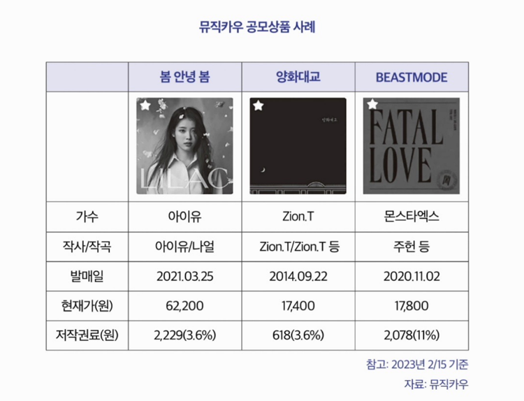
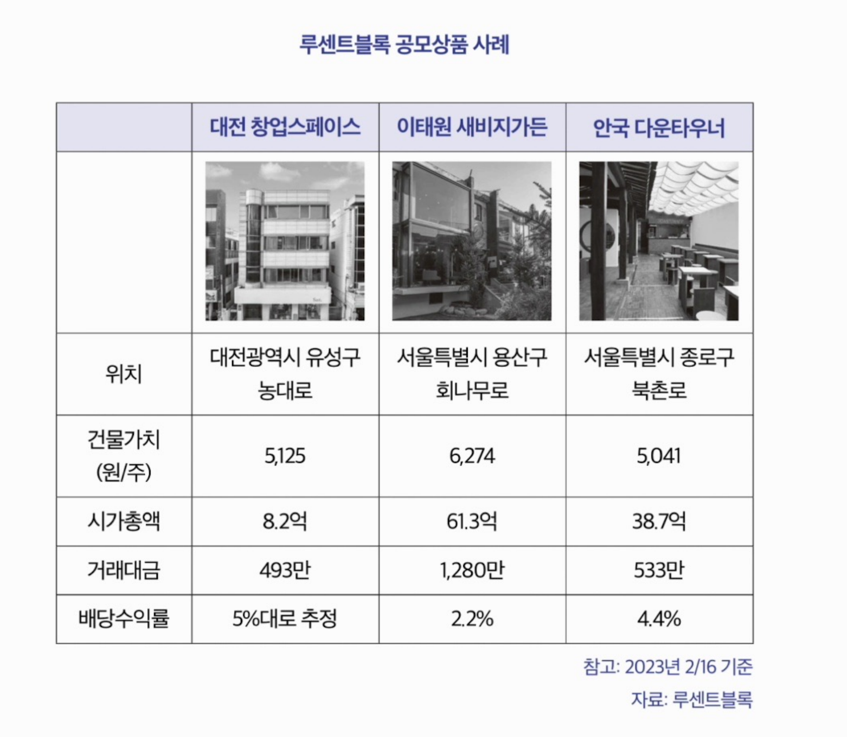

 
 

### STO 토큰증권 국가별 동향 

---

####  1. STO 뮤직카우(비상장)

- 2016년 설립, 세계 최초 음악 저작권 거래 플랫폼
- 음악저작권 기반 B2C 대체자산 플랫폼 중 최대 규모
- 2022년
  - 3월 : 금융당국이 ‘투자계약증권’으로 판단 
  - 9월 : 혁신금융서비스 지정 → 6개월간 사업재편 진행
- 향후 수익증권 형태로 음악저작권 발행·유통
  - 기존 발행 저작권도 수익증권 형태로 전환 예정
- 음악저작권은 거래량이 풍부해 STO 요건에 적합한 기초자산
- 대형 조각투자 플랫폼으로서 제도화 과정의 기준 모델 가능성 높음
- 정부 STO 육성·제도 마련 과정에서 레퍼런스 역할 기대

 

####  2. 뮤직카우 주요 수익원

- 조각투자 플랫폼 내 거래 수수료
- 자체 매입 저작권에서 발생하는 저작권료 수익
- 장기적으로 음악저작권 기반 금융상품으로 확장 계획
- 2022년 설립한 현지 자회사 통해 미국 시장 진출 준비 중

 

####  3. 뮤직카우 최근 투자치와 주요 주주

> 투자 유치 이력

| 연도/월    | 라운드/유형                  | 투자 금액             | 주요 투자자                                |
|---------| ----------------------- | ----------------- | ------------------------------------- |
| 2018.08 | Pre-A                   | (미상세)             | (미상세)                                 |
| 2019.01 | Series A                | (미상세)             | 하나금융투자 등                              |
| 2020.05 | Series B                | 70억               | LB인베스트먼트, 프리미어파트너스 등          |
| 2021.01 | Bridge (한화)             | 70억               | 한화                                    |
| 2021.06 | Pre-Series C / Series C | 170억 (누적 240억) | KDB산업은행, LB인베스트먼트 등 |
| 2022.01 | Series D                | 1,000억            | 스틱인베스트먼트 등                 |
| 2022.08 | Series D       | (미상세)             | 키움증권                                  |
| 2023.05 | Series E  | 600억 (누적 2,140억)  | 스틱인베스트먼트                       |

 

> 주요 주주

- 키움증권
- 스틱인베스트먼트
- 한국산업은행
- LB인베스트먼트
- 한화자산운용 등

 

> 뮤직카우 공모상품 사례 (2023.02.15 기준)

- 곡별로 배당률(저작권료 수익률) 상이
- 인기·스트리밍·공연·활용도에 따라 수익구조 차별화
- 실물 기반 수익 흐름이 존재하는 ‘현금흐름형’ STO 사례

 

####  4. STO 루센트블록(비상장)

> 루센트블록

- 2018년 설립, 부동산 수익증권 조각투자 플랫폼
- 부동산 관리 서비스까지 포함한 종합 부동산 금융 솔루션 지향
- 2021.04 금융위 혁신금융서비스 지정
- 전자증권법 하에서 안전하게 관리되는 구조 최초 구축

 

> 증권·신탁 구조

- 계좌관리기관: 하나증권
- 수익증권 발행: 하나자산신탁과 협력
- 자체 플랫폼 분산원장에 거래정보 저장
- 예탁원에도 동시 저장하는 ‘블록체인 미러링’ 방식 적용
- 서비스 초기부터 독자적 분산원장 기술 도입 → 타 조각투자 플랫폼과 차별화

 

> 플랫폼 전략

- ‘소유’ 플랫폼 안정성·효율성에 집중 투자
- 자체 블록체인 기반 다수 노드 운영 → STO 환경의 ‘탈중앙화’ 대비
- 단순 발행·유통이 아닌 인프라 중심 전략

 

> 부동산 관리 확장

- 오피스/코리빙 예약, 임대료·관리비 납부, 관리시스템 운영
- ‘컨시어지 솔루션’ 서비스 운영
- 향후 공모 부동산 관리 + 소싱 역량 내재화 계획
- 기초자산 관리 역량까지 확보하려는 구조

 

####  5. 루센트블록 최근 투자치와 주요 주주

> 투자 유치 이력

- 2020.04 서울대기술지주 등 Pre-A 투자
- 2022.03 하나증권 등 시리즈 A, 170억 투자

 

> 주요 주주

- 캡스톤파트너스
- 한국투자증권
- 쿼드자산운용
- 하나증권 등

 

####  10. 미국의 STO 진행 상황

> 미국의 STO 진행 상황

- 미국 STO 산업은 STO 기술사가 주도, 기존 금융사와 협업 구조
- STO 기술사는 발행공시 의무, 등록·면제 규정에 맞춰 발행·유통 서비스 제공
- 대표 사례: **mirrored stock** → 유동성 확대 목적의 조각화 주식

 

> 규제 체계

- 토큰증권 발행 시 연방 증권법 적용
- SEC(Securities and Exchange Commission)에 등록하거나 등록면제 규정 적용
- 토큰증권 유통도 SEC 규제 하에 기존 증권거래소와 유사하게 운영
- 적용 규정:
    - Regulation D (사모발행)
    - Regulation A (소액공모)
    - Regulation CF (크라우드펀딩)

 

> 거래 인프라

- 토큰증권 거래플랫폼은 ATS(Alternative Trading System) 인가 필요
- SEC 및 FINRA(Financial Industry Regulatory Authority)에 브로커-딜러로 등록

 

> 시장 특징

- 가장 많이 발행되는 유형: Reg D (사모발행)
    - 등록 면제, Form D 사후 통지
    - 절차 간편 → 발행 빈도 높음
    - 단, 투자자 범위 제한적

- 대표 플랫폼 tZERO 일간 거래량 약 7,469달러 수준
- 전통 증권과 동일한 SEC 규제 적용 → 코인 대비 투자 접근성 낮음
- 전용 거래소 중심 운영 → 별도 가입 필요
- 가상자산 시장 대비 상품 다양성 부족

 

####  12. 미국 STO의 주요 플레이어

> 증권형 토큰시장 참여자

| 주체 | 역할 | 인가 |
|------|------|------|
| 발행인 | 블록체인 기술을 이용해 증권형 토큰을 발행(STO)하여 자금을 모집하는 주체 | - |
| 수탁인 (Custodian) | 개인투자자가 토큰을 안전하게 보관할 수 있는 지갑(Wallet) 제공 발행 후 보호예수 기간 동안 토큰 보관 | 적격 관리인(Qualified Custodian) 자격 필요 |
| 명의개서대리인 (Transfer Agent) | DLT상 주주명부 생성·관리 증권 배부·배당·공시 등 기업행위(Corporate Actions) 대행 토큰 분실 시 대체 토큰 발행 지원 | 명의개서대리인 인가 필요 |
| 발행플랫폼 (Primary Exchange Platform) | 블록체인 기술을 활용해 증권형 토큰 발행 업무 대행 | 주로 브로커-딜러 인가 필요 *인가가 없을 경우 다른 브로커-딜러와 협업 |
| 거래플랫폼 (Exchange) | 토큰을 투자자에게 매매·중개 | ATS, 브로커-딜러 인가 필요 |
| 브로커-딜러 (Broker-dealer) | 투자자에게 거래플랫폼 내 매매·중개 서비스 제공 | 브로커-딜러 인가 필요 |
| 기타 | 청산기관, 스마트컨트랙트 개발사, AML 업무 대행사 등 | 관련 규제에 따른 인가·등록 필요 |

 

####  13. 미국 STO 플랫폼 예시

> 현재 미국 내 운영 중인 증권형 토큰 거래 플랫폼

| 플랫폼 | 비고 |
|--------|------|
| tZERO (tZERO ATS) | • 증권 토큰화를 원하는 기업의 토큰 발행 지원 • 자체 거래소(tZERO ATS) 통해 2차 거래 제공 • 자사 그룹 지분 토큰(equity token) 및 소프트웨어 기업 XYLab 주식 토큰화 사례 • 2023년 1월 tZERO ATS 일평균 거래규모 약 6만 달러 |
| INX | • 명의개서대리 + 2차 거래 서비스 제공 • INX Token, SPiCE VC, 블록체인캐피탈, Protos 등 증권형 토큰 거래 • 2021년 OpenFinance(ATS) 인수 → ATS 인가 확보 • 2022년 TokenSoft 인수 → 명의개서대리인 인가 확보 |
| Securitize | • 발행, 명의개서대리, 2차 거래 서비스 제공 • Exodus 지분, 일본 Sumitomo Mitsui Trust Bank의 ABS 토큰화 등 전통 금융상품 토큰화 사례 • 2차시장(Securitize Market) 운영: 오전 8시~오후 8시 (12시간) • 일평균 거래량 약 7,000달러 수준 (유동성 낮음) |

- 공통점: 발행 + ATS(대체거래시스템) 기반 2차시장 운영 구조
- 특징: 전통 금융 규제 체계 내에서 운영 → 거래량은 아직 제한적
- 시사점: 제도권 편입은 완료됐으나, **유동성 확보는 과제**

 

####  16. 미국 증권거래위원회(SEC)의 STO 규제 현황

> 주요 발행 규정 체계

| 구분 | 세부 규정 | 내용 |
|------|------------|------|
| Reg D | Rule 504 | 12개월간 최대 1,000만 달러까지 판매 가능 |
| Reg D | Rule 506(b) | 공모·광고 없이 발행 공인투자자 무제한 + 비공인 투자자 35인까지 가능 |
| Reg D | Rule 506(c) | 공모·광고 가능 공인투자자에게만 무제한 발행 가능 |
| Reg S | - | 미국 외 지역 대상 발행 공모·광고 가능, 공인투자자 중심 발행 |
| Reg A+ | Tier 1 | 12개월간 최대 2,000만 달러 판매 가능, SEC 승인 필요 |
| Reg A+ | Tier 2 | 12개월간 최대 7,500만 달러 판매 가능, SEC 승인 필요 |
| Reg CF | - | 모든 대중이 투자 가능한 크라우드펀딩 방식 |

 

> 추가 설명

- **Reg D**: 공인투자자(Accredited Investor) 대상 중심 발행 구조
- **Reg A**: 최근 2년 재무제표 기준 일정 요건 이하 기업 대상 활용
- **Reg S**: 미국 외 회사 또는 해외 발행 활용 규정
- **Reg CF**: JOBS Act 기반 규제형 크라우드펀딩
    - 기업은 최대 500만 달러 조달 가능
    - 12개월간 재판매 제한(락업) 존재
    - 2016년 시행, 2020년 개정

 

> 정책적 배경

- 2008년 서브프라임 모기지 사태 이후 자산유동화에 대한 감독 강화
- 무형·신종 자산의 증권화에 대해 재무건전성·투자자 보호 중심 규제 유지
- OECD도 자산 토큰화 관련 국제적 규제 정비 및 협력 강화를 권고

 

####  17. 미국의 디지털 자산 과세제도

- 미국은 가상자산과 코인증권을 별도로 구분하지 않고 **자본자산**으로 분류
- 전통 금융상품(주식·채권 등)과 동일한 체계로 과세
- IRS Notice 2014-21에 따라 가상자산 양도 시 자본이득세 과세

 

> 자본이득세 구조

- 보유기간 1년 미만 → 일반세율(약 10~37%)로 종합과세
- 보유기간 1년 이상 → 장기자본이득세(15% 또는 20%) 적용
- 사업목적 보유 시 일반세율 적용

 

> 손실 처리

- 가상자산 양도 손실은 다른 자본차익과 통산 가능
- 순자본손실은 연간 3,000달러(부부합산 기준)까지 일반소득에서 공제
- 초과 손실은 이월공제 가능

 

> 코인증권(증권형 토큰)

- 증권법상 증권과 동일한 과세체계 적용
- 코인증권 양도 시 자본이득세 과세
- 세율, 손익통산, 손실공제 방식은 가상자산 및 전통 금융상품과 동일

 

- **결론 : 미국은 디지털 자산을 기존 금융세제 틀 안에 편입해 과세하고 있음**

 

####  18. 미국의 STO 제도 정비 현황

- 미국은 신생 벤처기업의 자금조달 수단으로 STO를 제도권 내 승인
- SEC는 증권법이 아닌 **JOBS Act(Reg A+)**를 근거로 STO 승인 사례 창출
- 대표 사례: 블록스택(Blockstack)의 STO 공식 승인

 

> JOBS Act 기반 자금조달

- 2012년 오바마 행정부가 제정
- IPO 절차·규제 완화 → 스타트업 자금조달 지원
- 기업은 12개월간 최대 5,000만 달러 조달 가능
- 블록스택은 SEC 등록 절차 거쳐 사용자 토큰 형태 STO 발행
- STO 구매자는 플랫폼 내 서비스·프로그램 이용 가능

 

> 주요 사례

- 블록스택: 약 2,800만 달러 조달
- 유나우(YouNow): 약 2,400만 달러 STO 조달
- 2017년 SEC, 가상자산의 증권성 인정 시 연방증권법 적용 명시
- 2018년 아스펜리조트·22X, 최초 부동산·펀드 토큰화 사례
- 2022년 보스턴 증권거래소, SEC로부터 첫 거래소 인가 획득

 

- 평가: STO에 SEC 감독 체계를 적용한 새로운 자금조달 모델 정착
- 특징: 혁신(자금조달 확대) + 규제(투자자 보호) 병행 구조

