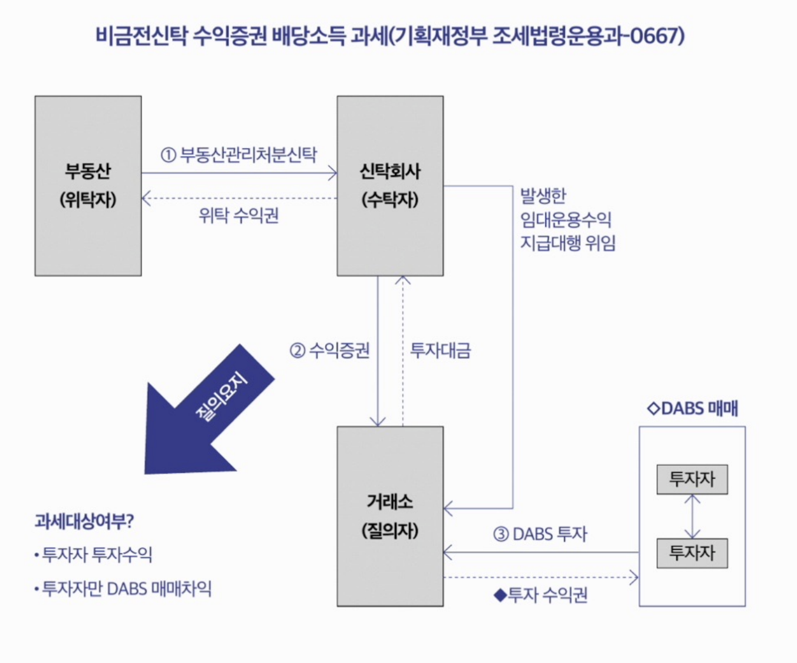

 
 

### STO 토큰증권과 세금 

---

####  1. 가상자산은 과세 대상인가? 

- 2023년부터 가상자산 양도·대여 소득을 기타소득으로 과세할 예정이었음
- 그러나 2022년 말, 금융투자소득세 과세 시행이 2025년으로 유예되면서 가상자산 과세도 함께 유예됨
- 2024년 현재 소득세법에는 가상자산의 양도·대여 소득이 과세 대상으로 열거되어 있지 않음
- 따라서 현재는 가상자산의 양도소득 또는 이자소득은 과세되지 않음

 

> 가상자산으로 대가를 지급받는 경우

- 금전 대신 가상자산으로 급여를 받으면 근로소득으로 과세될 수 있음
- 재화·용역 제공 대가를 가상자산으로 받으면 사업소득으로 과세 가능
- 가상자산으로 지급받았다고 해서 별도 비과세 규정은 없음
- 즉, “양도차익”은 현재 과세되지 않지만, “소득의 지급 수단”으로 사용된 경우에는 과세 대상이 될 수 있음

 

####  2. 토큰증권이 된 주식의 과세

- 현재 주식이 토큰증권 형태로 발행·유통되는 사례는 없음
- 따라서 현행 소득세법상 토큰증권 주식에 대한 별도 과세문제는 발생하지 않음
- 다만 향후 주식이 토큰증권으로 발행되더라도 기존 소득세법 체계에 따라 과세될 것으로 예상됨
- 세법은 ‘주식’ 자체를 기준으로 규정하고 있어, 실물증권·전자증권·토큰증권 등 발행형태에 따라 과세 여부가 달라지지 않음

 

> 양도소득 과세

- 주식(지분증권, 증권예탁증권 포함)의 양도는 형태와 무관하게 양도소득 과세 대상
- 토큰증권으로 발행되더라도 여전히 ‘주식’이므로 양도소득세 대상
- 상장주식의 경우 대주주만 양도소득세 과세
- 비상장주식은 원칙적으로 양도소득세 과세 대상

 

> 배당소득 과세

- 토큰증권에서 발생하는 배당은 ‘내국법인으로부터 받는 이익의 배당’에 해당
- 상장 여부와 관계없이 배당소득으로 과세될 가능성 높음
- 즉, 주식이 토큰증권으로 전환되어도 과세 구조 자체는 기존 주식과 동일

 

####  3. 토큰증권이 된 채권의 과세

- 현재 채권이 토큰증권으로 발행·유통되는 사례는 없음
- 따라서 토큰증권 채권에 대한 별도 과세 문제는 아직 발생하지 않음
- 향후 토큰증권으로 발행되더라도 기존 소득세법 체계에 따라 과세될 것으로 예상됨
- 현행 세법상 채권(채무증권)의 양도는 양도소득 과세 대상이 아님
- 채권 이자는 이자소득으로 과세

 

> 정리

- 채권이 토큰증권이 되더라도
  - 양도차익 → 과세되지 않음
  - 이자수익 → 이자소득으로 과세
- 즉, 발행 형태가 토큰으로 바뀌어도 과세 구조는 동일

 

####  4. 토큰증권이 된 ELS나 펀드의 과세

- 현재 ELS·펀드가 토큰증권으로 발행된 사례는 없음
- 향후 토큰증권으로 발행되더라도 기존 소득세법에 따라 과세될 것으로 예상됨
- ELS·펀드에서 발생하는 이익은 양도차익인지 분배금인지 구분과 관계없이
  → 배당소득으로 과세되는 구조

 

> 핵심

- 토큰증권으로 형식이 바뀌어도
- ELS·펀드 수익은 기존과 동일하게 배당소득 과세

 

####  5. 토큰증권이 된 비금전신탁 수익증권의 과세

- 분산원장을 활용한 비금전신탁 수익증권(조각투자)은 현재 배당소득으로 과세
- 기획재정부 행정해석에 따르면
  - 신탁 부동산의 임대·처분 수익
  - 거래 과정에서 발생한 매매차익
  → 모두 투자자의 배당소득으로 봄

 

> 구조 이해

- 위탁자(부동산 소유자) → 신탁회사(수탁자)
- 신탁회사가 수익증권 발행
- 투자자는 수익증권(DABS 등) 매입
- 발생 수익은 투자자에게 귀속
- 과세는 “투자자 배당소득”으로 처리

 

> 향후 제도 변화와 과세

- 전자증권법·자본시장법 개정으로
  - 계좌관리기관 분산원장에서 직접 발행·유통되더라도
- 증권의 본질은 달라지지 않음
- 새로운 행정해석이 나오지 않는 한
  - 비금전신탁 수익증권(토큰증권)은 배당소득 과세로 보는 것이 타당

 

####  6. 토큰증권이 된 투자계약증권의 과세

- 금융위원회가 투자계약증권으로 본 조각투자 사업자들은
  - 민법상 공유(공동소유) 구조로 해석하여
  - 투자자가 기초자산을 직접 소유한 것으로 보고
  - 수익을 기타소득으로 원천징수하는 경우가 많음
- 일부 사업자는 이를 사업소득으로 보아 원천징수하기도 함

 

> 과거 사례 (뮤직카우 등)

- 비금전신탁 구조로 개편되기 전
- 저작권료 참여청구권에서 발생한 수익은
  - 채권의 양도차익이 아니라
  - 저작인접권 사용 대가로 받은 금품으로 보아
  - 기타소득으로 원천징수함

 

> 왜 과세가 복잡한가?

- 투자계약증권은 법적 형태가 정형화되어 있지 않음
- 지분 성격에 따라
  - 상법상 익명조합
  - 합자조합
  - 투자익명조합
  등에 해당할 여지가 있음
- 그러나 자본시장법상 집합투자기구로 보기 어려운 경우도 많아
  법적 성격이 불명확함

 

> 핵심 정리

- 투자계약증권은 `계약의 실질`에 따라 과세가 달라질 수 있음
- 현재까지 과세당국의 명확한 통일 해석은 없는 상태
- 따라서 토큰증권 형태로 발행되더라도
  - 일률적 과세가 아닌, 구조별·계약별 개별 판단 필요
- 향후 행정해석·입법 변화에 따라 과세 체계가 달라질 가능성 존재

 

####  7. 2025년부터 가상자산이 과세된다?

- 2020년 세법 개정으로 가상자산 과세가 도입될 예정이었음
- 그러나 과세 체계 미정비 등으로 여러 차례 유예됨
- 2022년 말 금융투자소득세가 2년 유예되면서 가상자산 과세도 함께 2025년으로 유예
- 다만 2024년 세법 개정 과정에 따라
  - 폐지 또는 추가 유예 가능성도 존재
  - 실제 시행 여부는 확인 필요

 

> 2025년 시행 예정 과세 구조

- 가상자산을 **양도 또는 대여**하여 발생한 소득을 과세
- 소득 구분: 기타소득
- 소득금액 = 총수입금액 – 필요경비
  - 총수입금액: 양도·대여로 받은 대가
  - 필요경비: 실제 취득가액 + 관련 부대비용

 

> 취득가액 계산 방법

- 가상자산사업자: 이동평균법
- 그 외 일반 납세자: 선입선출법

 

> 세율 및 과세 방식

- 원천징수하지 않음
- 분리과세 방식
- 과세표준 = 가상자산소득금액 – 250만 원 공제
- 세율: 20%
  → (가상자산소득 – 250만 원) × 20%

 

> 핵심 정리

- 2025년부터 과세 예정이나, 입법 상황에 따라 변동 가능
- 연 250만 원 기본공제 후 20% 단일세율
- 양도·대여 소득만 대상 (보유 자체는 과세 아님)

 

####  8. 금융투자소득세(금투세)란?

- 2020년 세법 개정으로 도입된 새로운 과세 체계
- 주식·채권·펀드·파생상품 등 금융투자상품에서 발생하는 **자본이득(양도·환매·상환 차익)** 에 과세
- 금융투자소득 간 **손익통산 및 손실이월공제(5년)** 허용
- 배당·이자소득은 제외 (기존 금융소득 과세 유지)
- 실제 시행 시점은 유예 여부에 따라 변동 가능

 

> 금융투자소득의 범위 (6가지)

1. 주식 등의 양도로 발생하는 소득  
2. 채권 등의 양도로 발생하는 소득  
3. 투자계약증권의 양도로 발생하는 소득  
4. 집합투자증권(펀드)에서 발생한 이익  
5. 파생결합증권(ELS 등) 이익  
6. 파생상품의 거래·행사로 발생하는 소득  

→ 대부분의 “금융투자상품 양도차익”을 포괄

 

> 기본공제

- 1그룹(국내 상장주식·공모 국내주식형 펀드)
  → 연 5,000만 원 공제  
- 2그룹(기타 금융투자소득)
  → 연 250만 원 공제  
- K-OTC 중소·중견기업 주식도 1그룹 포함
- 공모 국내주식형 펀드는 상장주식 편입비율 2/3 이상

 

> 손익통산 및 이월공제

- 모든 금융투자소득 간 손익통산 허용
- 순손실 발생 시 5년간 이월공제
- 종합소득과는 별도 구분 과세

 

> 세율

- 과세표준 3억 원 이하: 20%
- 3억 원 초과: 25%
- 2단계 누진세율 구조

 

> 과세 방식

- 원칙: 금융회사가 반기별 원천징수
- 이후 추가 납부 또는 환급이 필요한 경우
  → 다음 해 5월 확정신고
- 상반기 원천세액: 7/10까지 납부  
- 하반기 원천세액: 다음 해 1/10까지 납부  

 

> 현행 세제와의 차이 핵심

- 상품별 과세 → “전 금융투자상품 통합 과세”로 전환
- 일부 손익통산 → 전면 손익통산 허용
- 이월공제 없음 → 5년 이월공제 허용
- 의제취득가액 규정 도입(2022년 말 기준가 활용)

 

> 핵심 리마인드

- 금투세는 “금융상품 자본이득 통합과세 제도”
- 손익통산 + 5년 이월공제가 가장 큰 특징
- 3억 원 기준 20% / 25% 누진세율 구조
- 시행 시점은 정책 상황에 따라 유동적

 

####  9. 금투세 시행 후의 투자계약증권과 토큰증권 과세

- 투자계약증권(토큰증권)의 양도차익은  
  → ‘투자계약증권의 양도로 발생하는 소득’으로 보아  
  → 금투세 과세 대상이 될 것으로 예상됨
- 즉, 금투세가 시행되면 투자계약증권도 금융투자소득 범위에 편입될 가능성 높음

 

> 분배금(운용수익)의 과세

- 투자계약증권에서 발생하는 분배금은  
  → 배당소득으로 과세될 가능성이 큼
- 다만 세법상 명확한 규정은 아직 부족
- 구조에 따라:
  - 배당소득으로 볼 수도 있고
  - 출자공동사업의 배당 또는
  - 지분비율에 따른 사업소득으로 과세될 가능성도 존재

 

> 비금전신탁 수익증권과의 관계

- 자본시장법상 비금전신탁 수익증권이 정형화되지 않은 상태
- 금투세에서도 과세 기준이 명확하지 않음
- 향후 자본시장법·전자증권법 개정에 따라
  → 과세기준이 정비될 가능성 있음

 

> 핵심 정리

- 금투세 시행 시 투자계약증권의 “양도차익”은 금융투자소득으로 편입 가능성 높음
- “분배금”은 여전히 구조별 판단 필요
- 투자계약증권은 계약 실질에 따라 과세 달라질 수 있음

 

####  10. 금투세 시행 후의 정형적 증권인 토큰증권 과세

- 토큰증권도 자본시장법상 ‘증권’
- 실물증권·전자증권과 동일하게 취급됨
- 주식, 채권, 파생결합증권, 금전신탁수익증권 등으로 분류

 

> 과세 방식

- 주식형 토큰증권 → 주식 양도소득 체계 적용
- 채권형 토큰증권 → 채권 양도·이자소득 체계 적용
- 파생결합증권형 → 파생결합증권 이익 과세
- 집합투자증권형 → 펀드 과세 체계 적용

 

> 금투세 적용 시

- 다른 금융투자상품과 손익통산 가능
- 과세표준 3억 원 이하 20%
- 3억 원 초과 25%
- 전 금융투자상품 통합 과세 체계 편입

 

> 핵심 정리

- 정형적 증권을 토큰화한 경우
  → 본질이 바뀌지 않으므로 과세도 동일
- 금투세 시행 시
  → 다른 금융상품과 통산하여 20%/25% 누진 과세
